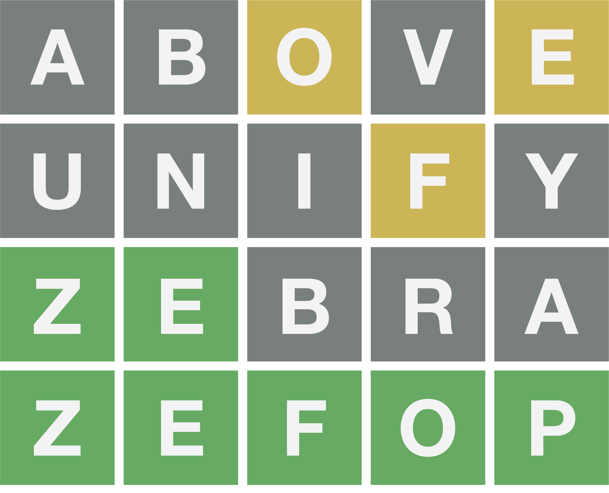

In this blog post we are going to build a console-playable Wordle game using Python and zef in 30 lines 🔥

The purpose of this blog is to showcase the usage of ZefOps to create easy, readable, composable, extendable, highly-decoupled, and [enter more buzz words here 😍] code! 

So before getting started, let's quickly review what is Wordle?



## What is Wordle? 🤔

Wordle is a simple game where you have six chances at guessing a five-letter word.

After each guess, the game will give you hints.

1. A green tile means that you guessed the correct placement of a letter.

2. A yellow tile means that the letter is in the word, but your guess had the wrong position.

3. And lastly, a grey tile means the letter is not in the word. 


## Rules 🔢

So the rules are pretty straightforward. Given we are playing the game in a console, let us remap the rules a bit.

After each guess,

1. A letter appearing by itself == Green tile 🟩

2. A letter appearing with [ ] around it == Yellow tile 🟨

3. A dash appearing means == Grey tile ◻️


## Building the game 👷🏻

To run the code below, you'll need early access to Zef (it's free) - sign up [here](https://zefhub.io)!

- Let's import ZefOps. Any operator we might need should be there 😜

```python
from zef import * 
from zef.ops import * 
```

- Then we load our 5-letter word list

For this example I am using [this wordlist](https://github.com/charlesreid1/five-letter-words/blob/master/sgb-words.txt) I found on Github.

Using ZefOps, we can either load the list from a link, a file stored locally, or simply from your clipboard 😲

```python
# Load from request response (Choose this one)
url = "https://raw.githubusercontent.com/charlesreid1/five-letter-words/master/sgb-words.txt"
wordlist = url | make_request | run | get['response_text'] | split['\n'] | map[to_upper_case] | collect

# Load from local file
wordlist = 'wordlist.txt' | load_file | run | get['content'] | split['\n'] | map[to_upper_case] | collect

# Load from clipboard
wordlist = from_clipboard() | run | get['value'] | split['\n'] | map[to_upper_case] | collect
```

We can already see the power and ease of ZefOps. In just one line we are able to load a string of words, split it on new lines,
then convert each string to uppercase. 

We will get more familiar with the lazy nature of ZefOps and why we need "collect" in a bit. But notice, to go from one stage to another aka **transform your input**, you just have to pipe `|` operators. This way your input will flow through your operator chain aka **pipeline** giving you the output you need.


- Now we initialize some game related variables
```python
# Game Variables
counter, to_be_guessed = 6, random_pick(wordlist)
discard_words, discard_letters, guesses_list = set(), set(), []
```

Btw, random_pick is also a ZefOp. Given a list, a string, or a simple iterable, it returns a random item/character from the input. So here, given our words list, we choose a random word that we will have to guess. 

Also notice we can call ZefOps similar to a function using `zefop(args)`.


- Now for some ZefOp 🪄 magic 🪄

```python
# Predicate function constructed using zefops
is_eligible_guess = And[length | equals[5]][contained_in[wordlist]][Not[contained_in[discard_words]]]
```
Using ZefOps, we're able to pack a lot into a single line (and still maintain readability). Let's look into it:

1. Firstly, this ZefOp declares a function that takes an input string and checks if its length is equal to 5 and is contained in the word list and it is not a previous guess.

2. If you pay attention we didn't have to pass an input yet or even compute a result. You can think of this as a mini program, one that we can use in multiple places, and extend easily by `piping` more ops into it. We've also just designed our very own ZefOp composed of other ZefOps. The beauty of it all it is just data 0️⃣1️⃣ more on that later...

3. "CRANE" | is_eligible_guess turns into a LazyValue. Put simply, a `value + zefop` is a LazyValue 🥱. A LazyValue is not computed until we do `| collect` to make it eagerly execute. We will see more value out of LazyValues later on.


- Now for the **meatiest** 🥩🥩🥩 part of the code

```python
def make_guess(guess, to_be_guessed, discard_letters):
    def dispatch_letter(arg):
        i, c = arg
        nonlocal to_be_guessed
        if c == to_be_guessed[i]:         # Rule 1 🟩
            to_be_guessed = replace_at(to_be_guessed, i, c.lower()) 
            return f" {c} "
        elif c in to_be_guessed:          # Rule 2 🟨
            to_be_guessed = replace_at(to_be_guessed, to_be_guessed.rindex(c), c.lower())
            return f"[{c}]"
        else:                             # Rule 3 ◻️
            if Not[contains[c.lower()]](to_be_guessed): discard_letters.add(c)
            return " _ "
    
    return (guess                       # "CRANE"
            | enumerate                 # ((0, "C"), (1, "R"), ...)
            | map[dispatch_letter]      # ["_", "[R]", "_", ...]
            | join                      # "  _  [E] _  _  _ "
            | collect 
        ), discard_letters
```

This is the main logic behind Wordle. After each guess, we match our guess characters with the actual word.
The focus of this function is in the return statement of the function. It is a chain of ZefOps that takes our "guess" as an input.

We run our guess word through enumerate to get back a list of tuples of *(character, index)*. We then pass that list to `map`, which is a ZefOp that, as the name suggests, maps each item of an input to an output given a dispatch function which we pass as the second argument using [ ]. The output of `map` is always a list of the individual outputs, so we `pipe` through `| join` to connect the list as a string. 
`collect` is finally piped so we evaluate this LazyValue.

`discard_letters` isn't part of the game logic but just makes it more playable. 

*Psst: join can be called with a joiner i.e join["_"] instead of the default which is empty string join[""]*


## Polishing and running ✨

Now we have to use these 2 simple functions along with couple of ifs and some more ZefOp 🪄 magic 🪄 to make the game playable!

```python
"~Welcome to Wordle~" | run[print]    # boujee way of printing using zefops

while counter > 0:
    guess = input("Your guess:").upper()
    if is_eligible_guess(guess):     # Calling our predicate zefop on the guess
        counter -= 1
        discard_words.add(guess)
        guess_result, discard_letters = make_guess(guess, to_be_guessed, discard_letters)
        discard_string = discard_letters | func[list] | sort | join | prepend ['     [Not in word]: '] | collect
        guess_string = guess_result | pad_right[20] | append[guess + discard_string] | collect
        guesses_list = guesses_list |  append[guess_string] | collect
        guesses_list | join['\n'] | run[print] 
 
        if guess == to_be_guessed: 
            f"Your guess {guess} is correct!" | run[print]
            counter = -1
    else:
        f"{'Previous guess' if guess in discard_words else f'Invalid guess {guess}'}! Try again." | run[print]

if counter == 0: f"Your ran out of trials, the word was {to_be_guessed}" | run[print]
```

- Okay, so what's going on?

"While" allows you to loop until a condi... I am joking 🤡  I know you are looking at those lines with zefops.

1. **discard_string** is a string of all the letters we guessed over time that aren't part of the word we are trying to guess.
We compute it by taking the set of **discard_letters** piping it through `func[list]` which is equivalent to casting set to list. Then we `sort` it and `join` it into a string. Finally we `prepend` another string to the string we created.
*`prepend/append` work on both list and string.*

2. **guess_string** is the **guess_result** piped through `pad_right` which pads our string with whitespace to a specifc length. Then we `append` our **guess** and **discard_string** to the padded string.

3. **guesses_list** is appended with the **guess_string**. This is just to print out the full list of guesses nicely in the console after each guess.

4. `join` appears again but this time with the new line joiner. We pipe through `run[print]` to perform a side effect of printing to the console. `collect` is used when computing a result.


## Wrap up 🔚

Just like that, in 30 lines (or less) we created Wordle in Python using ZefOps!

The takeaway from this is how easy ZefOps are. They are short. They are composable. They are lazy. They are data. They are extensible. They are pure. They are Zef!


If you'd like to find out more about Zef and get early access to run this code yourself, sign up on [zefhub.io](https://zefhub.io). It's completely free, we won't bombard you with emails, and we'll get you set up quick!

## Stuck? 😰

If you are stuck and want some help, in [part 2](/blog/wordle-solver-one-line) we create a Wordle solver using Python and ZefOps.
