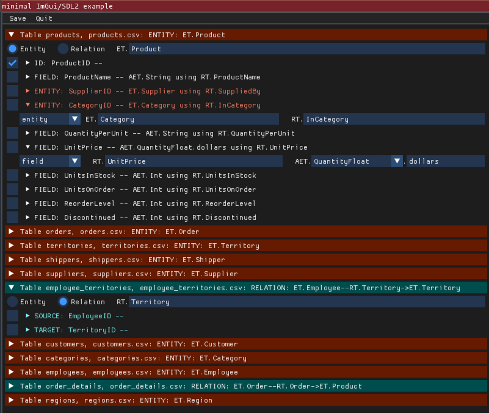
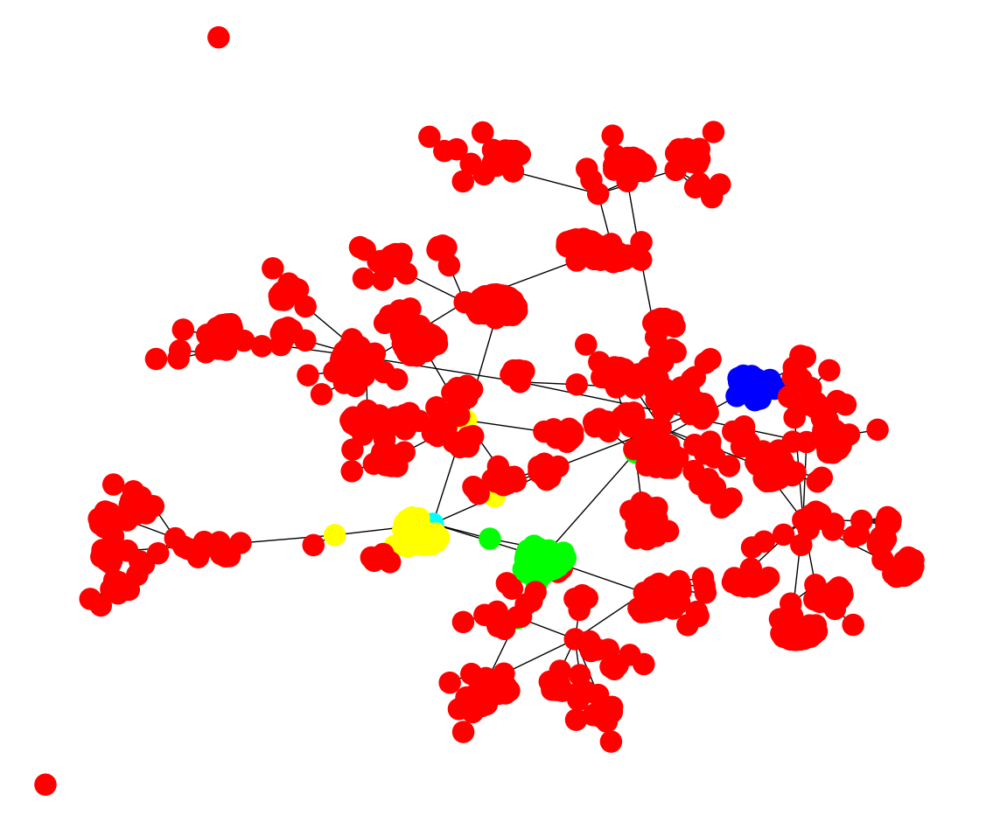

import RequiredVersion from "@theme/RequiredVersion";

The purpose of this blog is to show off the ease of importing from external data
into Zef and using a proxy view to expose Zef to 3rd-party packages. It is also
a diary of how the development of these features worked, allowing me to polish
them as we go!

There are many reasons you could want to expose a Zef graph using networkX:

- You have existing code that uses the networkX framework
- You want to use a 3rd party library that can accept a networkX graph, for
  example a plotting library like plotly.
- You want to use a graph analysis algorithm that isn't yet available in Zef.

The outline of this process is:

1. **Get some external data**
2. **Import it into a Zef graph**
3. Expose the data using a "proxy"
4. Do the analysis
5. Spit out some pretty visualisations

In this post, I will focus only on the highlighted points 1 and 2, i.e. getting your data into a
Zef graph.

## 1. Get some external data

We'll use the Northwind dataset as an example, which describes sales and orders
for a company. This is available from here
https://code.google.com/archive/p/northwindextended/downloads. To convert this
to CSV files, I wrote a little script available [export.py](sql-import-files/export.py), which creates a
temporary SQLite DB to export each table as its own CSV file. If you'd like to
follow along as home, to save you the bother I've made these CSV exports
available [northwind.zip](sql-import-files/northwind.zip).

After running this script, we find there are 14 CSV files in this dataset. I'll
use `products.csv` to demonstrate some of the features below and its first few
rows look like:

| ProductID |  ProductName  | SupplierID | CategoryID |   QuantityPerUnit   | UnitPrice | UnitsInStock | UnitsOnOrder | ReorderLevel | Discontinued |
| :-------: | :-----------: | :--------: | :--------: | :-----------------: | :-------: | :----------: | :----------: | :----------: | :----------: |
|     1     |     Chai      |     8      |     1      | 10 boxes x 30 bags  |    18     |      39      |      0       |      10      |      1       |
|     2     |     Chang     |     1      |     1      | 24 - 12 oz bottles  |    19     |      17      |      40      |      25      |      1       |
|     3     | Aniseed Syrup |     1      |     2      | 12 - 550 ml bottles |    10     |      13      |      70      |      25      |      0       |
|    ...    |      ...      |    ...     |    ...     |         ...         |    ...    |     ...      |     ...      |     ...      |     ...      |

So long as the CSV files can be imported using the `pandas` python module, then
we are able to import these into a Zef graph.

## 2. Import into Zef

If you have seen the "Import from CSV" how-to in our docs, you might first think
to jump straight to the Zef `pandas_to_gd` op to import it. However, the CSV
files in this dataset are in a representation that is best suited for SQL, with
columns representing both fields AND relationships between different entities.

Instead, we need to provide a declaration for the set of tables that the CSV
files represent, which all together produce the right graph structure. For
example, we should be able to specify the purpose of each column in the
`products.csv` table to be something like:

|           | ProductID  |  ProductName   |  SupplierID   |  CategoryID   |       UnitPrice       | ... |
| :-------- | :--------: | :------------: | :-----------: | :-----------: | :-------------------: | :-: |
| Purpose   |     ID     |     Field      |    Entity     |    Entity     |         Field         | ... |
| ET        | ET.Product |                |  ET.Supplier  |  ET.Category  |                       | ... |
| RT        |   RT.ID    | RT.ProductName | RT.SuppliedBy | RT.InCategory |     RT.UnitPrice      | ... |
| Data type |    Int     |     String     |      Int      |      Int      | QuantityFloat.dollars | ... |

The above is just a layout for me to organise my thoughts on what each column
should do. I could have instead said the above in sentences:

- _The `ProductID` column should represent the ID of the `ET.Product` entities
  which this table defines in each row. The IDs will be stored on the Zef graph
  using `RT.ID` relations._
- _The `ProductName` column gives fields for each row, which will have a relation
  type of `RT.ProductName` and be a string._
- _The `SupplierID` column is a different entity of type `ET.Supplier`, uniquely
  identified by the integer in this column. It is linked to the `ET.Product` via a
  `RT.SuppliedBy` relation._
- ...

We will need to introduce a couple of more "purposes" in a moment, but otherwise this has
nearly covered all of the main uses of the dataset.

Writing this all out by hand is tedious, so I wrote up a quick parser in Zef to
produce the initial layout for you and then allow you to edit it. I made the
following by running:<RequiredVersion>You need >= v0.15.2 for sql_import</RequiredVersion>

```py
from zef.experimental import sql_import

decl = sql_import.guess_csvs("products.csv")

decl | write_file["guess.yaml"] | run
```

then editing the file `guess.yaml` a little bit:

```yaml
default_ID: ID
definitions:
  - tag: products
    data_source:
      filename: products.csv
      type: csv
    kind: entity
    ID_col: ProductID

    cols:
      - name: ProductID
        purpose: id
        RT: ID
        data_type: Int

      - name: ProductName
        purpose: field
        RT: ProductName
        data_type: String

      - name: SupplierID
        purpose: entity
        ET: Supplier
        RT: SuppliedBy
        data_type: Int
```

I then wrote up a function `import_actions` which will take this declaration of
how to map the CSV data to the graph and do the busy-work to product a graph.
Here is how to run that:

```py
decl = "edited.yaml" | load_file | run | get["content"] | collect
g = Graph()
actions = sql_import.import_actions(decl)
actions | transact[g] | run
```

The `import_actions` function will use the information in `decl` to find the
files from which to read the raw data.

While the above works okay on the `products.csv` table, I needed to include two
more things to allow the import of all CSV files simulataneously: a way to tag a
table as a "entity" or "relation" style and a source/target purpose.

:::info Interlude into GUI land

Editing the yaml file by hand is clunky. However, it does have the benefit of
being easy to a) read as plain text, and b) save the declaration of the import
without custom data structures.

To get rid of the clunkiness, and also indulge myself to explore a new package,
I decided to write a little UI using `pyimgui` to better edit the file. Try it
out on my sample [sql_import.yaml](sql-import-files/sql_import.yaml)
with:<RequiredVersion>This requires zef >= v0.15.2</RequiredVersion>

```
python -m zef.experimental.sql_ui.wizard sql_import.yaml
```

You should see something like:



The UI is in its early stages so might not work fully. It also requires
installing the `pyimgui` module with sdl support (i.e. `pip3 install pyimgui[sdl2]` or the like). Weirdly this seems to have problems with python
version 3.10 on macos... we will be looking into this.

To read more about using this GUI, check out our docs page on [Multiple interlinked CSVs](https://zef.zefhub.io/how-to/imgui-csv)

:::

### "relation" kinds of tables

If there is a one-to-many or many-to-many relationship between two objects in a
SQL database, then there are various ways to represent this. In the Northwind
example, the "Order Details" table demonstrates this, as it allows each Order to
contain multiple different products (the one-to-many relation), with
particular `(order,product)`-specific prices, quantities and discounts.

| OrderID | ProductID | UnitPrice | Quantity | Discount |
| ------- | --------- | --------- | -------- | -------- |
| 10248   | 11        | 14        | 12       | 0.0      |
| 10248   | 42        | 9.8       | 10       | 0.0      |
| 10248   | 72        | 34.8      | 5        | 0.0      |
| 10249   | 14        | 18.6      | 9        | 0.0      |
| ...     | ...       | ...       | ...      | ...      |

Hence we can think of this table as not being entity-centric but rather
relation-centric. Any fields (e.g. the UnitPrice column) is information that
should be attached to the relation between the order and the product. As Zef
graphs we always have directed relations, so we need to also specify a "source"
and "target" column:

|           | OrderID  | ProductID  |       UnitPrice       |  Quantity   |  Discount   |
| :-------- | :------: | :--------: | :-------------------: | :---------: | :---------: |
| Purpose   |  Source  |   Target   |         Field         |    Field    |    Field    |
| ET        | ET.Order | ET.Product |                       |             |             |
| RT        |          |            |     RT.UnitPrice      | RT.Quantity | RT.Discount |
| Data type |   Int    |    Int     | QuantityFloat.dollars |     Int     |    Float    |

## The import!

My full processing of the CSV files is shown below. My edits to the
sql_import.yaml file are available here: [sql_import.yaml](sql-import-files/sql_import.yaml).

```py
from zef import *
from zef.ops import *
from zef.experimental import sql_import

decl = sql_import.guess_csvs("*.csv")
decl | write_file["sql_import.yaml"] | run

# ... edit sql_import.yaml externally...

decl = "sql_import.yaml" | load_file | run | get["content"] | collect
g = Graph()
actions = sql_import.import_actions(decl)
actions | transact[g] | run
```

After this import, the graph looks like:

```py
>>> yo(g)

<...snip...>
^^^^^^^^^^^^^^^^^^^^^^^^^^^^^^^^^^^^^^^^^ Atomic Entities ^^^^^^^^^^^^^^^^^^^^^^^^^^^^^^^^^^^^^^^
[6007 total, 6007 alive]       AET.String
[2985 total, 2985 alive]       AET.Float
[2527 total, 2527 alive]       AET.Int
[2232 total, 2232 alive]       AET.QuantityFloat.dollars
[2469 total, 2469 alive]       AET.Time

^^^^^^^^^^^^^^^^^^^^^^^^^^^^^^^^^^^^^^^^^^^^ Entities ^^^^^^^^^^^^^^^^^^^^^^^^^^^^^^^^^^^^^^^^^^^
[1660 total, 1660 alive]       ET.Order
[154 total, 154 alive]         ET.Product
[12 total, 12 alive]           ET.Employee
[93 total, 93 alive]           ET.Customer
[53 total, 53 alive]           ET.Territory
[4 total, 4 alive]             ET.Region
[3 total, 3 alive]             ET.Shipper
[29 total, 29 alive]           ET.Supplier
[8 total, 8 alive]             ET.Category

^^^^^^^^^^^^^^^^^^^^^^^^^^^^^^^^^^^^^^^^^^^  Relations ^^^^^^^^^^^^^^^^^^^^^^^^^^^^^^^^^^^^^^^^^^
[4 total, 4 alive]             RT.RegionDescription
       [4 total, 4 alive]             (ET.Region, RT.RegionDescription, AET.String)
[2155 total, 2155 alive]       RT.Order
       [2155 total, 2155 alive]       (ET.Order, RT.Order, ET.Product)
[9 total, 9 alive]             RT.ReportsTo
       [9 total, 9 alive]             (ET.Employee, RT.ReportsTo, ET.Employee)
<...snip...>
```

If you don't want to do the import yourself, you can also look at the graph that
I created at the tag `zef/blog/northwind`, that is, you can access it via:

```py
g = Graph("zef/blog/northwind")
```

## Final comments

As always, answering a simple question has opened up many more questions which I
can't help myself but discuss below...

### One final purpose: "field_on"

There's another addition that's needed to import many production SQL tables: a
way to handle databases with optimised tables.

While we do not need this kind of purpose for the Northwind dataset, it is
useful to mention it to "complete the story". The above example of the "Order
Details" table which produced pure relations (and not entities) is because the
Northwind dataset is in "first normal form".

A "denormalised" dataset could also be used for performance reasons. For
example, obtaining all of the products ordered by a particular customer would
require an SQL JOIN query to obtain:

```sql
SELECT DISTINCT(order_details.ProductID)
FROM order_details INNER JOIN orders
ON order_details.OrderID = orders.OrderID
WHERE orders.CustomerID = "VINET";
```

Instead, the join of orders and order_details could itself be stored as a table
(or view) in the SQL database:

| OrderID | CustomerID | OrderDate  | ... | ProductID | Quantity | ... |
| ------- | ---------- | ---------- | --- | --------- | -------- | --- |
| 10248   | VINET      | 1996-07-04 | ... | 11        | 12       | ... |
| 10248   | VINET      | 1996-07-04 | ... | 42        | 10       | ... |
| 10248   | VINET      | 1996-07-04 | ... | 72        | 5        | ... |
| 10249   | TOMSP      | 1996-07-05 | ... | 14        | 9        | ... |
| 10249   | TOMSP      | 1996-07-05 | ... | 51        | 40       | ... |
| ...     | ...        | ...        | ... | ...       | ...      | ... |

The concept of avoiding joins is rather weird when coming from a graph
perspective, as the equivalent of joins are trivial on a graph. However, you may
not have any choice in the data you want to import. In this case, we can mark
those columns as belonging to the relation between the order and product using
"field_on":

|           | OrderID  | CustomerID  |  OrderDate   | ProductID  |  Quantity   |
| :-------- | :------: | :---------: | :----------: | :--------: | :---------: |
| Purpose   |    ID    |   Entity    |    Field     |   Entity   |  field_on   |
| ET        | ET.Order | ET.Customer |              |  Product   |             |
| RT        |    ID    |  Customer   | RT.OrderDate | RT.Product | RT.Quantity |
| Target    |          |             |              |            |  ProductID  |
| Data type |   Int    |     Int     |     Time     |    Int     |     Int     |

Here the "Quantity" column cannot be set as a `field` as it would have multiple
values for the same `ET.Order`. So instead we designate that it should be
attached to the "target" column `ProductID`. This means we could write a Zef
query for the total quantity of an order as:

```py
z_order > L[RT.Product] >> RT.Quantity | value | add | collect
```

### Batteries-included?

The imported tables still duplicate a lot of information. For example, each of
the `ET.Order`, `ET.Supplier`, `ET.Customer`, `ET.Employee` have a `RT.Region`
which is a scalar string. This is not very connected, as it would be better to
have these `RT.Region`s point at a `ET.Region`. That way, we could ask for all
suppliers in the same region as a customer without doing string matching.

I was tempted to add this in as another purpose, something like
`entity_from_matching_field`. But this would have degenerated into providing an
arbitrary language to describe the endless possible databases out there.
Instead, we can post-process the imported Zef graph, which gives us access to
the entire Zef ops capabilities.

You might be worried about exposing the gorey details of the import process and only
the post-processed data. This is easy, if we export only `g | now` to a new
graph after performing the post-processing.

### A comment on speed

If you run the commands in this blog post on a large dataset, then you are going
to be waiting several minutes for the import. Even as part of writing this post
up, and using the Northwind dataset which is relatively small, I found I had to
optimise some aspects of the `GraphDelta` implementation.

This is largely due to the current pure-python implementation of the evaluation
engine for ZefOps. In the future this will be implemented in C++ along with the
core of the GraphDelta code.

### Import directly from SQL

To be honest this blog post is a little crude, using CSV files which lack
type information rather than the SQL source directly. The information available
in the SQL schema can also assist automatic detection of connected entities and
whether a table represents a single entity or many-to-many relations.

The benefit of handling CSV files is it allows us to accomplish almost all kinds
of imports, so long as we provide enough additional information. If we supported
only SQL, then this would limit the flexibility.

The other reason that the SQL schema is not used directly, is that it's a fair
bit more work to support a SQL connection or export. But our intent is to extend
these tools and make imports as close to one-click as possible!

## Analysis using external tools

I'll leave this for the next blog post! But as a sneak preview...



## Wrap up

If you'd like to find out more about Zef and ZefHub (and get early access), get us out at [zefhub.io](https://zefhub.io).
