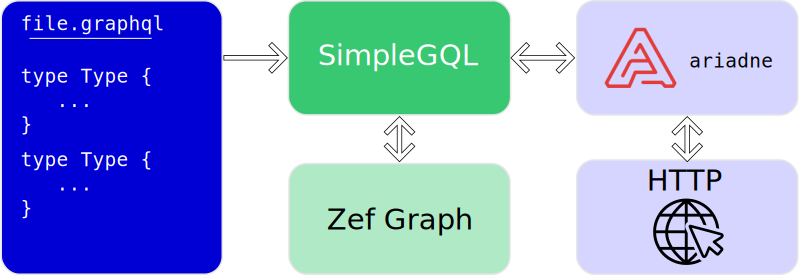

Sometimes the full power of a database can take too long to get your teeth into.
Instead, you might say:

> I know how I want to talk to my database, GraphQL, can't I just describe my database in GraphQL?

To answer that question we created `SimpleGQL`!

> The purpose of SimpleGQL is to provide frontend developers a backend that
> "just works" but can later be extended/interacted with the full suite of Zef
> capability.



# A GraphQL example

As a real-world example, we are building a budgeting app called "Ikura", using
Zef as the backend. Ikura is mainly a frontend app - to declare the database
that Ikura will use, we want to write something like:

```graphql title="ikura.graphql"
type User {
  email: String!
  name: String
  dob: DateTime
  transactions: [Transaction]
}

type Transaction {
  user: User
  categories: [Category]
  amount: Int
  date: DateTime
}

type Category {
  transactions: [Transaction]
  name: String
  icon: String
}
```

From this, we want to be able to just say:

```
python -m zef.gql.simpelgql ikura.graphql ikura-database
```

and have a GraphQL server be created, with all kinds of endpoints to query and
mutate the database, which is a Zef graph created and tagged with
`ikura-database`. Note that we haven't specified any queries/mutations in the
above example... and we want to keep it that way!

## Building the server pipeline

The server is made up three components:

1. A parser (the Facebook reference implementation) to parse the `ikura.graphql`
   file.
2. The `SimpleGQL` part: our code that talks to the Zef graph and generates
   various endpoints including filtering, sorting, authentication and hooks.
3. The server itself, [ariadne](https://ariadnegraphql.org/), that we feed the appropriate
   endpoint callbacks.

In this post I want to talk a little bit about how ZefOps made implementing some
features of SimpleGQL a breeze.

## 🔌 Generating endpoints 🔌

We have taken a leaf out of the book of [Dgraph](https://dgraph.io/) to guide
our development of an API. This should mean anyone migrating from Dgraph will
find it trivial to use a Zef graph instead. This also allows one to self-host a
[Dgraph-like](https://dgraph.io/docs/graphql/quick-start/) GraphQL server.

In our API we provide the following queries for each type, where the word `Type`
is substituted for the type name in the `.graphql` file:

- `getType`: obtain a single instance
- `queryType`: search and retrieve multiple instances with filtering, sorting
  and pagination.
- `aggregateType`: pull out useful totals, averages, minima, maxima over what
  `queryType` would normally return.

Similarly, we provide some mutations:

- `addType`: add a new instance (or update an existing one by ID)
- `updateType`: update one or more instances matching a criteria to set/remove their
  fields
- `deleteType`: delete one or more instances

## 🔍 Filtering 🔍

The code to generate the above endpoints is available on our GitHub repository.
The part I want to show off now is that of the filtering, which makes good use
of the lazy zefops. For example, we want a query:

```graphql
query {
    queryTransaction(filter: {
        amount: {ge: 5, le: 10},
        category: {size: {eq: 1}}
    }) {
        id
        amount
        date
    }
}
```
To return the transactions the user can see, which have an amount between 5 and
10, and are assigned to a single category. Internally, this `filter` structure
is converted to a zefop that looks like:

```py
filter_predicate =
  And[get_field["amount"]
      | And[greater_than[5]][less_than[10]]]
     [get_field["category"]
      | length
      | equals[1]]
```
and this zefop can be applied as a simple predicate for a filter. Although the
below is not exactly what happens, this is not far off from the process that a simple
`queryTransaction` does:

```py
g | now | all[ET.Transaction] | filter[filter_predicate] | collect
```

## 🔒 Authentication 🔒

The Ikura database will store many different users' data and we want to ensure
no user can peak at another user's private information.

The auth setup, describing the key (symmetric or asymmetric), and what HTTP
headers to use to verify, are given as a special comment in the `.graphql` file.
The actual auth checks themselves are included with a special `@auth` directive
attached to each type, and are simple strings representing the Zef query. There
are several auth possibilities, shown here as an example directive in the
`graphql` file:

```graphql
type SomeType
@auth(
    query: "..."
    add: "..."
    update: "..."
    updatePost: "..."
    delete: "..."
  ) {
  ...
}
```

Don't worry about the overload of options though! By default, if a `updatePost`
check is not explicitly given, the checks will fallback to a `update` check if
that is present, then a `query` check.

Note that this checking is performed not at the query level, but at the entity
level. For example, it shouldn't matter how we arrive at a `ET.User` entity,
whether it's from a `getUser` query or a `getTransaction` query asking for the
corresponding user, the appropriate rights should be checked before allowing the
query to proceed.

Finally, we have implemented an experimental "rollback" feature into Zef that
allows us to run auth tests on the graph data in situ. What I mean by that is we
can perform, for example, a "pre" and "post" auth check on an update mutation.
The "pre" check can run a Zef query similar to:

```py
z_transaction_before | Out[RT.User] | uid | equals[verified_user_uid]
```

which says "Only transactions that the connecting user owns can be modified",
and then a follow-up "post" check:

```py
z_transaction_after | Out[RT.User] | uid | equals[verified_user_uid]
```

effectively says "The transaction cannot be changed to point to a different
user". Notice that these checks are exaclty the same, so if we leave off the
input and just write it as a ZefOp we get:

```py
Out[RT.User] | uid | equals[verified_user_uid]
```

In the actual auth check, we don't write `verified_user_id`, but use the
verified JWT found in the query HTTP headers, made avaiablle via `info.context['auth']`.


## Annotated graphql file

All of the above requires a few extra details to be added to the original
`ikura.graphql` file. Here is what it looks like now:

```graphql
# Zef.SchemaVersion: v1
# Zef.Authentication: {"Algo": "HS256", "VerificationKey": "...", "Audience": "ikura.app", "Header": "X-Auth-Token"}

type User
  @auth(
    add: "info.context | get_in[('auth', 'admin')][False]"
    query: """
    (z | Out[RT.Email] | value
    | equals[info.context
            | get_in[('auth', 'email')][None]
            | collect])
    """
  )
@hook(onCreate: "userCreate")
{
  email: String! @unique @search
  name: String
  dob: DateTime
  transactions: [Transaction]
    @incoming
    @relation(rt: "TransactionUser")
}

type Transaction
  @auth(query: "auth_field('user', 'query')")
{
  user: User @relation(rt: "TransactionUser")
  categories: [Category] @relation(rt: "TransactionCategory")
  amount: Int @search
  date: DateTime @search
}

type Category {
  transactions: [Transaction]
    @incoming
    @relation(rt: "TransactionCategory")
  name: String
  icon: String
  created: DateTime
}
```

You can also notice a few other directives, `@unique`, `@search`, `@incoming`,
`@relation`... These are described in more detail in our [documentation](/how-to/graphql-simplegql).