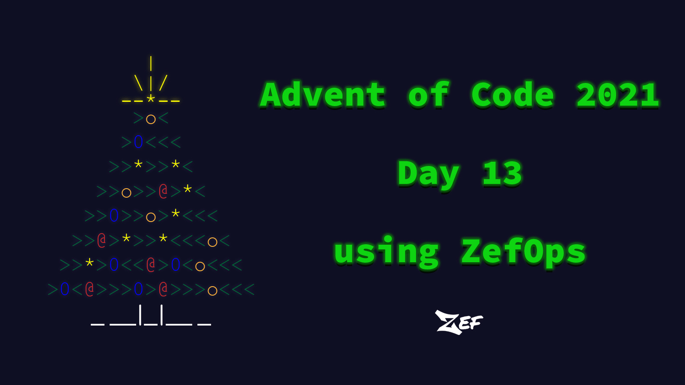
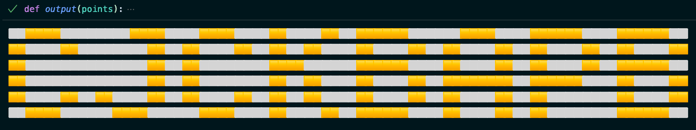

In this blog, we will see how we can use ZefOps to solve [Advent of Code - Day 13](https://adventofcode.com/2021/day/13)!

We will see how ZefOps, compared to plain Python or Python with other libraries, allows us to write short, readable and composable code.

Before you start reading, get familiar with the problem we are solving today and even give it a shot [here](https://adventofcode.com/2021/day/13) before digging in.




## Problem Explanation ❓

After reading the problem statement, let's explain and simplify some points:

- We can divide our input into 2 lists:
    - points (x,y)
    - fold instructions (axis, val)

- Each fold instruction could only reduce or maintain the number of points, but never increase them.
- 2 points overlapping become the same point, thus reducing the number of points.

With these points in my mind, let us attempt the solution to part 1!

## Solution Breakdown 💡

### Parsing the Input

*We will use for this blog, the [input](aoc13-input.txt) I was given while solving the problem, that will differ from yours.*

The first step of almost all of Advent of Code problems is to parse the input. This is usually a daunting problem to beginners, but with ZefOps it won't be. 

As mentioned above let us manually divide our big input into 2 strings, `str_points` and `str_folds`. 

```python
from zef.ops import *       # don't forget to import ZefOps module from zef

str_points: str = """..."""                  
str_folds:  str = """..."""                    
```

#### Parsing Points String

We start by parsing `str_points` using this simple ZefOp chain:

```python
points =  str_points | split["\n"] | map[split[","] | map[int]] | collect                    
```

We can also stack the chain like this for better readability:

```python
points = (
str_points
| split["\n"]                # ["897,393", "...]
| map[split[","] | map[int]] # [[897,393], [...]
| collect                    
)
```

Let us look at the simplicity of the ZefOps in parsing the input from a single string to a list of points `[x,y]`.

We first used `split["\n"]`, as the name suggests to split the string into a list of individual strings on each line: `["897,393",...]`

Then we used, `map[split[","] | map[int]]` to map each individual string onto the smaller ZefOp chain which splits the line on the character `,` and maps each resulting string onto an int: `[[897,393], [...]`

*We see in this small example how composable ZefOps are. We are able to stack ZefOp chains inside ZefOp chains*

Lastly, we `collect` to evaluate the lazy expression. 

*Oh you didn't know that ZefOps were lazy by nature! Well now you know. Computation will only happen on ZefOp chains once you call `collect` or `run`*
*`collect` is a ZefOp used at the end of a Zef pipeline that makes it eager and returns a value. Without collect, the expression is just data.*


#### Parsing Fold Instructions Strings

The second step is to similarly parse the fold instructions string `str_folds`.

```python
foldings = (
str_folds
| split["\n"]                                   # ["fold along y=6", ...]
| map[split[" "] | last | split["="]]           # [["y", "6"], [...]
| map[lambda p: (int(p[0] == 'y'), int(p[1]))]  # [(1, 6), ..]       
| collect                                       
)
```

As the first parsing, we split the long string over the new line character `\n`, then we `map` each string onto a small ZefOp chain `split[" "] | last | split["="]` which produces a list of lists of 2 strings `["axis", "value"]`.

We then `map` of these `["axis", "value"]` lists, on a lambda expression that returns a tuple of `(axis_encoded, value)`. The encoding of the axis will help us later. `0 for x and 1 for y`.


### Core logic

After parsing the input, it is time to write the logic of our algorithim to solve part 1!

Let me describe the algorithim flow in plain english and then we will see the equivilant Zef code.

- For each point given a fixed `axis` 0 or 1 and a `val` to fold on, 
    - If the point x or y, `(0 or 1 i.e axis value)` coordinate  is larger than than `val` then return its new coordinate after the fold
    - Else just return the point itself, i.e it is on the side that won't be folded.
- Cast the list of points on a `set` so that points that overlap become a single point, given that property of `set`.

The new coordinate of a point could be found using this simple algorithim.

*Note either x or y will remain and the other will be mapped according to the equation:*
- If axis is x i.e 0 then:
    - point will be (val - (p[axis] - val), p[1])
- Else
    - point will be (p[0], val - (p[axis] - val))

To understand how this work, make a simple matrix of points on a piece of paper and try to figure out how does a point's new location after a fold relates to its old position.


Putting this all together we can create a function `fold` that takes the list of `points` and `fold_info` and returns the new set of points after the fold has been performed.


``` python
def fold(points: set, fold_info: tuple) -> set:
    axis, val = fold_info
    new_coordinate = lambda p: ( (p[0], val - (p[axis] - val)) if axis == 1 
                                else (val - (p[axis] - val), p[1]) )
    dispatch = lambda p: new_coordinate(p) if p[axis] > val else tuple(p)
    return set(
        points
        | map[dispatch]
        | collect
    )
```

As you can see from the code, we simply have 2 lambda functions to dispatch and return new coordinate and a simple ZefOp chain that `maps` each point onto the `dispatch` lambda function.
The last step is to call `set` over the resulting list to remove duplicate points, *points that now overlap*.


### Part 1

That is pretty much all the code we need to solve part 1. As stated in the problem statement, part 1 solution asks to find the number of points after the first fold instruction. So let's do that:

``` python
fold(points, foldings[0]) | length | collect 
```

We called fold with the starting lists of `points` and the first fold instruction, `foldings[0]`. 
As we said above, we will get back the set of points after the fold. All we gotta do is to just call `length` on that set, and that's the answer to part1!


### Part 2

Part 2 is where it gets interesting as the problem statement makes it sound complicated but as a matter of fact, it is quite easy 😜

The idea is to run the points through the whole list of fold instructions in order and then somehow find a secret code 🕵🏻 encoded by the remaining points. 

So this first step is to run our points through the whole list of fold instructions. But here is where it might be tricky, we run the points through one instruction and then with new set of points we run that over the next instruction.
If that explanation wasn't a clue enough of what ZefOp to use, will we are going to use `reduce`. 
As the explanation suggests, with each fold instruction we reduce our points and pass that onto the next instruction. Until we have  done all the instructions.

This looks as simple as:

``` python
foldings | reduce[fold][points]
```

After running reduce on the list of points, we need to now figure out the secret code.

So the idea, is to treat our remaining points as part of a `Row x Col` grid with `Row` being the highest `y` value in our list of points i.e number of rows, and respectively `Col` being the highest `x` value.

Now the fun part is to print this whole grid in our terminal, with 🟨🟨 for any (x,y) in our list of points and ⬜️⬜️ for any (x,y) that isn't in our points.

I know I know, this is all confusing but we are almost done! We put the logic above in a function output that takes the list of points!

``` python
def output(points):
    for y in range((points | map[second] | max | collect) + 1):
        for x in range((points | map[first] | max | collect) + 1):
            if (x,y) in points: print("🟨🟨", end="")
            else: print("⬜️⬜️", end="")
        print("")
```

Let us put it all together now, where we run the result of the `reduction` on the `output` function like this:

``` python
foldings | reduce[fold][points] | run[output]
``` 

And the result is 🥁




When I tell you I was shocked to see this, I am not lying. Probably one of the most exciting problems I got to do on Advent of Code! 

## Other Solutions 😓

For this portion of the blog, I scoured the internet for random Python solutions of AoC day 13 just to compare them with the ZefOp solution.

Bear in mind, beside the nice readability and composability of the ZefOp solution, if we remove the multiline chains, made for easier readability, the ZefOp solution stands at only 10 lines 😲! 

[Using Numpy](https://dev.to/qviper/advent-of-code-2021-python-solution-day-13-5227), around 40 loc.

[Using matplotlib](https://www.reddit.com/r/adventofcode/comments/rf7onx/comment/huvh9ef/?utm_source=reddit&utm_medium=web2x&context=3) around 45 loc.

[Using plain python only](https://www.reddit.com/r/adventofcode/comments/rf7onx/comment/i5rig5d/?utm_source=reddit&utm_medium=web2x&context=3) around 50 loc.

[Using plain python only](https://github.com/simonbrahan/aoc2021/tree/master/13) around 70 loc.

[Using Multiple Approaches](https://colab.research.google.com/github/hhoppe/advent_of_code_2021/blob/main/advent_of_code_2021.ipynb#day13) around 35 loc.

These were some solutions that I randomly selected with no intention of offending their respective authors or critiquing their styles and solutions.
The intention is to put these solutions beside the ZefOp solution to showcase its readability and easy composability.


## Takeaways! 🔚

ZefOps make you think data first. It forces you to write clean, composable code! 

Using ZefOps is an acquired skill, the more you push yourself to use ZefOps, instead of other libraries or even plain python, the more you discover cool shortcuts and ways of doing things you never knew existed.

Its like a **superpower** 🕷