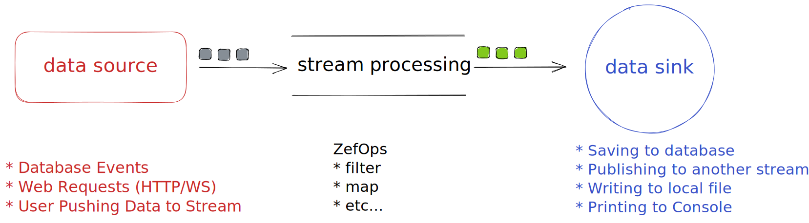

  
Zef offers a built-in streaming capability as a core feature. This allows users to build reactive systems without requiring any additional libraries. In fact, a significant part of the ZefDB is built on top of streams inherently. Users can leverage this streaming capability to react to various events in the database such as the creation, assignment, or removal of entities. The resulting reactive system can be used for a range of applications such as push notifications or real-time data processing.  
  
A data stream consists of three stages: a data producer (source), a processing engine, and a data sink.    
  
In this tutorial, we will explore three different types of data sources for streaming that zef can produce, and learn how to write simple code to react to them.  
  
#### Reacting to Database Events  
Let's say we want to build a reactive system that sends push notifications every time a new movie is created in the database. We can subscribe to the events emitted every time an `ET.Movie` is created using the `on` operator:  
```python  
db | on[Instantiated[ET.Movie]] | subscribe[print]  
```  
  
In Zef, a stream is considered lazy until at least one data sink (or consumer) subscribes to it. The `subscribe` operator essentially activates the stream and triggers it to start producing and emitting data.  
  
Whenever a new movie is created, Zef will emit an `Instantiated` event. Let's create a new movie:  
```python  
new_movie = ET.Movie(title="Hunger Games")  
new_movie | db | run  
```  
  
You should see the following output:  
```console  
Instantiated({'target': <ZefRef #97 ET.Movie slice=2>})  
```  
  
If we want to send a push notification to users, we can do  
```python  
def send_push_notification(event):  
	# do something with the event emitted  
  
db | on[Instantiated[ET.Movie]] | subscribe[send_push_notification]  
```  
  
There are two other graph events that we can subscribe to, `Assigned` and `Terminated`. For example:  
```python  
db | on[Assigned[AET]] | subscribe[print]  
db | on[Terminated[ET.Movie]] | subscribe[print]  
```  
  
`Assigned` event is emitted usually when a value is assigned to a node, and usually it is an Attribute Entitiy (AET). Going back to the same example above, when `new_movie` is created, the emitted `Assigned` event looks like this.  
```console  
Assigned({'target': <ZefRef #127 AET.String slice=2>, 'prev': None, 'current': 'Hunger Games'})  
```  
  
When a movie is removed from the database, the `Terminated` event is emitted:  
```  
Terminated({'target': <ZefRef #302 ET.Movie slice=5>})  
```  
  
  
#### Pushable Streams  
In addition to graph events, Zef also allows us to create pushable streams where we can push messages or data and react to them. It works similarly to creating a "Topic" in Kafka.  
  
To create a pushable stream, we can run the following command:  
```python  
stream =  FX.Stream.CreatePushableStream() | run  
```  
  
After that, we can create a subscription to the stream like this:  
```python  
def do_something(data):  
	print(f"Doing something with {data}")  
	  
stream | subscribe[do_something]  
```  
  
Now, if we have other systems pushing data to this stream, such as data from a HTTP request or a websocket, we can push data to the stream like this:  
  
```python  
"new data" | push[stream] | run  
```  
  
The output console should show the following:  
```console  
Doing something with new data  
```  
  
#### Web Requests as Data Stream  
One can think of web requests as an stream of data. Any incoming requests from a HTTP Server or a Websocket Server can be treated as an event that trigger a series of downstream computation.  
  
```python  
handle = (   
	FX.HTTP.StartServer(  
		port=3000  
	) | run            
)  
```  
The return value of executing the `HTTP.StartServer` side effect is a dictionary that consist of:  
* `server_uuid` - unique identifier of the server   
* `stream`  - A pushable stream where all incoming requests will flow into  
  
Similar to the last example, we can subscribe to the request stream by doing the following:  
```python  
def handle_request(req: Dict) -> FX:  
	# Can do something else  
	# I.E. send push notification  
	  
    return (  
	    FX.HTTP.SendResponse(  
			server_uuid=req["server_uuid"],  
			request_id=req["request_id"],  
			response="Hello World!"  
		)  
	)  
  
handle['stream'] | map[handle_request] | subscribe[run]  
```  
The only difference is, we would need to send a response back to the client within a specified amount of time, or else a timeout will be returned.  
  
#### Recap  
Zef is continuously improving its reactive component and adding more features, such as more advanced stream processing operators and joins. Additionally, the complexity of building distributed streaming process systems will be absorbed by Zefhub.  The goal is to make it easy for users to build streaming and reactive systems.