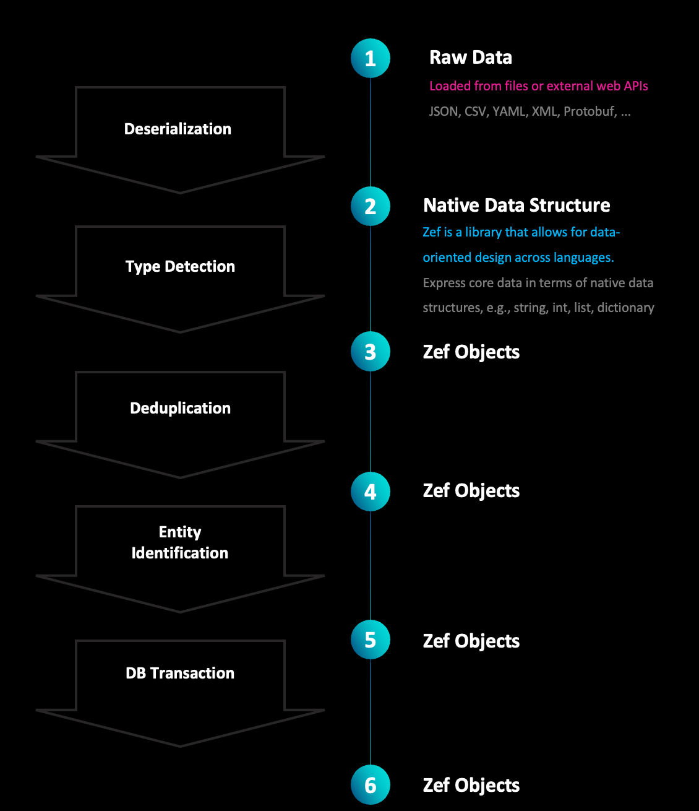

  
  
  
    
### Type Inference    
Suppose we start off with some native Python data. This could come from a REST API, a file, etc.     
```python    
# native_data: Python dicts, lists, strings, ...    
movies_native = [    
    {    
        'title': 'Avatar',    
        'year_of_release': 2009,    
        'director': {    
            'first_name': 'James',    
            'last_name': 'Cameron'    
         }    
    },    
    {    
        'title': 'The Terminator',    
        'year_of_release': 1984,    
        'director': {    
            'first_name': 'James',    
            'last_name': 'Cameron'    
         }    
    }    
]    
```    
    
The various dictionaries in this data correspond to different kinds of entities in our domain model.    
To convert this data into a form with typed objects, we can specify a set of type inference rules declaratively and use the `infer_types` function.    
    
```python    
# Z specifies the position of the subject for which the type should be inferref    
type_inference_rules = [    
    [(Z, "director", Any), ET.Movie],    
    [(ET.Movie, "director", Z), ET.Person],    
]    
    
    
# run the type inference    
objects_1 = infer_types(movies_native, type_inference_rules)    
objects_1  
    
    
# this is the resulting expression    
objects_1b = [    
    ET.Movie['1'](    
        title='Avatar',    
        year_of_release=2009,    
        director=ET.Person['2'](first_name='James', last_name='Cameron'),    
    ),    
    ET.Movie['3'](    
        title='The Terminator',    
        year_of_release=1984,    
        director=ET.Person['4'](first_name='James', last_name='Cameron'),    
    ),    
]     
  
objects_1b == objects_1   # True    
```    
`objects` has the same (tree) structure as the native data, but plain dictionaries are replaced by typed objects when recognized.    
    
    
    
### Deduplication    
It could be that the same logical entity is specified multiple times, such as in the nested tree structure form above. In the example above, there are two objects of type `ET.Person` that correspond to the same person.     
    
Zef provides the `deduplicate` function which makes it easy to     
```python    
# specify a predicate function that takes two objects and decides whether they are the same logical entity    
is_same_person = lambda p1, p2:  p1.first_name == p2.first_name    
    
    
# a declarative set of rules    
deduplication_rules = {    
    ET.Person: is_same_person,    
}    
    
objects_2 = deduplicate(objects_1, deduplication_rules)   
objects_2  
```    
    
    
    
### Entity Identification    
Before we run this step we can create a sample db with one person like so:  
​  
```python    
db = DB()  
[  
ET.Person['p1'](  
    first_name='James',  
    last_name='Cameron',  
)  
] | db | run  
```    
​  
```python    
def find_person_in_db(obj, graph_slice):    
    return (graph_slice    
        | all[    
                ET.Person &    
                (Z | F.first_name == obj.first_name) &    
                (Z | F.last_name == obj.last_name)    
            ]     
          | single         # there should be at most one    
     | discard_frame    
     | collect  
    )                
# if single fails, an exception is raised which signals "not found"    
# alternatively, this function can return "None" if "not found"   
    
id_rules = {    
    ET.Person: find_person_in_db    
}    
    
objects_3 = identify_entities(objects_2, id_rules, now(db))    
```    
    
    
    
### Combined as Pipeline    
```python    
# combine the entire pipeline into one operator    
wrangle_data = (    
   infer_types[type_rules]    
 | deduplicate[deduplication_rules]    
 | identify_entities[id_rules][graph_slice]    
 )    
    
# this can now be applied to data of the expected form    
cleaned_data = wrangle_data(movies_native)    
```    
    
    
### Raw vs Typed and Structured    
With "raw data", we mean not explicitly typed entities.     
    
JSON is not explicitly typed (there are JSONObjects, JSONArrays, JSONNumbers, ...). It is common to include a "type" or "kind" key-value pair into objects, which you could argue makes the objects typed. Yes, this is at the level of a language you are creating and embedding **into** JSON, it is not on the level of the JSON language.    
The data wrangling pipeline described above can be seen as a set of tools to make it easy to translate between these two worlds.    
