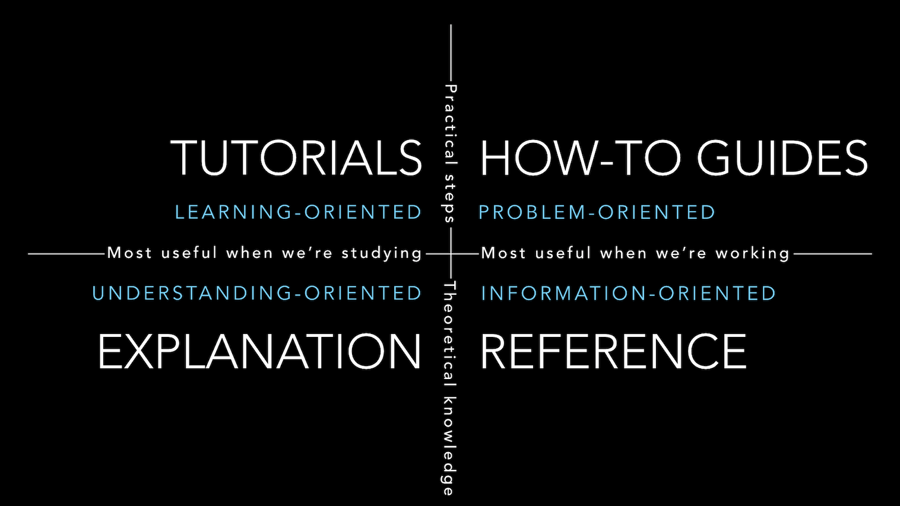

  
  
  
  
This page will give an overview of  
1. "I want to...": point you somewhere quickly  
2. How the documentation is structured  
3. A table of contents giving an aggregated overview of the contents  
  
  
## I want to...  
- have an overview of what Zef is: Introduction to Zef  
- get quick practical overview of working with Zef: Quick Start Quick  
- install Zef: Installation Guide  
- know how to configure something: Configuration Docs  
- FAQs  
  
  
  
## I'm new and want to get a quick overview...  
A good starting point may be the introductory articles.  
(Youtube overview videos coming soon)  
  
  
- ZefDoc - Introduction to Zef  
- [Introduction to ZefDB](introduction-to-zef-db)  
- ZefDoc - Introduction to ZefOps  
  
  
  
## I Need Help With...  
- installing Zef  
- configuring zef  
- connecting to ZefHub  
  
  
  
  
## How the Documentation is Structured  
We follow the structure laid out in [the wonderful guide by Divio](https://documentation.divio.com/).  
Essentially, there are four categories for documentation.  
  
  
source: [Divio](https://documentation.divio.com/)  
  
  
### 1. Tutorials  
Lessons that take the reader by the hand through a series of steps to complete a project. Each is self-contained and these are suitable if you want to get started with concrete examples, but **don't** know what questions to ask yet.  
We plan to make all tutorials available as Jupyter Notebooks as well, to allow you to easily explore.  
  
  
### 2. How-To Guides  
These take you through the steps required to solve a common problem, which you can formulate. They are also based on examples, but are focussed on the problem at hand.  
  
  
### 3. Explanations (Discussions)  
These discuss underlying concepts. More the **why** and **what**, rather than just the **how**. They may also contain examples though.  
  
  
### 4. Reference  
Technical description of the machinery and how to operate it. This aspires to provide an extensive documentation of the API with many of the gory details. A large part of this is auto-generated from the doc-strings in the codebase.  
  
  
  
  
## Feature List  
(this is a work in progress, not all things considered features are listed)  
- Start using ZefDB in a Local-First approach, switch to distributed and automatic persistence any time  
  
  
  
  
