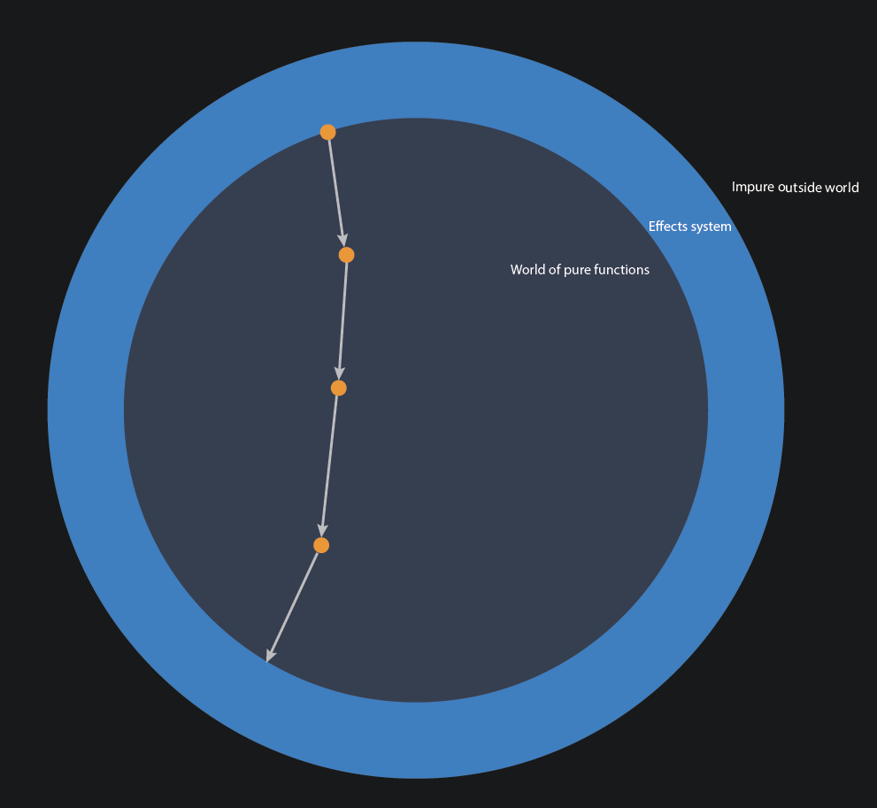

Functional programming and pure functions are very fashionable in recent times and we wholeheartedly agree that most business logic should be written in pure functions where-ever possible. But at the end of the day, not everything can be pure. Some side effects have to happen somewhere that we can interact with our application.

How much time have you spent searching for bugs and asking "how has my program gotten into this state" or "why is this variable this value here?". These problems only get worse as the code base grows.

This is where zefFX (zef's effects system) comes in to help. Its goal is to solve two problems:

- make it as easy as possible for the user to incur side effects and interact with the outside world
- blur the edges between development on a local system and deployment to production
- simplify testing
- improve clarity of the core business logic and simplify debugging
- composability

---

## Executing effects

Let us assume we have a stream of effects that we want to execute (e.g. API requests that were answered in our data pipeline). To actually get the effects system to do something (zefops are lazy), we need to subscribe to the stream.

The function/operator that is passed into `subscribe` is the one that executes side effects and is called `run`. It is worth remembering that it is one of the few builtin operators that is not pure. Doing the dirty work of executing effects in a controlled environment is its only job.

```python
my_effect_stream | subscribe[run]
```

If it operates in this way within the `subscribe`, it also has to work by itself on a single effect in a more imperative style.

```python
run(my_effect)
```

By default, it will execute the effect in the environment of the local Python kernel. We can also declare a different execution context, such as a different process (say a different Python process on the local machine, a different computer connected to zefhub or zefhub itself)

```python
my_effect | run[zefhub]    # tell zef that the effect should be executed on zefhub
```

`run` is the general function we can throw effects at and it will dispatch based on a set of rules. This includes dispatching to user defined effect handlers which we can register with the effect system.

---

## Creating a GraphQL API

```python
my_gql_effect = {
    'effect': 'gql_api',
    'api': z_my_api,
    'port': 6000
}

my_gql_effect | run
```

Suppose you are happy with it and want to deploy it to production via zefhub and bind it to a url. Maybe you also want to use some existing authentication scheme for incoming connections.

```python
{
    'effect': 'gql_api',
    'api': z_my_api,
    'auth': z_my_auth_settings,
    'url': 'zefhub.io/wagggio/dog_news'
} | run[zefhub]             # no "subscribe": single effect executing eagerly
```

A process started on zefhub will outlive our own local kernel. Suppose we come back tomorrow and want to turn off the API: we can simply see all our processes running on zefhub via our zefhub user graph to get hold of the `z_my_process` ZefRef. From this we could then terminate it via

```python
run(terminate[z_my_process])
```

Note that analogous to the case of GraphDeltas, `terminate[z_my_process]` is simply an expression (a lazy zefop). To actually execute it, we need the help of the zefFX system and use `run`.

## Launching a zefUI App from the Backend

```python
my_app_effect = {
    'effect': 'run_zefui',
    'app': z_app_template,
}

my_app_effect | run[dashboard]
```

```python
my_app_effect | run[z_zeyads_process]
```

## Graph Transactions via Effects

Adding and removing RAE tags

```python3
[
    tag[z1]['my tag label']
    remove[tag[z1]['my tag label']],
    tag[z2][allow_steal]['my tag label']
] | transact[g] | run
```

Tagging graphs is different from tagging RAEs within a graph. The latter is visible to all users, whereas adding tags to a graph is within the context of the specific user or a role. Tagging a graph is thus not done via a Graph update (it leads to information being stored outside the context of the graph), but via a separate effect

```python3
Effect({
    'effect': 'tag_graph',
    'tag_name': 'my-favorite-graph',
    'scope': me,            # proposal: "me" equivalent to the own zefhub user ZefRef
})
```

Alternatives for 'scope':

- a zefhub group / role,
- a list of explicit users and or roles
- `public`

#### Tag namespaces:

Proposed shorthand:
g | tag['my-favorite-graph']

## Launching a Websocket Server

```python
# pack the handler for the output of the actual stream that the runtime should connect inside
eff_launch_ws_server = Effect({
    'type': FX.StartWebsocketServer',
    'port': 5000,
    'ip_filter': 'localhost',
    'pipe_into': filter[my_auth] | filter[msgs_i_want] | map[handle_msgs] | subscribe[run]
}) | run[local]
```

## Launching a SocketIO Server

```python
{
    'type': FX.StartSocketIOServer',
    'port': 5000,
    'ip_filter': 'localhost',
    'pipe_into': map[validate] | map[handle_event] | subscribe[run]
} | run
```

## Managing Zefhub User Privileges

The effect system can also be used to manage the privileges of different zefhub user with respect to different graphs (changing someone's permission is a change to the state of the zefhub system).

To inspect the current privileges for a graph

```python
g | privileges         # returns a dictionary
```

is a function that returns a dictionary summarizing the relevant information.
Note that the return value may depend on the user executing the query (a low priority user should not be able to see all permissions of a graph).

If we are only interested in the role of one specific user, we may restrict the query

```python
g | privileges[z_some_user]        # returns a dictionary
```

#### Changing user privileges:

```python
Effect({
    'type': FX.Privileges,
    'type': EN.GraphPrivileges.ViewGraph,
    'graph': g5,
    'user': z_some_user             # ZefRef to z zefhub user
}) | run
```

## Registering Effect Handlers via Effects

## Accessing Running Processes

:::note Note
Processes in this context to not refer to operating system based processes, but persistently running programs within the zefFX system that react to external triggers (e.g. websocket servers graphQL APIs, ...).
:::


