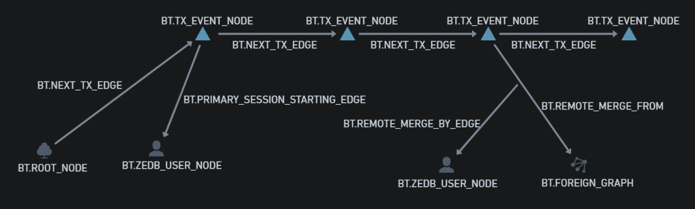

import useBaseUrl from "@docusaurus/useBaseUrl";

The very first transaction is automatically created upon graph instantiation and is rooted to the BT.ROOT_NODE of the graph.

The zefDB user who instantiated the graph can be inferred from the very first transaction.

Any time a zefDB graph is loaded as primary instance in a process, this is considered the **_start of a primary session_**. This this is marked by a `BT.PRIMARY_SESSION_STARTING_EDGE` going from the `BT.TX_EVENT_NODE` node to the `BT.ZEFDB_USER` node.
