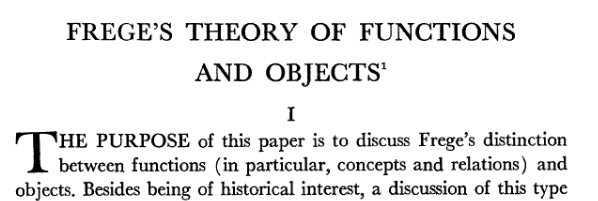
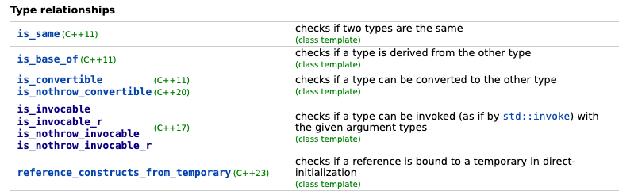

  
### Facts  
These are atomic statements relating two entities.   
Example: `Bertrand was born in Wales`:  
- subject: an entity we refer to as `Bertrand`  
- object: Wales  
- relation `born in`  
  
There are different ways to express facts.  
  
  
### Triples  
One succinct way is in the form of triples  
```python  
(bertrand, country_of_birth, wales)  
```  
By convention this is always expressed in the form  
```  
(subject, relation type, object)  
```  
Using such triples is common:  
- in [RDF](https://en.wikipedia.org/wiki/Resource_Description_Framework) and amongst ontologists  
- Prolog (a logic programming language)  
- [Datalog](https://en.wikipedia.org/wiki/Datalog): a query language and subset of Prolog  
  
  
### Predicate Functions  
In both logic and computer programming, facts can also be encoded inside predicate functions  
```python  
def born_in(sub, obj) -> bool:  
	# do stuff...  
  
assert country_of_birth(bertrand, wales) == True  
```  
Of which type are `sub` and `obj`? That depends on the data structures you choose to represent your domain. They could be  
- uids (e.g. represented as strings)  
- objects with suitable semantics for identity and comparison  
- one of an infinite number of other choices...  
  
Suppose you built out a system which can represent all entities you're dealing with in your domain. Your role would be to implement one function of the above type for each possible relation type (a finite number) with the following property:  
- it returns `True` if you consider the fact to be true in the real world and false otherwise.  
- It can take all possible `objects` / entities as one of the two arguments.  
  
Historical remark: this was in fact how Gottlob Frege, the founding father of modern logic (following Bool) thought about facts.  
  
[source](https://www.jstor.org/stable/2182877)  
  
This concept of encoding relations as functions is also well known to C++ meta-programmers  
  
  
from [cppreference](https://en.cppreference.com/w/cpp/meta)  
  
  
  
### Information Equivalence  
Suppose you implemented the predicate functions for all relation types in your domain. You could, in principle,  
```python  
ents  # list of all entities  
  
facts = {  
 (e1, RT.CountryOfBirth, e2)   
 for e1 in ents for e2 in ents  
 if country_of_birth(e1,e2)  
}  
```  
calculate the set of all facts (restricted to countries of birth here, but easily extendible) and have the same information content expressed in plain data: as a set of facts.  
  
  
  
### Objects / Dictionaries  
Let's look at the following sentence  
```  
Bertrand was born in Wales in the year 1872.  
```  
There are actually two facts in here  
- `(bertrand, country_of_birth, wales)`  
- `(bertrand, year_of_birth, 1872)`  
  
In human language we often `compress` this in language to not repeat ourselves unnecessarily: the subject is "factored out" and implicitly applies to both facts.  
The same technique is often applied in programming: when using dictionaries or defining objects.  
```python  
bertrand = Person(  
	country_of_birth=wales, #'wales' is also an entity / object  
	year_of_birth=1872  
)  
```  
  
The subject is also "factored out" and becomes the (typed) container object.  
- relation types are equivalent to field names  
- the objects (targets attached to the relation) become field values  
  
The same information could be expressed as a list of two facts  
```python  
[  
 (bertrand, country_of_birth, wales),  
 (bertrand, year_of_birth, 1872),  
]  
```  
  
difference:  
- triples notation: the subject is part of the triple, it is the first element  
- object notation: the subject identifier is to the left of the assignment operator  
  
To see the various things a triple can mean in Zef, see ZefDoc - The Various Meanings of Triples.  
  
  
  
  
### Related Topics  
- ZefDoc - The Various Meanings of Triples  
  
  
### Further Reading  
- [On Denoting](https://www.uvm.edu/~lderosse/courses/lang/Russell(1905).pdf) by Bertrand Russel  
   
  
  
