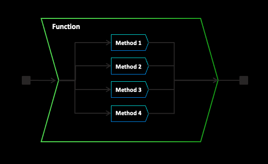
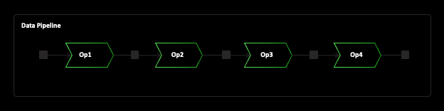

  
  
To start off simply: Both functions and methods are values. They can be understood from their content hash.  
```python  
my_func = lambda x: x*x + 5  
```  
  
- the function itself does not know or care about its name (any more than a tuple or dict which you assign to a variable in Python cares about its name)  
- if anyone else were to write the same function body, you would both agree that it is "the same thing". Even if they gave it a different name  
  
```python  
my_hash_val = zef_hash('lambda x: x*x + 5')  
```  
Suppose `zef_hash` is cryptographic: the hash value itself can be considered to fully describe the function (an identifier / name for its value).  
  
### What about dependencies?  
Suppose you define a function that depends on things from your environment. That could be  
- values defined in some outer scope (outer functions scope, global scope)  
- other functions defined outside. We can also seen them as values and they fall under the previous point. They could also be defined in some external library.  
- some stateful object that cannot be serialized: e.g. an http server: These are not allowed to be accessed in zef functions (which should be pure and deal with side effects in a managed way, i.e. using ZefFX). We don't allow this nastiness in our pure world for now and will deal with this at length later.  
  
Whatever your function depends on, the dependency is made **explicit** in Zef. That does not mean you need to worry about doing this work - Zef will do the heavy lifting. The take-away is: at definition time you can think of Zef detecting all these dependencies in the environment and putting them into an explicit dictionary. It pins down the value of them at definition time (lexical closure). This dictionary is itself a value that can be sent over the wire, stored, etc.  
  
  
  
### What are Zef Functions?  
  
A Zef function is a container object, which groups semantically similar behavior (structural vs ad-hoc polymorphism). If you think of chaining of operators as sequential composition (one applied after the other), you can think of Zef Functions as "parallel composition with a dispatch mechanism": based on the input value, it will be dispatched to the first method that matches on the specified input types.  
  
You can think of overloads and the dispatch mechanism to have exactly the same behavior as the pattern matching operator  
```python  
match[  
	Int: my_method_int,  
	Float: my_method_float,  
	...  
]  
```  
  
Note: if the types on the left are not mutually exclusive, the order of definitions may play a role!  
If you prefer a more declarative definition where this is not the case, you can always orthogonalize them by iteratively redefining the type in a given line by subtracting all types above. In practice, this is often less readable though. The transformation is mechanical and they both represent the same function.  
  
  
  
### How do I use a Zef Function?  
  
For actual usage, it is always wrapped inside a ZefOp. The ZefOp is the thing you work with in your everyday code when you make use of existing functions. If you define a single function (not chained), it just happens to be a ZefOp with exactly one internal function. This is like the correspondence between a character and a string in Python: a character is also just a string, it just the special case of a string with length 1.  
  
  
  
  
### How are Methods Defined?  
A method implementation is one of the core building blocks of programs in Zef.  
If you were to think about defining a method as data, you could think of making it a dictionary / class / struct with the following fields:  
  
- body: the core part that defines the computation to be performed. By default this is saved as a string, but you could also save it in more granular form (e.g. its AST)  
- signature:   
	- the types of the input values  
	- type of output value  
- environment: everything it depends on  
	- other Zef functions and ZefOps  
	- any regular values closed over  
	- external libraries and their version  
- declaration of required abilities. If a method is impure (we may call these something completely different altogether, e.g. "procedure"). e.g. "this method may write to the local file system"  
- more advanced options: e.g. precompute step executed at compilation time  
  
```python  
{  
 'body': 'x = 2*x1 ...',  
 'input_args': OrderedDict(x),  
 'return_type': Int,  
 'environment': {  
	 'x': 42,  
	 'f1': ZefOp('🔒7483758475893454325342'),  
 }  
}  
```  
  
  
  
### Methods are not Unique  
The same logical method can have many concrete implementations by this definition.  
Suppose you were to add irrelevant whitespace to the function body. This would change the content hash of the method implementation, but lead to exactly the same behavior.  
This is okay, we just need to keep this many-to-one behavior in mind.  
One thing we can say for sure is that if the content hashes agree, it will uniquely define the logical function: if the hashes agree the logical function will definitely be the same.  
  
  
### Overloads are not Unique  
A similar concept applies to the function overload definition.  
We'll use the match operator for simplicity, which has the same behavior as function dispatch  
```python  
match[  
	Int & (Z>=10): my_method_int,  
	Int & (Z<10): my_method_int,  
]  
  
# equivalent to  
match[  
	Int: my_method_int,  
]  
```  
  
There is a huge number of rearrangement which lead to the identical function. As a rule of thumb, you should choose to structure your functions in a way that is most readable and matches your mental image of the domain as closely as possible.  
  
  
### Extreme Granularity  
One other representation that stands out is the extreme form where each type on the left corresponds to exactly one value: each type on the left contain exactly one concrete value  
```python  
match[  
			Z == 1: lambda x: x*x,  
			Z == 2: lambda x: x*x,  
			Z == 3: lambda x: x*x,  
			...  
]  
```  
  
In this case you could always perform the evaluation of each function head of time and simplify the body  
```python  
match[  
			Z == 1: lambda x: 1,  
			Z == 2: lambda x: 4,  
			Z == 3: lambda x: 9,  
			...  
]  
```  
  
which is of course equivalent to a dictionary lookup (or a caching of the entire function)  
```python  
def f(x):  
	return {  
		1: 1,  
		2: 4,  
		3: 9,  
		...  
	}[x]  
```  
  
In this sense, the predicate dispatch mechanism can be seen to allow you to gradually switch between   
- a big monolithic implementation of a function (with e.g. if-else statements inside)  
- a more readable form with segmentation along "natural" semantic and structural boundaries  
- a fully granular form corresponding to a hash map lookup  
  
  
  
# Representing Methods, Functions and ZefOps  
Composition is simpler than decomposition. As on other fronts with aggregate values, we start with the small building blocks and move up the chain by composing values.  
- Methods  
- Functions   
- ZefOps  
  
  
  
### Choosing the "Right Type"  
Which data structure should we use to define this types?  
- Dicts  
- Define a custom type as a thin wrapper around a dictionary  
- Entity  
  
  
### Exploring the Implications of choosing Entities  
- without assigning uids: behaves like a typical product type  
- storing in a DB / FlatGraph as a value (no uid): structural sharing  
- in a DB: assigning identity and   
  
  
  
  
