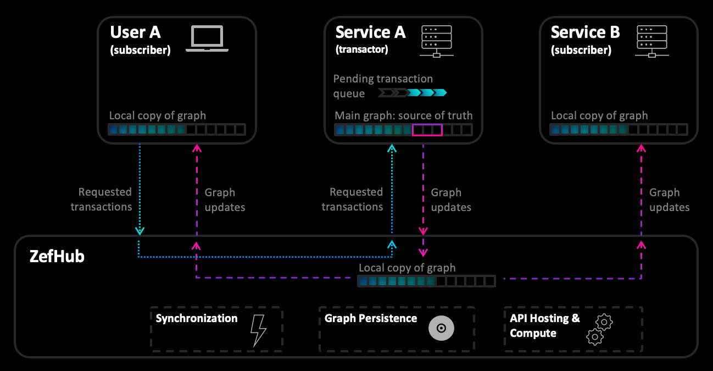

  
  
  
### Single Transactor  
At any point in time, there may be at most one transactor for a given ZefDB graph.  
  
  
### Strong Consistency  
The transactor runs on a single thread and is in charge of committing transactions. Only once the data is written and verified, does a transaction close. This ensures that the transactions are [linearizable](https://en.wikipedia.org/wiki/Linearizability), i.e. have a well defined order.  
  
  
### Intra-Process Access  
Other threads running in the same process can only "see" a new transaction once it is closed. The core ZefDB graph data structure is designed such that this process is   
1. automatically thread-safe  
2. lock-free and [non-blocking](https://pvk.ca/Blog/2021/06/07/entomological-solutions/) (no locks are ever required to achieve consistent reads)  
3. reads in any GraphSlice are permissionless: it is safe to continue reading data while the transactor appends new data. This also requires no locks  
  
  
### Access Across a Network  
Once a transaction is closed / committed, it is ready to be sent out. This only occurs if the graph is in `sync`  mode. The validation, coordination and distribution is performed by ZefHub.  
Once the data arrives and has been validated (hashes compared for written data) on a foreign node, the new GraphSlices also become visible in a non-transacting process. Reads in existing GraphSlices also remain unaffected and permissionless.  
  
  
### Same Node, Different Process  
**Upcoming feature:**  
The same physical memory can be mapped into multiple processes by Zef. This allows for the following: Suppose you have a large graph which you want to process in parallel using multiple Python processes. The memory required by the loaded part of the graph will only be used once, instead of once per process.  
  
  
  
### References & Related Material  
- [ZefDoc - ZefDB Transactions](zef-db-transactions)  
