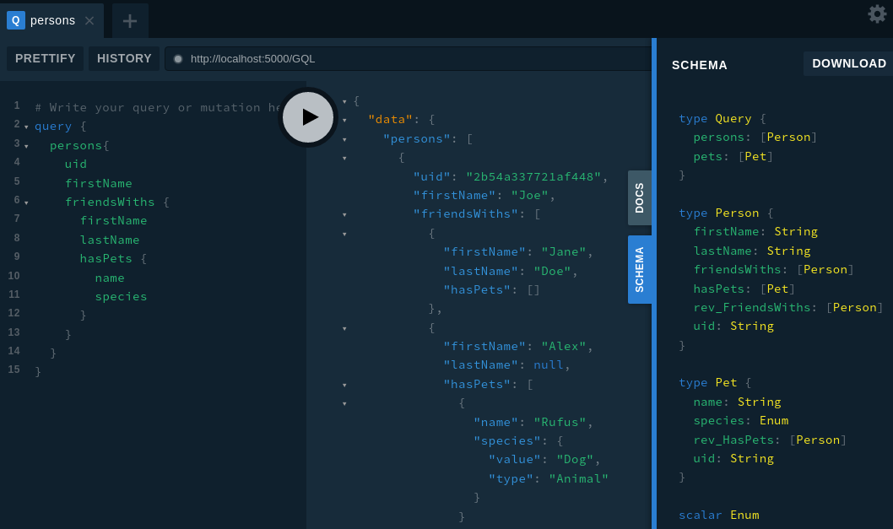

ZefDB provides some convenient tools to expose a graph as a GraphQL endpoint.
The correspondence between entities and relations on a zef graph is closely
related to the layout of a GraphQL schema, although there are differences (see x
for a more detailed discussion).

ZefDB uses the package `ariadne` (https://ariadnegraphql.org/) to serve GQL
requests.

The [sample graph](#sample) used for the data in the examples on this page is at
the bottom of this page.

### Automatic creation of GQL schema representation
A GQL server and client communicate via prior agreement using a GQL schema. In
Zef we can create a representation of this schema on the graph, alongside the
"normal" schema of the graph. This can be done via a generation function:

```py
# ...
# Load or create a graph `g` before these commands.
# ...
from zef.gql.auto import auto_generate_gql
gd = auto_generate_gql(g)
r = gd | g | run
gql_schema = r["schema_root"]
```
```
<ZefRef #693 ET.GQL_Schema ts=3>
```

The automatic generation returns a `GraphDelta` which can be applied to the
graph or inspected/modified beforehand. The GQL schema representation is rooted
at a `ET.GQL_Schema` entity which is labelled `"s"` in the `GraphDelta`.

:::caution

The GraphQL schema itself can exist on the same graph as the rest of the data.
Once this occurs, it is "part of" the complete schema of the graph, i.e. the
delegate structure. If you would like to decouple these schemas, you can
transact the `GraphDelta` onto a fresh blank graph instead. However, this also
requires some custom logic discussed in the section below on manually creating a
GQL schema.

:::

### Launching a GraphQL API Server

Serving up a GQL server with this representation is easy through the zefFX
system:

```python
graphql_r = Effect({
    'type': FX.GraphQL.StartServer,
    'schema_root': gql_schema,
    'port': 5000,
    'playground_path': "/",
}) | run
```

```
[debug    ] http_server started            port=5000 uuid=UUID('74e8b626-9e8c-474d-9bc0-73fbfb368c9d')
[info     ] Started GQL server at http://localhost:5000/GQL
[info     ] Playground available at http://localhost:5000/
```

This starts a HTTP server on the specified port using a separate thread.

By providing the key `playground_path`, the server will also serve up the
GraphQL Playground viewer (https://github.com/graphql/graphql-playground) to
explore the GraphQL API, and open it automatically in a browser window. An
example screenshot from the playground is shown below.



### Terminating a running process

The server will automatically shutdown on end of the python process. However, to
stop it earlier, the `FX.GraphQL.StopServer` can be used.

```python
Effect({
    'type': FX.GraphQL.StopServer,
    'server_uuid': graphql_r['server_uuid'],
}) | run
```

```
[debug    ] http server stopped            uuid=UUID('74e8b626-9e8c-474d-9bc0-73fbfb368c9d')
```


## Sample graph used in the examples {#sample}

The sample graph used in the examples above can be created with the code below:

```py
g = Graph()
[
    (ET.Person["joe"], RT.FirstName, "Joe"),
    (Z["joe"], RT.LastName, "Bloggs"),
    (Z["joe"], RT.DOB, Time("1991-01-01")),

    (ET.Person["jane"], RT.FirstName, "Jane"),
    (Z["jane"], RT.LastName, "Doe"),
    (Z["jane"], RT.DOB, Time("1992-02-02")),

    (ET.Person["alex"], RT.FirstName, "Alex"),

    (Z["joe"], RT.FriendsWith, Z["jane"]),
    (Z["joe"], RT.FriendsWith, Z["alex"]),

    (Z["joe"], RT.HasPet, Z["rufus"]),
    (Z["jane"], RT.HasPet, Z["rufus"]),

    ET.Pet["rufus"],
    (Z["rufus"], RT.Name, "Rufus"),
    (Z["rufus"], RT.Species, EN.Animal.Dog),
] | transact[g] | run
```