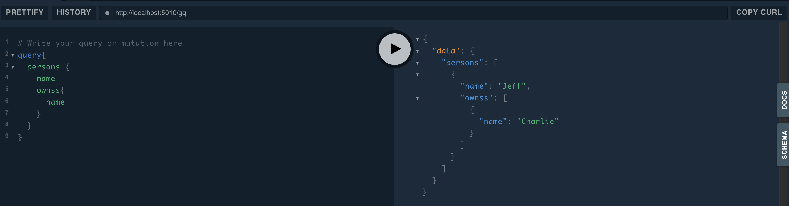

## Prepare a Graph

Creates a graph and instantiates something
```python
from zef import *
from zef.gql import *
from zef.ops import *

g = Graph()
[
        (ET.Person["p1"], RT.Owns, ET.Dog["d1"]),
        (Z["p1"], RT.Name, "Jeff"),
        (Z["d1"], RT.Name, "Charlie"),
] | transact[g] | run
```


## Autogenerate a GraphQL Schema
We can easily autogenerate a GQL schema from the graph's data structure:
```python
actions = auto_generate_gql(g) # this generates a set of actions for a transaction
my_schema = actions | transact[g] | run | get['schema_root'] | collect
```
Now we have a GQL schema defined on the graph g.

## Explore with the GQL Playground

```python
Effect({
        "type": FX.GraphQL.StartPlayground,
        "schema_root": my_schema,
        "port": 5005,
}) | run 
```
Running the effect starts a Playground server in the background on the user's machine and starts a browser.



## Launch Server
```python
Effect({
        "type": FX.GraphQL.StartServer,
        "schema_root": my_schema,
        "path": '/my-api',
        "port": 6000,
}) | run 
```
Now a server is running in the background and can be queried at `localhost:6000/my-api`


---
Related:
- [Customizing and designing a schema](graphql-manual).
- For creating and hosting a GraphQL server directly from a
  `.graphql` schema file, see [SimpleGQL](graphql-simplegql).
- Ref to Explanations.GraphQL


