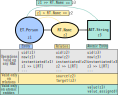

## Starting Traversals

To start a graph traversal, one needs an entry point

1. listing all nodes of a specific type (similar to a full table scan)
2. from a tag (both nodes and relations can be tagged)
3. we already have a concrete reference (ZefRef or EZefRef) to a node or relation on the graph and can traverse from there

## 1. Listing All Instances of a Type

```python
gs = g | now                                            # get the latest graph slice

gs | all                                                # lists all instances that exist in this graph slice
gs | all[ET]                                            # list all entities that exist in this graph slice (RT/AET also valid)
gs | all[ET.Person]                                     # returns a LazyValue[List[ZefRef]]
gs | all[AET.Float]                                     # all atomic entities of type Float
gs | all[RT.FirstName]                                  # relations have types too. A ZefRef can also refer to a relation
gs | all[(ET.Person, RT.FirstName, AET.String)]         # more specific: source/target type can also be included
```

All the examples return lists of instances in lazy form which exist in the graph slice `gs`.

Analogous operations can be done on the eternal graph: This will answer the question "show all instances that ever existed at any time".

```python
g | all
g | all[ET]
g | all[ET.Person]
...
```

## 2. Entering via a Tag

```python
z_dog = gs['my favorite dog']                           # any string can be used as a tag within the context of a graph slice
```

# Traversing



```python
first_names = all_persons | Out[RT.FirstName] | value       # this is still lazy
```

z | has_out[RT.Foo]
relation(z1, RT.Foo, z2)
relations
has_relation(z1, RT.Foo, z2)

gs | contains[(z, RT.Foo, _any)]
(z, RT.Foo, \_any) | contained_in[gs]

z | out_rels[RT.Name]
z | out_rels[RT]
z | in_rels[RT]

image

> > <<
>
> > L[...]

source
target

```python
(gs
  | all[ET.Person]
  | filter[lambda z: z | Out[RT.FirstName] == 'Yolandi']
  | single                                              # there can only one (otherwise single will fail)
  | collect                                             # trigger evaluation
)
```

````python
```python
```python
```python
```python
```python
```python
```python


## structure
---

Normal traversal
```python
z1 | outs
z1 | ins
z1 | Outs[RT.FriendOf]
z1 | out_rels[RT.FriendOf]
z_rel = z1 | out_rel[RT.FriendOf]
z_rel | target
z_rel | source
...
````

Time travel

```python
z1 | to_frame[g | now]

z1 | time_travel[-2]        # moves the reference frame: go back two slices
z1 | time_travel[+5]
z_tx | time_travel[-2]      # if z_tx is a ZefRef, it also only moves the reference frame, even if z_tx points to a TX

z1 | time_travel[Time('2021 December 4 15:31:00 (+0100)')]


# z1 | exists[my_graph_slice]
z_zr | contained_in[my_graph_slice]
z_ezr | contained_in[g]
```

Given a RAE, look at all events in its past:

```python
z_ae | instantiated                     # when was the AET instantiated
z_ae | value_assigned                   # a List[ZefRef[TX]]  when values were assigned
z_ae | terminated
```

Given a TX, explore what happened there

```python
my_tx | instantiated                        # show all instantiated RAEs
my_tx | terminated
my_tx | value_assigned
my_tx | merged
my_tx | affected

```

given a ZefRef / EZefRef pointing to a TX, get the graph slice / state following this TX

```python
z_tx_zr | to_graph_slice           # ZefRef  -> GraphSlice,     discards reference frame, returns a GraphSlice
z_tx_ezr | to_graph_slice          # EZefRef -> GraphSlice      returns a GraphSlice
```

Conversely, given a graph slice, get the TX that precedes it.

```python
my_graph_slice | to_tx     # => ZefRef[TX]
```

The reference frame is also that of the GraphSlice.

## Temporal Traversals

Relative traversals: there are

```python

z_zr | time_travel[-2]                  # move the reference frame back 2 time slices, keep pointing at the same object
z_zr | time_travel[-3*units.hours]      # go back 2 time slices

my_graph_slice | time_travel[+3]        # it can also be used on graph slices directly
```

Absolute traversals: the 'now' operator is the bridge between modeled time and execution time. It takes one to the point in time of execution, i.e. it cannot be used inside any pure function.

```python
now()                                   # -> Time.              returns current time (of type Time)
g | now                                 # Graph -> GraphSlice
gs | now                                # GraphSlice -> GraphSlice
z_zr_my_entity | now                    # ZefRef -> ZefRef:     fast forward to very latest reference frame at time of execution
z_ezr_my_entity | now                   # EZefRef -> ZefRef:    fast forward to very latest reference frame at time of execution
```

---

<!---
There are three ways 

## Tags / UIDs
if you know the exact entity that you want to go to on a graph, either from its uid or from a tag you gave it (e.g. `my_tag`), you an immediately jump there
```python
g | get['my_tag']           # just another zefop that can be chained
g['my_tag']                 # normal index notation
```
In this sense, ZefDB graphs act very much like dictionaries.


## Listing all RAEs of a given type

```python
gs | All[ET.Person]         # gs is of type "GraphSlice", i.e. the state at a fixed time
```
The query above will return a list of ZefRef (pinned to the reference frame of the graph slice queried). By default, this list will be ordered according to their instantiation time. Note that in contrast to most other databases, the query above is a pure function: if you were to ever run it again in the future, it is guaranteed to return the same result, since the reference frame ("as of query") is baked into `gs` and every state of the graph will remain accessible.

If you are familiar with relational databases, this analogous to selecting all rows in the "Persons" table. We see that the choice of tables to model a domain with a relational DB schema maps onto the zef type system.

The above query returns all entities that exist in a given time slice (i.e. the ones instantiated prior, but terminated prior to the reference frame of `gs`). We could also want to ask a different question though: return a list of `ET.Person` that have ever existed on the graph up to the point of performing the query:
```python
g | All[ET.Person]           # g is the eternal graph, i.e. of type "Graph"
```
This will return a `List[EZefRef]` with no reference frame baked in.

When running this query again in the future, a different list may be returned (i.e. it is not a pure function). It will definitely contain all ET.Person it contained in the current result, but it may contain new entities as well.

:::info Why is `All` capitalized?
In contrast to all other zefops, `All`, `Any`, `And`, `Or`, `Not` are capitalized to not clash with the python builtin keywords and functions.
:::


```python
animals_i_like = Or[is_a[ET.Dog]][is_a[ET.Cat]]
gs | All[animals_i_like] 
```


## Traversing the Graph Structure

Suppose we are on a given RAE or set of RAEs of our graph at some fixed time, i.e. we have a `z1: ZefRef` (this can also be extended to `List[ZefRef]` and higher orders).

One thing we may want to do is to traverse the graph from there. Just like Entities and AtomicEntities, every instance of a relation has a concrete relation type (RT).

```python
z1 >> RT.Name       # move along the single, unique edge "RT.Name" to the target RAE.
```

In ZefDB, vertices and relations are treated on equal footing: we can have ZefRefs to both.
:::info ZefDB Graphs are not Really Graphs
They are Meta-Graphs. (not to be confused with the rebranding of the Facebook social graph)

We learned this naming from a paper by Ben Goertzel https://arxiv.org/abs/2012.01759.
What are Meta-Graphs? Relations themselves can have incoming and outgoing relations (these are distinct from the source/target).
Why did we not just stick to Graphs? Our in-house graph database that preceded ZefDB (and was designed as a more performant version of NetworkX) was built on property graphs. Both nodes and edges can have properties attached: dictionaries in our case.
Since ZefDB graphs are maximally flat (avoid unnecessary nested/internal structure that is ontologically ambiguous), we needed a way to represent fields/attributes on edges. Although disputed at first, we never regretted this choice. It is an extremely useful structure to have in representing ontologies and removes the ambiguity of whether a given attribute should be an internal field of the edge/node or is justified.
:::

Since relations are also first class citizens on graphs, we can also provide a richer syntax for the traversal:
```python
z1 > RT.Name       # only move onto the edge (a single step)
```
:::info Analogy to fields on objects / structs:
Note that `my_zefref >> RT.MyFieldName` is often analogous to `my_struct.my_field`. 
:::


## Pattern Matching ❤️ Graphs

Pattern matching is a power approach to get to the data that one wants quickly and declaratively. 
In essence it is the answer to the following question: given a pattern `p` and a concrete data structure `d`, find all instances contained in `d` that fulfill `p`.

SQL queries can be understood in the context of pattern matching, as can be the new structural pattern matching statement introduced in Python 3.10.

We can also recognize the basic query `gs | All[ET.Person]` as a pattern matching problem: return all RAEs in the graph slice `now(g)` that fulfill the following pattern: They are of type `ET.Person`.

Clearly we can extend this concept. Suppose we are looking for all relations of type `RT.Name` that have a `ET.Person` as a source and an `AET.String` as a target: in Zef we represent this in plain data as a (semantic) triple
```python
gs | All[(ET.Person, RT.Name, AET.String)]         # returns a List[ZefRef]
```

```python
```


## Questions of Existence
```python
(z1, RT.FriendOf, z2) | exists              # returns a Boolean
```
This returns True if there is one ore more relation instance of type `RT.FriendOf` between the two specific entities `z1` and `z2`. If `z1` and `z2` are ZefRefs and no graph slice is provided to the `exists` zefop, they MUST have the same reference frame for the question to be unambiguous.

Suppose we are interested in whether exactly one such relation exists
```python
(z1, RT.FriendOf, z2) | exists[single]      # returns True iff one such relation exists
```


```python
```

--->
