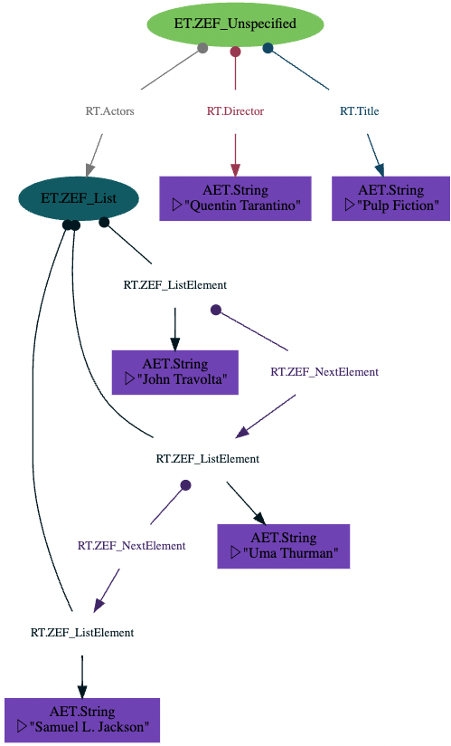
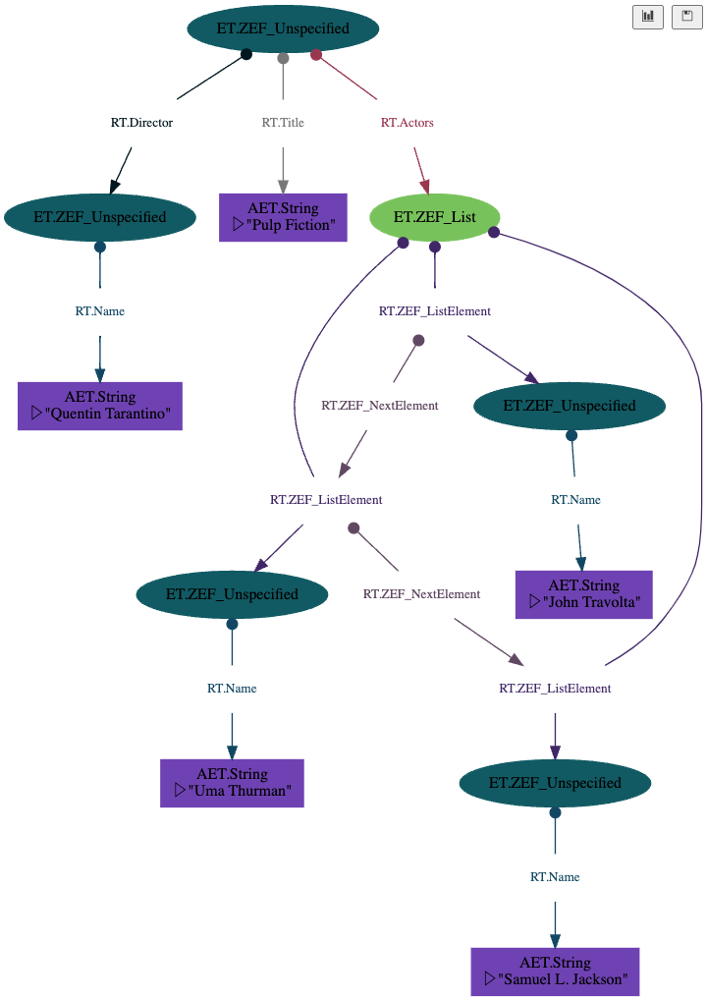
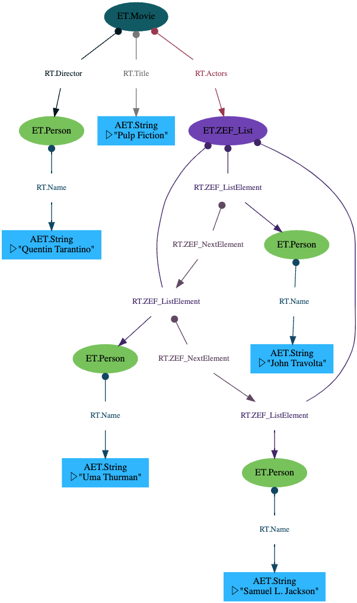

- **Tutorial Level**: Easy  
- **Prerequisites**: piping syntax  
  
In this tutorial we will explore some ways to get plain Python data structures imported to a graph.  
  
One of the highly convenient features that Python brings along is its excellent library of basic data types that can be mixed and matched with container types like lists and dictionaries.  
  
Let us look at an example of building a Netflix clone. Starting off small, we may want to begin thinking about movies as the first entity type we want to add to our system.  
  
```python  
  
movie_v1 = {  
    'title': 'Pulp Fiction',  
    'director': 'Quentin Tarantino',  
    'actors': ['John Travolta', 'Uma Thurman', 'Samuel L. Jackson'],  
}   
  
movie_v1 | to_flatgraph | graphviz | collect  
```  
  
Output:  
  
  
But wait, the actors and directors should be first class entities on our graphs. Not strings.  
Lesson: determine the language of your domain. You should consider making any significant "thing" that you can talk about as a concrete instance in the world an entity itself. Each actor is an entity on the graph and their names are attributes. The actors name is not the same as the actor entity in a good domain model.   
  
Side note: If you're familiar with the relational model, you may notice that this distinction is analogous to denormalizing your data to third normal form (or higher). Okay, so how can we conveniently make them entities? We can change that directly at the level of the input dictionary. Every entity on a graph corresponds to a dictionary in data oriented design (or "objects" in OO).  
  
```python  
movie_v2 = {  
    'title': 'Pulp Fiction',  
    'director': {'name': 'Quentin Tarantino'},  
    'actors': [  
        {'name': 'John Travolta'},  
        {'name': 'Uma Thurman'},  
        {'name': 'Samuel L. Jackson'},          
        ],  
}   
  
# Let's look at the graph of this new version of the movie.  
movie_v2 | to_flatgraph | graphviz | collect  
```  
  
  
Output:  
  
  
  
The actors each are separate entities now, but of type 'ZEF_Unspecified'. There's no way for the "to_flatgraph" operator to know what type of entity they are.  
  
We can give it a hint though. If we specify a key-value pair for the key '_type' with the value 'actor', then the operator will know that this is an actor.  
  
```python  
movie_v3 = {  
    '_type': 'Movie',  
    'title': 'Pulp Fiction',  
    'director': {'_type': 'Person', 'name': 'Quentin Tarantino'},  
    'actors': [  
            {'_type': 'Person', 'name': 'John Travolta'},  
            {'_type': 'Person', 'name': 'Uma Thurman'},  
            {'_type': 'Person', 'name': 'Samuel L. Jackson'},          
        ],  
}   
movie_v3 | to_flatgraph | graphviz | collect  
```  
  
  
TODO:  in python we can specify a set. In this case don't insert a Zef_List, but the same relation directly  
TODO: change **to_flatgraph**  
```python  
movie_v3 = {  
    '_type': 'Movie',  
    'title': 'Pulp Fiction',  
    'director': {'_type': 'Person', 'name': 'Quentin Tarantino'},  
    'actors': {  
            {'_type': 'Person', 'name': 'John Travolta'},  
            {'_type': 'Person', 'name': 'Uma Thurman'},  
            {'_type': 'Person', 'name': 'Samuel L. Jackson'},          
        },  
}   
movie_v3 | to_flatgraph | graphviz | collect  
```  
  
  
Output:  
  
  
Much better. Now all the types are correct. But the graph looks a little noisy. The actors were specified as a list, but in this case the order is actually of no significance. JSON does not support sets. We also can't use a set in Python with native Python dictionaries, since these are not hashable.  
  
There are three approaches:  
1. specify via meta-information that the list is supposed to be understood as a dictionary.  
2. Use Zef Dicts (these are hashable values) as the constructors inside a set.  
3. Clean up the structure in a further processing step after the construction of the initial FlatGraph.  
  
  
  
  
>[!note]  
> It is useful to distinguish between lists and sets, also for representing data on a graph.   
> Choose lists if the order is important: these are converted to Zef Lists where the order is represented by helper relations on the graph.  
> Choose sets if the order is not important. The simplest corresponding structure on a graph is a one-to-many relation, i.e. the same type of relation going out of the parent multiple times.  
  
>[!warning]   
>It is not generally possible to use the set notation when the children themselves are entities (dictionaries). This is due to a limitation in Python: dictionaries are mutable, i.e. not hashable and therefore cannot be used as members in Python sets. We cannot tackle this problem in Zef, since the expression is invalid before Zef can access it.  
>  
>If you want to use one-to-many relations and sets, you can simply use the object API to import data to graphs.  
  
  
  
  
### Graph Pattern Matching  
Ideas for syntax:  
```python  
[  
 (Any, RT['r1'], ET.ZefList['zl']),  
 (z['zl'], RT.ZEF_ListElement['rl'], ET.Person['p']),   
]  
  
# not everything needs to be present in the returned dictionary  
  
```  
  
What is the signature of the `replace` function to perform substitution?  
It takes  
- rules:  
	- matching pattern  
	- transform function  
- the input FlatGraph  
  
  
###### Transform Function  
Signature:  
- input: dict of the matched atom instances  
- return value: list of graph commands  
  
```python  
[  
	terminate[my_flatref_1],  
	terminate[my_ref],  
	assign[my_flatref_2][42],  
	ET.Foo,                     # instantiate  
	tag[z5]['my favorite'],  
]  
```  
  
Stages for `replace`:  
1. All patterns are matched and the transform function called for each match  
2. the return commands from all transform functions is combined and checked for any conflicting actions  
3. if there are none, a new FlatGraph is constructed by applying the actions to the input FlatGraph  
  
  
