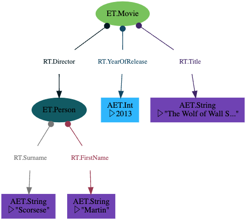
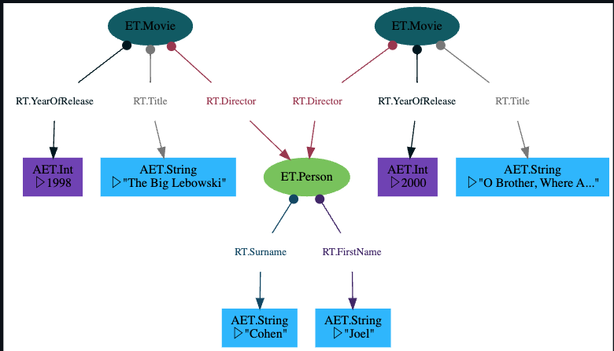
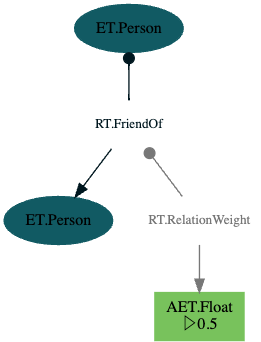

  
This introduction to ZefDB graphs is aimed at newcomers. By the end you will have a basic overview of   
- creating a graph  
- the various ways of writing data to graphs  
- how transactions work  
  
We assume that you have  
- installed Zef  
- a basic understanding of how information is represented on graphs  
  
  
## Importing Zef  
For demonstration purposes, we will assume in all the following code snippets that all relevant types have been imported.   
```python  
from zef import Graph, ET, RT, AET  
from zef.ops import map, run, transact  
```  
But there are more as we go along. As usual in production use, you may want to extend this list incrementally.  
For demonstration purposes, we often use  
```python  
from zef import *  
from zef.ops import *  
```  
  
The main data structures, types and utilities live in the namespace `zef`, whereas the core builtin operators live in `zef.ops`.  
  
  
  
## Creating a Graph 🌱  
Compared to most other databases, creating a ZefDB graph is rather easy and "cheap". It takes in the millisecond range and feels more like creating a new dictionary  
```python  
g = Graph()  
```  
This is it for setting up a new "database". You don't have to run it in a separate process, you don't communicate with it via messages in its own query language. You can operate it directly using Python syntax.  
  
Without further parameters, our new graph `g` is not persisted. If it goes out of scope, it will be destroyed like any other Python object.   
If at any time you feel that you want to persist a graph or share it with others, one can sync it with ZefHub:  
```python  
run(sync(g, True))      # run is used to execute the effect  
  
# or the same thing using piping syntax  
(g   
 | sync[True]    # returns an effect (pure data: a dict)  
 | run           # execute the effect  
)  
```  
  
If you know that you want to persist a graph from the very start, this can also be specified using  
```python  
g = Graph(sync=True)  
```  
  
  
## Exploring our Graph 🔍  
Every graph has a UID which can never be changed:  
```python  
uid(g)        # the repr shows "BaseUID("68a6042e96de937e")"  
```  
  
Compared to many other data structures we often work with in Python, ZefDB graphs often become fairly large. Therefore printing the entire content our within a `repr` function is not a good idea and we want different ways to explore the content of a graph instance.  
1. using the `yo` op that Zef provides. This is a "casual" operator in Zef that you can call in any context to give you a quick overview of any data structure, operator, type, etc. For graphs you can simply call it as `yo(g)` (or pipe it)  
2. exploring the blueprint of a graph: what is the structure of the data without listing all instances  
3. using the wonderful GraphViz library (more later)  
4. using queries (more later)  
  
  
## Loading an Existing Graph 🌍  
Suppose we created a graph with data yesterday and now want to continue working on it. We may have closed yesterday's Python session or we may be on a different computer altogether: if the graph was synced with ZefHub, we can always access it again if we know the uid   
```python  
g = Graph('68a6042e96de937e')  
```  
  
For graphs we commonly work with, tracking or memorizing the uid is not great. That is why synced graphs can have tags. Any graph synced on ZefHub can have any number of tags.  
  
How do we assign a tag? Again, via a wish and the effect system:  
```python  
(g  
 | tag['my personal notes']    # creates the wish (pure data)  
 | run                         # submit this to the effect system to execute  
)  
```  
We can then use the tag in the graph constructor as well  
```python  
g = Graph('my personal notes')  
```  
To learn more about tags, their namespaces and sharing with others, see ... TODO!  
  
  
## Let's Add some Data  
Different people think about data very differently. Often it just depends on which representation of data you're most exposed to:  
- spreadsheets  
- objects in object oriented languages  
- dictionaries / maps  
- tables in relational databases  
- knowledge graphs  
and we could go on. The same information may be represented in different ways and understanding how these various representations relate is an important part of getting comfortable with paradigms that may seem weird to you at first.  
  
To get started, let's focus on a representation of data that is probably familiar if you're coming from Python: representing some real world entity as an object or as a dictionary. They differ in that that an object is typically typed (i.e. an instance of a class you may have defined).   
  
```python  
@dataclass  
class Movie:  
	director: Person  
	title: str  
	year_of_release: int  
```  
Using dataclasses is great for this, it does the work of writing init and repr (and some more) boilerplate for us. Notice that for any instance of an object, we can always ask for its `type`: this information is accessible at runtime.  
  
If you were to represent the same object in a dictionary  
```python  
{  
	 'type': 'Movie',  
	 'director': 'Quentin Tarantino',  
	 'title': 'Pulp Fiction',  
	 'year_of_release': 1994,  
}  
```  
This is ok, but when working on a larger project a few issues could arise.   
1. The type is treated on equal footing with all other fields, but it has a somewhat different standing in that it defines the type of the object itself. This is not reflected by the structure.  
2. We are mixing up the director's entity with his name. What if he were to ever change his name? We would have a huge amount of unnecessary coupling of this entity to this specific string. In relational databases this problem is solved by creating a separate table for directors and then referencing that entity using a foreign key. Zef's data model is actually very similar to the relational model on a conceptual level, with a slightly different language and focus. Not everything is a table or a row in a table. We would simply model the director as a separate entity on a graph.  
  
The interface to create and access data may be hierarchical in Zef. But that is only the interface and not the information itself. That has the full freedom to be accessed from any direction. To describe any non-trivial domain from the real world in a data model, graphs are generally the most versatile data structure. If you look at Wikipedia and all the connections between pages describing entities, you may be aware that this cannot be modeled as a tree. In fact there is an underlying Wikidata graph (an RDF graph).  
  
What does this mean for Zef? When adding data, we can do so in tree form, e.g. a dictionary  
```python  
  
changes1 = [  
{ET.Person: {  
	RT.FirstName: 'Quentin',  
	RT.Surname: 'Tarantino',  
}},  
]  
  
  
my_changes = [  
{ET.Movie: {  
	RT.Director: quentin,      # we can refer to an existing entity  
	RT.Title: 'Pulp Fiction',  
	RT.YearOfRelease: 1994,  
}},  
]  
```  
which inherently has hierarchical form.  
Notice that similar to defining a data type or class, the type of the entity sits outside of the fields. Within the fields, we can   
1. specify a value: a new Attribute Entity of the associated type will be instantiated and the value assigned  
2. refer to any existing RAE. E.g. `quentin` could be any type of reference (ZefRef, EZefRef or Ref). It could even be a reference to an entity on a different Zef graph!  
  
This notation makes it very convenient to construct complex data model incrementally, but all without mutating existing information and compromising thread safety or synchronization and consistency across a distributed system.  
  
Clearly, `my_changes` above is just a local data structure - a dictionary. To apply these changes onto the graph, we have to run a transaction  
```python  
receipt = (  
 my_changes        # a list of changes that I want  
 | transact[g]     # a wish: it has all the context to perform the effect  
 | run             # send this to the effect system and ask it to execute  
)  
```  
Let's note a few things  
- If the graph is visible outside of the function we are running this in, applying these changes in a transaction is a side effectful operation.  
- This syntax is independent of whether the graph transactor lives in our local process or in some server on the other side of the world. The effect system will see the graph change wish, the target graph and do the routing accordingly.  
- If we're running this in a multithreaded context, the transaction operation is automatically thread safe. The change wish is sent as a message into a queue managed by the thread that is in charge of writing to that graph.  
- The transaction either completes successfully or is rolled back. This guarantees that our data remains in a consistent state with a well defined transaction model between any two states (graph slices).  
- If any schema is activated, the new graph slice is automatically guaranteed to comply. Otherwise the transaction would have failed and the state prior to the attempt would remain.  
  
Let us look at what is returned by the effect system: the `receipt`.  
Firstly, calling `some_wish | run` always returns a dictionary or an `Error`.  
In our case above, nothing went wrong and a dictionary of the form  
```python  
{'tx': <ZefRef 249 TX at slice=4 seen from slice=2>}  
```  
is returned. This contains a ZefRef to the transaction that was just completed, from which we can access different things (e.g. the resulting GraphSlice, all events that resulted from that tx etc.).  
  
But maybe we want access to specific instances that were just instantiated. We can do this by assigning internals names in our change request:  
```python  
my_changes = [{ ET.Movie['m']: {  
	RT.Director: quentin,  
	RT.Title['rel1']: 'Pulp Fiction',  
	RT.YearOfRelease: 1994,  
}}]  
```  
Transacting this would returns a dictionary of the form   
```  
{  
 'tx': <ZefRef #280 TX at slice=5 seen from slice=5>,   
 'm': <ZefRef #284 ET.Movie slice=5>,   
 'rel1': <ZefRef #414 RT.Title slice=5>  
}  
```  
which gives us immediate access to instances we select beforehand.  
  
Let's have a closer look at what happens during a transaction: we put in a type (e.g. an `ET.Movie`) and this is transformed into an instance of that type. This operation is neither pure nor strictly reproducible. If we were to run the same transaction again, a different uid and hence an instance with a different identity would be created. This is one fundamental aspect of how domain objects are different from pure values.  
  
  
  
  
## Shorthand Notation  
Sometimes the notation above can get a bit tedious: we're instantiating a few RAEs and want immediate access to the ZefRef. We always have to give an internal name to the thing we instantiate and then append some `get['n1']` to extract the ZefRef from the receipt.  
In this case you can also use the shorthand notation:  
```python  
p1, (m, _, title_aet) = [  
 ET.Person,  
 (ET.Movie, RT.Title, "Fargo")  
] | g | run  
```  
There's a lot going on here, let's compare it to the normal transaction notation.  
1. just as in the normal notation, we specify a list of changes  
2. instead of `transact[g]`, we pipe it directly into `g`, which returns an effect  
3. the return value is not a dictionary, but a tuple with the same shape as the input data. This means we can use Python's destructuring / unpacking into variables  
Beware that if an Error is returned the destructuring will fail.  
  
Resulting structure:  
  
  
  
  
## Nesting Dictionaries  
The dictionary syntax can be nested. Note than the direction of the relations on the graph always point **towards** the children.  
```python  
[  
 {ET.Movie: {  
	  RT.Title: 'The Wolf of Wall Street',  
	  RT.YearOfRelease: 2013,  
	  RT.Director: {ET.Person: {  
		  RT.FirstName: 'Martin',  
		  RT.Surname: 'Scorsese',  
	  }}  
 }},   
] | transact[g] | run  
```  
  
Resulting struvture:  
  
  
  
## Cross Referencing Entities  
Sometimes the changes we want to express within one direction cannot all be expressed within one dictionary, but individual parts can.   
  
```python  
[  
 {ET.Person['joel']: {  
		RT.FirstName: 'Joel',  
		RT.Surname: 'Coen',  
 }},   
 {ET.Movie: {  
	  RT.Director: Z['joel'],   # use `Z[...]` to refer to internally named RAEs  
	  RT.Title: 'O Brother, Where Art Thou?',  
	  RT.YearOfRelease: 2000,  
 }},   
 {ET.Movie: {  
	  RT.Director: Z['joel'],   # use `Z[...]` to refer to internally named RAEs  
	  RT.Title: 'The Big Lebowski',  
	  RT.YearOfRelease: 1998,  
 }},  
] | transact[g] | run  
```  
Allowing cross referencing (using internal names) between the dictionary notation and other elements in the change list is a powerful tool to make your code more expressive.  
  
Let's have a look at the graph structure:  
  
  
  
## Adding Bare Entities  
Sometimes you may want to create bare entities without any fields.  
```python  
foo, bar = [ET.Foo, ET.Bar] | g | run  
```  
instantiates two bare entities.  
  
Relations are always created together with a source and a target and represented by triples  
```python  
[  
 (ET.Person, RT.FriendOf, ET.Person),      # creates an instance of a relation  
 (ET.Person['p1'], RT.FirstName, 'Ninja'), # AEs are created for values  
] | g | run  
```  
  
  
  
## Attributes on Relations  
For property graphs both nodes and relations can contain internal attributes. It's often very convenient to save additional information on the relation. Since ZefDB grew out of a property graph, we took this feature along in the form of relations being allowed to have other relations as sources and targets as well.  
Technically, this makes ZefDB graphs [Typed Meta-Graphs ](https://arxiv.org/abs/2012.01759) (not to be confused with the Facebook graph after rebranding).  
```python  
[  
 (ET.Person, RT.FriendOf['rel'], ET.Person),  
 (Z['rel'], RT.RelationWeight, 0.5),  
] | g | run  
```  
  
  
  
  
  
## Ensuring Field Uniqueness: SetField  
  
  
  
  
  
  
  
