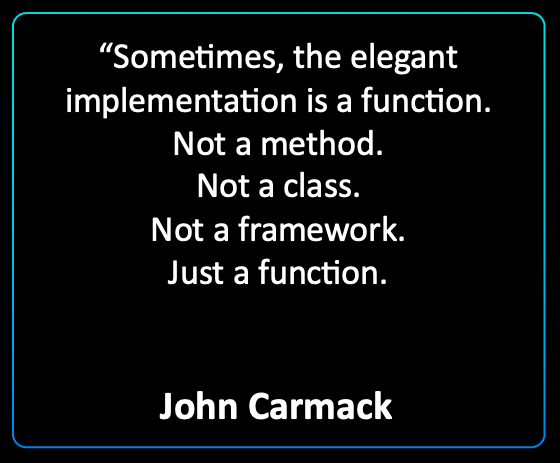
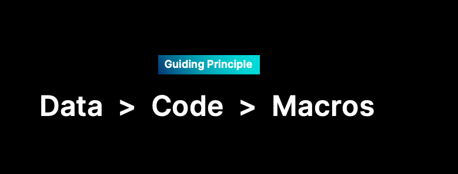

  
# Introduction to Zef-FX  
  
  
  
Most programmers will probably not disagree with the following statement:   
>"If you can express some logic as a pure function, you should express it as a pure function."  
  
Writing as much of your code base in terms of pure functions has many advantages, as [Gary Bernhardt points out in his talk "Boundaries"](https://youtu.be/eOYal8elnZk). So why don't we do this more commonly in languages like Python? Speaking from our own experience, it is often not that we prefer impure functions over pure ones, but rather that we lack easily accessible tools in these languages that enable us to express more of our code in terms of pure functions. After all, any useful program has to interact with the outside world in some form to be of use.   
ZefFX is an attempt to provide a pragmatic and easy to use [[#^429ca2 |functional effect system]] to Python user.   
  
  
## What does ZefFX Enable?  
How does ZefFX work in a nutshell and what does it allow you to do?  
Instead of eagerly executing side effects from within functions in your codebase, you can simply **describe** which interaction with the outside world you would like to occur. You can simply describe the interaction / effect you want in terms of a plain (immutable) data structure: a dictionary of a certain form. This data structure is called a wish.  
One or a list of these wishes can now be returned from your functions. This has the following advantages  
- It is simple and easy to make previously impure functions pure  
- It puts the **caller** of the function in control. The caller can inspect the effect, possibly discard it, forward it on to its caller or eagerly execute it itself. Importantly, this enables you to also make the caller a pure function if you choose to do so. Previously it was not a pure function, since it itself called into an impure function.  
- Better testability: no more mocks and stubs!  
  
  
  
  
  
## Procedural Effects  
  
These are the "side effects" that interact with the outside world in imperative and object oriented programming languages. This is the programming style that most of us may be familiar with coming from Python, C++ and similar languages: many of our core functions are impure, because any useful program **has to** interact with the outside world if they want to do anything useful.  
  
> Procedural effects are side-effecting, non-deterministic partial interactions with the real world. They are the soul of procedural and most object-oriented programming.  
  
[John De Goes on Functional Effects](https://youtu.be/-KA3BSdqYug?list=LL&t=214)  
  
"Procedural effects do things with the real world. They leave their mark on the real world."  
They are often encoded in side effecting functions.  
These functions are not total, they might blow up, they may not return. They're not deterministic.  
  
Every time you call a database, you may get back a different answer.  
This is the heart and soul of procedural programming. If you're building a business app using procedural programming, you are building it mostly on a stack of procedural effects.  
A bunch of statements in your program, doing one thing after another.  
  
  
## Functional Effects  
These are a different animal.  
"Functional effects are immutable data structures that **describe** procedural effects, and they can be interpreted later into the procedural effects they describe."  
  
This is what the Zef Effect system does: it takes a functional effect, it may validate and check it, when opening resources it does so in a safe managed context, it may start logging, it may check settings and security policies. If all is good, it goes ahead and interprets the functional effect and executes the actual effect.  
One important aspect is that only very few effect handlers cover a large variety of use cases. These only have to be written once and should be well tested, since this part of your program is one of the most critical ones where things may go wrong in many ways. It lifts the burden of managing the hard parts of side effectful code from the author using the effect system and places it on the implementor of the effect handler.  
  
This leads to an inversion of control. More of the core logic of a program can be implemented as a pure function. If this function would like to actually have something done in the real world, it can return a list of functional effects as a return value. It is up to the caller of this function what it wants to do with this. It may e.g.  
- simply forward the effect to its caller  
- it may want to check the effect and possibly transform it into one or multiple other effects.  
- It may combine these effects with other ones that it defines or obtains as values by calling other functions.  
  
Dealing with effects is no different than dealing with other plain old data structures and it enables a much larger part of an application to be written in a cleaner, more reproducible and testable way. It is only at the very end of a sequence of function calls or a data pipeline that the effects are passed off to the effect handler, which is then in charge of executing them.  
This is what is meant by moving side effects to the outer boundaries of an application, i.e. the imperative shell which surrounds a functional core.  
  
Zef is a Python library that can help you write functional programs at the scale of applications. It helps you write applications that are concurrent, asynchronous and parallel. It does so both at the scale of your local process, as well as at the scale of a distributed system. It does so in a way that is focussed on simplicity, providing excellent monitoring and visualization tools and focusses on the developer experience.  
  
Using Effects you can move from a more imperative programming style focussed on statements, to a more declarative style focussed on values and composition. This opens the door for a higher level of expressivity, terser syntax, higher code reuse and better testability.  
  
For an Effect: it may fail if you try to run it in different ways. This is encoded in the return value signature of the effect handler.   
You get back either an error or a success value.  
  
Using Streams and Effects you can unify various models of computation into the same computational model provided by Zef. This makes it much easier to reason about the execution of your application and provides the tools to monitor, replay and test your code. Both by providing a powerful set of tools that can be used during development as well as on your running production code, whether one process or a distributed system.  
  
  
  
  
  
  
## Not Algebraic Effects  
ZefFX is explicitly not an attempt to implement an [algebraic effects system](https://overreacted.io/algebraic-effects-for-the-rest-of-us/).   
Algebraic effects are a conceptually different control flow model, much more akin to the structure of `try` - `except` blocks in languages with exceptions.  
  
  
## How to Think about ZefFX  
We think that ZefFX's mental model is more familiar and easy to grok for most of today's developers: simply think of the effects system as a service running in the background of all your async processes, much like a service behind a JSON HTTP API. You can communicate with it through messages (wishes) and say what you want. It will try to execute your wishes and return a response. However, since it lives in the same process  
- It is typically much faster to communicate with: microseconds rather than milliseconds  
- You don't have to serialize your intent to JSON strings. You can just send it native data structures: dictionaries. It will also respond with a dictionary.  
- To execute local effects, like reading from the clipboard, there is no network in between and there are fewer failure modes.  
  
> "In order to understand imperative impure functions, we have to drill down into everything to understand everything that they do exhaustively, because their types don't say anything about what they do. And then we have to simulate the entire program inside our head to come up with a mental model of its correctness. That's a lot of work.  
> Once you find functional programming and discover that you don't have to do that, you never want to do that again." - John de Goes  
  
source: [Blazing Fast, Pure Effects without Monads](https://youtu.be/L8AEj6IRNE)  
  
  
### Further Material and References  
- [Algebraic Effects for the Rest of Us](https://overreacted.io/algebraic-effects-for-the-rest-of-us/) by Dan Abramov  
- [What's cool about Unison?](https://jaredforsyth.com/posts/whats-cool-about-unison/) by Jared Forsyth  
- [An Introduction to Algebraic Effects and Handlers](https://www.eff-lang.org/handlers-tutorial.pdf) by Matija Pretnar  
- [Exotic Programming Ideas: Part 3 (Effect Systems)](https://www.stephendiehl.com/posts/exotic03.html) by Stephen Diehl  
  
