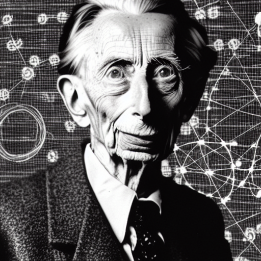

  
  
Bertrand Russel and Atomism by [Stable Diffusion](https://github.com/CompVis/stable-diffusion)  
  
### No Internal Structure  
In contrast to objects and property graphs, the conceptual model is different for logical atomism: entities (and atoms in general) are considered to have no internal structure. No internal attributes or fields.  
  
  
### But What About Attributes?  
Attributes or fields are also connected by relations. This is a much more granular form of representing information. Attributes / Fields can themselves be attached in two forms:  
- **Attribute Entities**: you can think of this as a persisted stream. Different values are assigned at different times. It only makes sense to ask about a value in the context of a specific time. The most recent preceding value which was assigned (in the reference frame / clock of the transactor) is considered to be the value at that time.  
- Values: Values have no inherent concept of time and do not change over time. Assigning attributes as fields is conceptually similar to marking struct fields "const" or non-mutating: it expresses the intent that this field in this context can never change.  
  
  
  
### GraphQL & Logical Atomism  
[GraphQL's data model](https://graphql.org/learn/schema/) can also be seen as logical atomism.  
- **Attribute Entities / Values**: correspond to [scalar types](### [#](https://graphql.org/learn/schema/#scalar-types))  
- **Entities**: correspond to GraphQL [objects](https://graphql.org/learn/schema/#object-types-and-fields)  
  
  
  
### The Relational Model & Logical Atomism  
  
  
  
### Facts  
Relations between entities. Aka [semantic triples](https://en.wikipedia.org/wiki/Semantic_triple) in RDF or datalog.  
  
In Zef we use plain Python data types to represent them:  
```python  
(france, RT.CapitalCity, paris)  
```  
`france` and `paris` are one of the [Zef reference types](reference-types) here.  
  
  
### Facts in Dictionaries  
```python  
movie1 = {  
	'title': 'Pulp Fiction',  
	'year_of_release': 1994,  
}  
```  
Entities ("objects") typically correspond to dictionaries (aka maps) in plain data structures. Their type may be implicit to the context or specified as as an additional internal key-value pair.  
Each key-value pair can be seen as a fact in the context of the dictionary / object in which it appears. For example, the fact "movie1 was released in 1994" corresponds to the second key-value pair and can also be expressed as a triple `(movie1, RT.YearOfRelease, 1994)`. This would correspond to a single relation instance on a graph  
  
  
### Facts in Objects  
Very similar principles to dictionaries apply: the field names map to relations and field values to the target nodes. The field values could be of scalar type or other objects.  
  
  
### Facts in Tables  
Very similar principles to dictionaries apply: the field names map to relations and field values to the target nodes. The field values could be of scalar type or other objects.  
  
Actor Table  
  
 | first name | last name | favorite food |  
 | ---------- | --------- | ------------- |  
 | John       | Travolta  | 🍕            |  
 | Samuel     | Jackson   | 🍔            |  
 | Uma        | Thurman   | 🥦            |  
  
  
!450  
Each relation instance can be seen as a fact. Multiple facts can relate to the same entity, leading to the graph-relational model of information.  
This graph structure is to be understood on the conceptual level (i.e. not the concrete representation in a graph DB). The same visual representation can be used for data stored in a relational database or a Pandas dataframe.  
  
For more details see [ZefDoc - Graph Relational Model](graph-relational-model).  
  
  
### History  
Logical atomism was developed by Bertrand Russel and Ludwig Wittgenstein. It is one of the foundational parts of the [Tractatus Logico-Philosophicus](https://www.wittgensteinproject.org/w/index.php?title=Tractatus_Logico-Philosophicus_(English)).  
  
Some of the core ideas are well summarized by the [Plato Encyclopedia](https://plato.stanford.edu/entries/wittgenstein-atomism/)  
> The core tenets of Wittgenstein’s logical atomism may be stated as follows:   
> 1.  Every proposition has a unique final analysis which reveals it to be a truth-function of elementary propositions (_Tractatus_ 3.25, 4.221, 4.51, 5);   
> 2. These elementary propositions assert the existence of atomic states of affairs (3.25, 4.21);   
> 3. Elementary Propositions are mutually independent — each one can be true or false independently of the truth or falsity of the others (4.211, 5.134);   
> 5. Elementary propositions are immediate combinations of semantically simple symbols or “names” (4.221);   
> 6. Names refer to items wholly devoid of complexity, so-called “objects” (2.02 & 3.22);  
> 7. Atomic states of affairs are combinations of these objects (2.01).  
  
  
  
