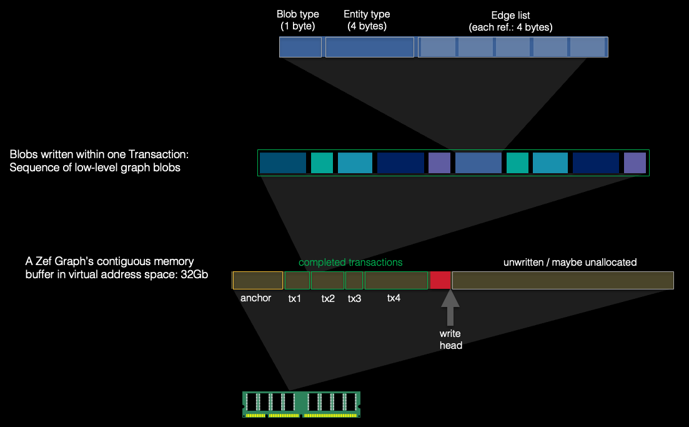
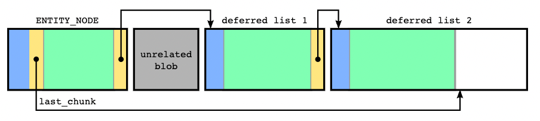

  
  
  
  
    
## Overview    
Two important features of any Zef graph are that it is append-only and has a consecutive in-memory structure. This is implemented using a sequence of "blobs", that create a low-level graph structure. In contrast to the user-facing "high-level" structure, the low-level structure is made up of nodes and edges and is reference-less (less accurately, it is timeless, i.e. it has no concept of time).  The word "blob" has a double meaning. It is most commonly used on its own as a term to refer to the low-level object. It's other use is in the term "blob index" is to refer to the index of a chunk of memory (currently 16 bytes) which the low-level blobs are aligned to. This smallest division of memory will be referred to as a "chunk" on this page.    
  
  
## Blob binary representation  
Each blob starts at a particular blob index, and occupies a whole number of chunks. The structure (and order) for each blob is similar to: - The first integer of the blob is its type (such as `ROOT_NODE`, `ENTITY_NODE`,   `TX_EVENT_NODE`, `RELATION_EDGE`). - A sequence of fixed properties about the blob such as `entity_type` for an   `ENTITY_NODE`. - A `source_index` and `target_index` if the blob represents a low-level edge. - A local edge list, whose size is set only when the blob is instantiated, but   thereafter fixed. Only for blobs which can contain outgoing/incoming edges. - Any additional variably sized data, such as the content of a value node.    
  
  
  
### Individual blob structures to appear here    
(TODO)    
  
  
### Edge list structure    
Any blob that can have outgoing or incoming edges has an edge list. Although an arbitrary number of edges are allowed on a blob, the append-only nature means that each such blob must start with a small preallocated space for edges. This is called its "local edge list". The size of the local edge list is generally a safe default for each blob type, although revisioning of a graph can change this.    
  
:::info    
The edge lists are an exception to the append-only rule, in that the addition of any new blob with an edge to an older blob, modifies bytes inside of existing data. However, these modifications are predictable and invertible (i.e. they can be inferred from any new blob appended, and can be undone).    
:::    
  
To grow beyond this local size, the final index serves a special role to point at a `DEFERRED_EDGE_LIST_NODE` blob, which continues the edge list. Whenever the addition of a new edge would overflow the local edge list, a new deferred edge list is created, with a dynamically determined size, and the subsequent deferred edge list index is set to this newly created blob. Deferred edge lists themselves act as blobs, and so their local edge lists can also overflow, in which case they will create a new further deferred edge list. Each subsequent deferred edge list grows exponentially in size.  Each index in the list is a blob index that points to an outgoing/incoming edge blob. In our implementation, every index in the edge list must also be reflected by a corresponding `source` or `target` of the edge blob. The difference between an incoming or outgoing edge is indicated by a negative value (incoming edges have negative edge indices).    
  
:::info    
Note: the high-level view of entities/relations with relations allowed to connect to either entities/relations and the low-level view of nodes/edges with edges allowed to connect to either nodes/edges is that of a "metagraph". However, at this lowest level of looking at blobs, we can see that a standard graph structure emerges, where edges (the integers contained in the `edge_list`, `source_index` and `target_index`) can only connect to nodes (the blobs) and only nodes (the blobs) contain metadata.    
:::    
  
For optimized addition of edges, we often want to refer directly to the location in memory of the last added edge. To help this, we prefill the edge list with zeros for all unset edges, and a sentinel value for the final subsequent deferred edge list index. This way, we can always tell whether we are able to immediately add a new edge, or if we need to create a new deferred edge list.  Then, each blob that can be the start of an edge list (i.e. all blobs containing edge lists, except for `DEFERRED_EDGE_LIST_NODE`) also contains a `last_chunk` reference, pointing at the blob index for which the last edge indices can be found. This `last_chunk` is updated on every new edge addition.    
  
:::info    
Note: as the first valid graph index is the root node index (currently 42) then all values up to 41 are valid options for sentinel values.   
:::    
  
There is a final fly in the ointment that an edge list may not be aligned to a blob index. This is problematic only if there are no edges in an edge list and is handled specially by initializing `last_chunk = 0` and using special logic in this case.  Hence, the binary structure of any edge list looks similar to (all items are integers):    
- `local_capacity = 12`: the size of the local edge list.   
- `last_chunk = 92`: the last chunk containing a space for a new edge.   
- `first edge = 56`: an outgoing (+ve) edge.   
- `second edge = -58`: an incoming (-ve) edge.   
- `third edge = 0`: an empty space, which the next edge will be placed   
- ...   
- `last proper edge = 0`   
- `subsequent deferred edge list = 1`: the sentinel value indicating there is no   subsequent deferred edge list.      
  
Graphically, this could be shown as:   where blue indicates blob-specific information, yellow indicates the subsequent deferred edge list indices, or the `last_chunk` reference, and green indicates filled edges.    
  
  
## Delegate representation  (TODO)   
Mention source=target=edge for relation delegate group.    
  
