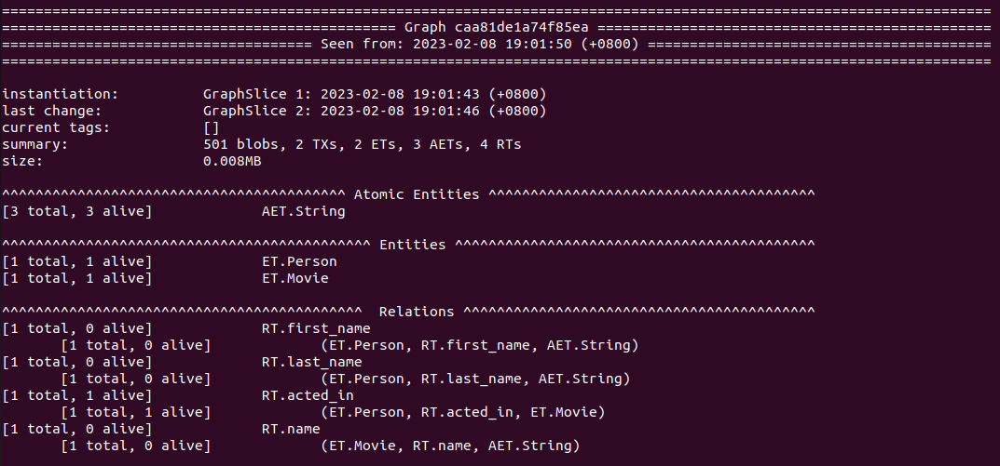
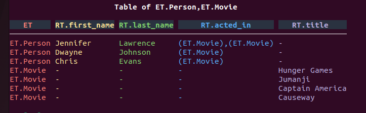
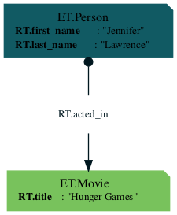
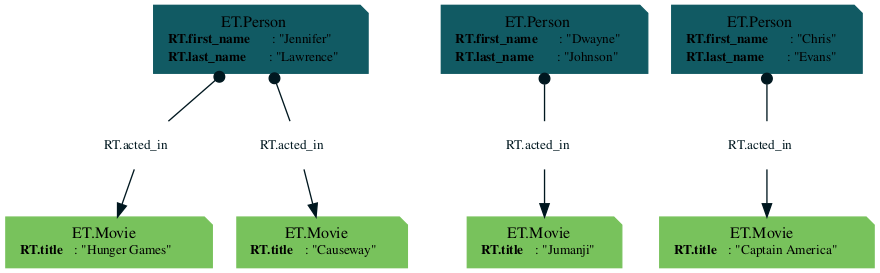

  
One of the best way to learn is by example.   
  
In this tutorial series, you will learn how to:  
* [Model, add, view, and update your domain data with ZefDB](manage-your-data-with-zef-db)  
* [Build Data pipeline with ZefOps](building-data-pipelines-with-zef-ops)  
* [Deploy a working backend with Zef](deploying-a-backend-with-a-graph-ql-api)  
* [Build a reactive application with Zef](data-streaming-with-zef)  
  
You can walk through these tutorials using IPython, or any of its extension:  
* Jupyter Notebook,   
* [Jupyter Notebook in VSCode](https://code.visualstudio.com/docs/datascience/jupyter-notebooks)  
  
## Importing Zef   
Let's import all the necessary modules for this tutorial:  
```python  
from zef import DB, ET, RT, Where, Z  
from zef.ops import all, collect, count, F, filter, graphviz, Ins, now, run, time_travel  
```  
  
or you could just do:  
```python  
from zef import *  
from zef.ops import *  
```  
  
## Defining the data  
One way to express your data is using the object notation as follow:  
```python  
data = ET.Person(  
	first_name="Jennifer",  
	last_name="Lawrence",   
	acted_in=ET.Movie(title="Hunger Games")  
)  
```  
This expression represents how we can think of data in terms of object, which is natural if you have worked with OOP or have used ORM to represent data.  
  
Here, we have expressed a single entity `ET.Person`, which fields are  
- `first_name` - Jennifer  
- `last_name` - Lawrence  
- `acted_in`  - another entity `ET.Movie` with field `name` = `Hunger Games`  
  
## Instantiating DB  
```python  
db = DB() # Graph()  
```  
A new database instance is created within your local Python session, just like that! ZefDB is fully embedded, you can work with it within Python and without network connections!  
  
## Adding Data into DB  
Now, we want to insert the data we declared above into our database.   
```python  
jen_law = data | db | run  
```  
  
:::info  
  
Throughout the Zef ecosystem, you will see  "|" pipe being used everywhere, which is unusual for a python library. However, the piping syntax is common across some other languages like Elixir, Elm, or most commonly seen in Unix Programming(i.e. Bash) ! In Zef, pipe is overloaded so users can chain together values, Zef operators (ZefOps), and functions in **sequential, lazy, and executable pipelines** where data flow is **left to right**.  
  
:::  
  
The return value of this operation is a handle to the object that is transacted into the database.   
```console  
In [7]: jen_law  
Out[7]: <ZefRef #97 ET.Person slice=2>  
```  
  
These handles can be used for further operations (traversals, addition of data), which we will use later in this tutorial!  
  
## Exploring the Data  
##### yo  
When you are working with Zef and come across "something" and you wonder if you can get additional context about it so in your head you go:  
   
When you are working with Zef and came across "something" that you want to have additional information, in your mind you would be thinking : "Yo Zef, show me more about this something!". `yo` is exactly the operator that you would use in these scenario.  
```python  
yo(db)  
```  
  
You'll see the following in your repl:   
  
  
`yo`-ing the database gives you a summary of it outputted in the form of ASCII (SVG in the future). User can look at information such as the size of the database, number of entities and relations, when was the last transaction made, and etc.   
  
### Relational Data  
ZefDB is a graph-relational database. For those familiar with relational data, it's common to think in terms of tables.  To view data in a tabular form, run:  
```python  
db | now | all | ui.to_table | show  
```  
  
  
###### Graph Data  
Data in ZefDB can also be viewed in graphical form. Zef has incorporated  [GraphViz](https://graphviz.org/) as one of our native operator.   
  
:::warning  
  
User might need to manually install graphviz if there machine doesn't already have it. Follow the instruction from [here](https://graphviz.org/download/) to install the package according to your OS.  
  
:::  
```python  
db | now | all | graphviz | collect  
```  
  
You'll see the following output:  
  
  
## Creating and Updating Data  
We have now successfully added the initial data into the database.   
  
Let's add two more entry into our database:  
```python  
more_data = [  
	ET.Person(  
		first_name="Dwayne",  
		last_name="Johnson",   
		acted_in=ET.Movie(title="Jumanji")   
	),  
	ET.Person(  
		first_name="Chris",  
		last_name="Evans",  
		acted_in=ET.Movie(title="Captain America")   
	)  
]  
  
handles = more_data | db | run  
```  
  
Suppose an actor has acted on a new movie, and we want to add this information into the database as well:  
```python  
new_data = (  
			jen_law,                    # Source  
			RT.acted_in,                # Relation  
			ET.Movie(title="Causeway")  # Target  
		)  
  
new_handle = new_data | db | run  
```  
  
Here, we use the "Triple Notation" `(Source, Relation, Target)` to declare our `new_data`. Why did we not use the object notation as we used before?  
```python   
# This will replace Hunger Games with Causeway  
jen_law(  
	acted_in=ET.Movie(name="Causeway")   
)  
  
# This will create a new instance of Jennifer Lawrence  
ET.Person(  
	first_name="Jennifer",  
	last_name="Lawrence",  
	acted_in=ET.Movie(name="Causeway")   
)  
```  
We can think of the object notation as declaring the state of the database that we want to achieve, using it here would replace the original relation `ET.Movie(name="Hunger Games")` with `ET.Movie(name="Causeway")` instead of creating a new relation, which is not desired.  
  
Let's look at the graph again:  
```python  
db | now | all | graphviz | collect  
```  
  
  
## Querying the data   
Let's say we want know how many movies Jennifer Lawrence has acted in, we would do:  
  
```python  
query = (    
	ET.Movie &  
	Where[  
		Ins[RT.acted_in] |                               
			filter[  
				(Z | F.first_name == "Jennifer")   
				& (Z | F.last_name == "Lawrence")  
		]  
	]    
)  
  
result = (  
	db   
	| now           # get the latest state of the DB  
	| all[query]    # list all items that satisfy the query  
	| count         # how many entities (movies) were returned?  
	| collect       # trigger evaluation  
)  
  
print(result) # 2  
```  
  
From this example, we can see how Zef allows us to write succint and readable code with the powerful piping syntax and composable operators. We will discuss more about ZefOp in one of the following tutorial.  
  
## Querying the data - Time Traveling  
Now, we want answer the same question as above, maybe sometime ago. We can access any previous time slice with ease with ZefDB by doing:  
```python  
  
result = (  
	db   
	| now             # get the latest state of the DB  
	| time_travel[-1] # Moving -1 relative slice from now  
	| all[query]    # list all items that satisfy the query  
	| count         # how many entities (movies) were returned?  
	| collect       # trigger evaluation  
)  
  
print(result) # 1  
```  
  
We've traversed one DB state earlier with respect to the current state, which the fact that `J. Lawrence` has not yet acted in `Causeway` . The result of the query will then become `1`. There are few ways to traverse time in ZefDB, check out this [topic](changing-reference-frames).  
  
## Persisting Database  
Persisting graphs requires a free ZefHub account. See this [[ZefDoc - Quick Install Guide#Sign up for a free Zefhub account|section]] on getting your ZefHub account.  
  
```python  
db | sync[True] | run  
```  
This persists, syncs, and distributes all future changes via ZefHub in real-time. Anyone can access the db anytime and anywhere as long as they have the nessecary permission to do so.  
  
## Recap  
To summarize, so far, we have learned how to manage our data with ZefDB, exposed to the visualization toolkit of Zef, and have been introduced to the powerful querying and data transformation capabilities of the library.  
  
Next, we will learn how we can deploy a simple backend, exposing an interface to ZefDB via GraphQL API.  
  
