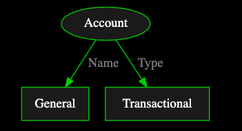
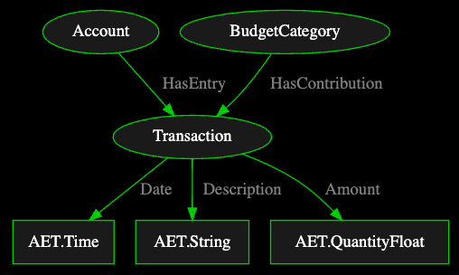
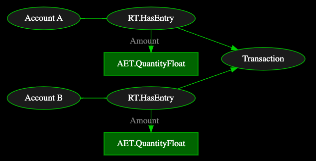
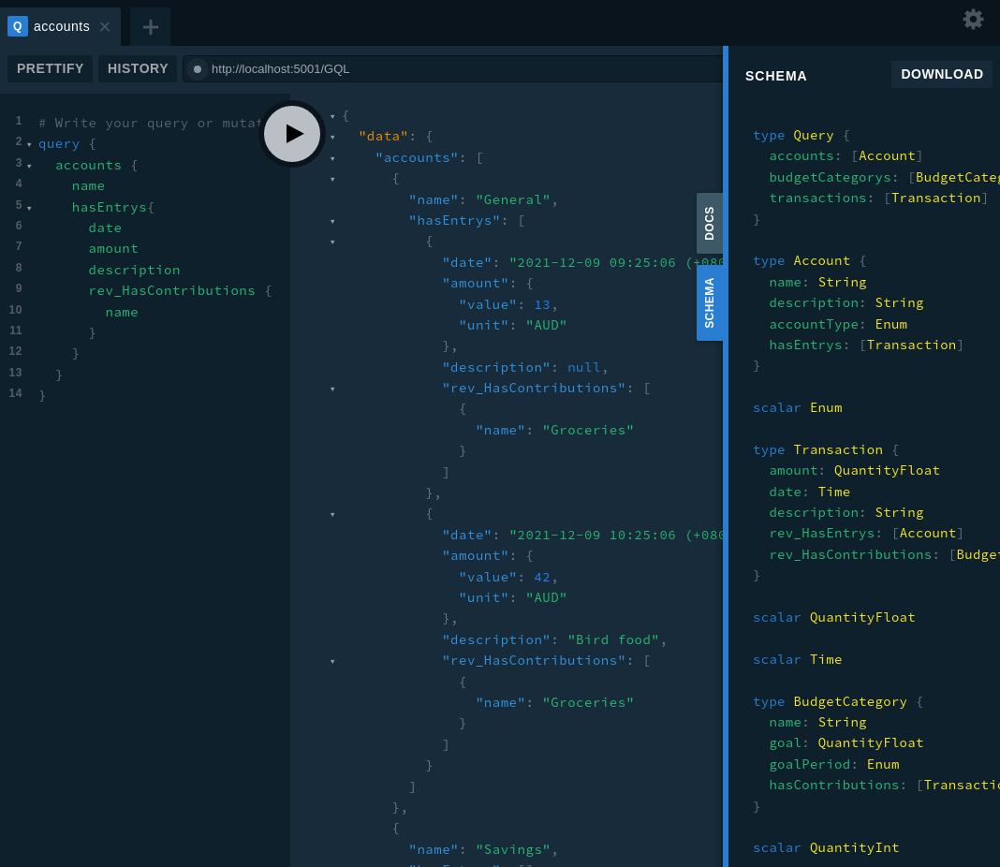

  
## Goal  
  
Scenario: I want to keep track of where my money is spent and provide loose  
guidelines on how much I want to spend on groceries, maintenance, eating out  
and splurges. I'd like to be able to import my bank statements and click  
around a basic interface to assign categories.  
  
There are several parts to achieve the above:  
  
-   Creating a database structure to describe the situation.  
-   Handle importing data and updating data.  
-   Displaying this in a simple web app.  
  
By the end of this tutorial series we will have all of the above in place,  
although we won't head straight for the finished product but instead take a  
detour to "smell the roses" along the way. This means we'll look at:  
  
-   Create an ad-hoc data structure to get us off the ground quickly.  
-   Write a REPL interface to manipulate the data programmatically.  
-   Create some spec functions to restrict the database structure to make it  
    predictable and verifiable.  
-   Rephrase the database queries/modifications as human-readable questions.  
-   Hook into the REPL interface using GraphQL queries.  
-   Write a frontend to use the exposed GraphQL interface.  
  
:::caution  
  
You can copy-paste this code into most REPL prompts in order to follow along  
with this tutorial. However, be warned that the plain `python` REPL does not  
handle indenting/blank lines well, so it is recommended to use the `ipython`  
REPL, a `jupyter` notebook, or an IDE like `VSCode`.  
  
:::  
  
:::info Prerequisites  
  
This tutorial assumes some familiarity with core zef actions. (maybe we  
should mention "go through all of x guides here")  
  
-   Data types and flat structure of Zef graphs.  
-   Creating and connecting entities and relations using the shorthand syntax.  
-   Using `GraphDelta` with `Z["ref"]` notation.  
-   Zef functions and the `@func` decorator.  
  
:::  
  
  
## Design of the data layout  
  
This section is a dangerous one to write. It could easily expand to become  
90% of the entire example. To avoid this, we'll present one narrow view as an  
option, but at the end we'll raise some discussion points and describe  
alternative choices.  
  
To implement a budgeter, we will require some kind of representation of:  
  
-   Accounts  
-   Transactions  
-   Budgeting categories  
  
  
### Creating an account  
  
One of the major advantages of zefDB is its representation as a completely  
flat graph database. This means we don't need to specify any database schema  
up front and can just dive into creating a layout as we go. Let's start then  
by creating a pretend account on a graph:  
  
```python  
from zef import *  
from zef.ops import *  
g = Graph()  
```  
  
```python  
receipt = [  
    ET.Account["acc"],  
    (Z["acc"], RT.Name, "General"),  
    (Z["acc"], RT.Type, EN.AccountType.Transactional),  
] | transact[g] | run  
z_acc = receipt["acc"]  
```  
  
This has made an account entity and attached a couple of simple pieces of  
metadata, one a string and one an enum. As a figure, this might look like:  
  
  
  
In zefDB these are 3 separate entities, but in other databases (e.g.  
`examples here`) this might be represented as a single "object" with separate  
fields. Having multiple entities is called "flattening out" the objects and  
it allows for more flexible changes to the data layout, e.g. the addition of  
a new "field".  
  
  
### Linking transactions to the account  
  
To represent changes to a budget, we need to capture the transactions that  
occur from credit card charges, transfers between accounts, ATM withdrawals,  
etc&#x2026; At first, it would seem like this is simple, so we will dive straight  
into creating an example transaction, and then afterwards talk about what  
could be wrong with this representation.  
  
```python  
receipt = [  
    ET.Transaction["trans"],  
    (Z["trans"], RT.Amount, QuantityFloat(10.0, EN.Unit.AUD)),  
    (Z["trans"], RT.Date, Time("2021 Dec 06 12:00")),  
    (Z["trans"], RT.Description, "Rising Against Bread Co."),  
  
    (z_acc, RT.HasEntry, Z["trans"]),  
] | transact[g] | run  
  
z_trans = receipt["trans"]  
  
z_acc | now | yo | collect  
```  
  
```  
  
  
    ======================================================================================================================  
    ================================================== Historical  View ==================================================  
    ===================================== Seen from: 3: 2022-02-01 15:22:58 (+0800)  =================================  
    ======================================================================================================================  
  
    uid:                    22e0a1d6d75c6153ecb408691a93dc48  
    blob index:             96  
    type:                   ET.Account  
    current owning graphs:  ecb408691a93dc48  
    other graphs viewing:   /  
    instantiation:          2: 2022-02-01 15:22:57 (+0800)  
    termination:            /  
  
        ^^^^^^^^^^^^^^^^^^^^^^^^^^^^^^^^^^^^^^^^^^^ Incoming & Outgoing Relations ^^^^^^^^^^^^^^^^^^^^^^^^^^^^^^^^^^^^^^^  
  
        1x:     (z:ET.Account) ---------------------------(RT.Name)-------------------------> (AET.String)  
                    (z) ----(c590ed3418fcc806ecb408691a93dc48)---> (922448b8355bf379ecb408691a93dc48 [latest val: General])  
  
        1x:     (z:ET.Account) ---------------------------(RT.Type)-------------------------> (AET.Enum.AccountType)  
                    (z) ----(9afaf9c2c5dd9f0decb408691a93dc48)---> (3c90cff78c8dfcc1ecb408691a93dc48 [latest val: EN.AccountType.Transactional])  
  
        1x:     (z:ET.Account) -------------------------(RT.HasEntry)-----------------------> (ET.Transaction)  
                    (z) ----(22f6e0e8380cef45ecb408691a93dc48)---> (4bdbfb4960bbee57ecb408691a93dc48)  
  
  
  
        ^^^^^^^^^^^^^^^^^^^^^^^^^^^^^^^^^^^^^^^^^^^^^^^^^^^ Timeline ^^^^^^^^^^^^^^^^^^^^^^^^^^^^^^^^^^^^^^^^^^^^^^^^^^^^  
  
  
            ^  
           ^^^  
            |  
            |            Instantiated Relation:                            [3: 2022-02-01 15:22:58 (+0800)]  
            |            (RT.HasEntry)                                     (ET.Transaction)  
            |----------(22f6e0e8380cef45ecb408691a93dc48)---------------->>(4bdbfb4960bbee57ecb408691a93dc48)  
            |  
            |  
            |            Instantiated Relation:                            [2: 2022-02-01 15:22:57 (+0800)]  
            |            (RT.Type)                                         (AET.Enum.AccountType)  [latest val: EN.AccountType.Transactional]  
            |----------(9afaf9c2c5dd9f0decb408691a93dc48)---------------->>(3c90cff78c8dfcc1ecb408691a93dc48)  
            |  
            |  
            |            Instantiated Relation:                            [2: 2022-02-01 15:22:57 (+0800)]  
            |            (RT.Name)                                         (AET.String)  [latest val: General]  
            |----------(c590ed3418fcc806ecb408691a93dc48)---------------->>(922448b8355bf379ecb408691a93dc48)  
            |  
            |  
        =========  <---- Instantiation                                     [2: 2022-02-01 15:22:57 (+0800)]  
        -----------------------------------------------------------------------------------------------------------------  
  
```  
  
  
The info output shows all of the connections and some of the timeline history  
of this entity. At the moment it shows nothing more than what we have just  
created, but it is a very useful tool to explore unfamiliar graphs and our  
own once changes have occurred and made the timeline more interesting.  
  
Let's create a second transaction (using the `GraphDelta` method) and see how  
we would sum up all the transactions in an account.  
  
```python  
AUD = QuantityFloat(1.0, EN.Unit.AUD)  
receipt = [  
    ET.Transaction["t"],  
    (Z["t"], RT.Amount, 42.0 * AUD),  
    (Z["t"], RT.Date, now()),  
    (Z["t"], RT.ID, "123456789"),  
  
    (z_acc, RT.HasEntry, Z["t"])  
] | transact[g] | run  
z_trans2 = receipt["t"]  
  
total = z_acc | now >> L[RT.HasEntry] >> RT.Amount | value | add | collect  
print(f"Total credits in account is {total}")  
```  
  
```  
Total credits in account is <QuantityFloat: 52 EN.Unit.AUD>  
```  
  
Note on notation: we are taking the choice here to label relations with  
passive verbs, e.g. `RT.HasEntry`. Naming is a tricky choice to get right but  
some good guidelines is to make them easy to remember, clearly indicating  
which type of entity is their source/target, and/or describing their  
relationship usefully. Unfortunately, it is not always possible to achieve  
all of these goals.  
  
In cases where an atomic entity acts as a "field" of an  
entity, it is very common to use just a noun indicating the attribute of that  
entity, e.g. `RT.Amount` or `RT.Date` above.  
  
  
### Budget categories  
  
It isn't enough to just record all of the transactions that are taking place  
in our account, we also want to categorise these as different types of  
expenses, e.g. groceries or maintenance.  
  
```python  
receipt = [  
    ET.BudgetCategory["groceries"],  
    (Z["groceries"], RT.Name, "Groceries"),  
    (Z["groceries"], RT.Goal, 200.0 * AUD),  
    (Z["groceries"], RT.GoalPeriod, EN.Period.Monthly),  
  
    (Z["groceries"], RT.HasContribution, z_trans),  
    (Z["groceries"], RT.HasContribution, z_trans2)  
] | transact[g] | run  
z_groceries = receipt["groceries"]  
  
total = z_acc | now >> L[RT.HasEntry] >> RT.Amount | value | add | collect  
print(f"Category {value(z_groceries >> RT.Name)} has a goal of {value(z_groceries >> RT.Goal)} over a {value(z_groceries >> RT.GoalPeriod)} period")  
```  
  
```  
Category Groceries has a goal of <QuantityFloat: 200 EN.Unit.AUD> over a EN.Period.Monthly period  
```  
  
  
### Revisting the layout  
  
Earlier, we glossed over a few of the problems to do with the transaction  
layout. Let's look at the layout so far:  
  
  
  
What are some possible problems here?  
  
-   What if the transaction is a debit instead of a credit?  
-   What if the transaction is between two bank accounts? This also opens up  
    several new questions:  
    -   What if the transaction is an international transfer with different currencies?  
    -   What if the transaction entries for each account occur on different dates?  
    -   What if the description for each account is different?  
-   What if the transaction contributes to multiple budget categories?  
  
These questions can be addressed in different ways. For example, we could  
separate the identity of the transaction from the entry in each associated  
account. Alternatively, we can use a feature of zefDB to store information  
on relations. For example:  
  
  
For brevity, only amounts have been shown, but dates and descriptions can  
also be attached to the HasEntry relations. To view this data, think of the  
amount as belonging not to the account, or to the transaction, but belonging  
to the combined pair of those two entities. If we were to remove the  
transaction, or remove the account, then the amount would also be removed.  
  
Let's first go with the simple view, where the amounts are attached directly  
to the transactions. In part 2, we'll explore the more flexible layout, while  
also showing how the graph layout can allow your code to be backwards compatible.  
  
  
## Writing a REPL interface  
  
At first, we should test out the budgeter for our own personal use. This  
allows us to identify any wrinkles in the data layout we've chosen while not  
investing lots of time into the perfect UI. What we need are functions that  
do the following:  
  
-   add an account, transaction or budget category  
-   link a transaction to an account or a category  
-   view all transactions, either globally or in the scope of an  
    account/category.  
-   obtain aggregate information for accounts/categories  
-   update transaction properties, e.g. description  
  
We first start from a blank graph, ignoring the old data.  
  
```python  
# Start from a blank slate  
g = Graph()  
```  
  
  
### Adding items  
  
```python  
def add_account(g : Graph, name : str, *, desc=None, kind=None):  
    actions = [(ET.Account["acc"], RT.Name, name)]  
    if desc is not None:  
        actions += [(Z["acc"], RT.Description, desc)]  
    if kind is not None:  
        actions += [(Z["acc"], RT.AccountType, kind)]  
  
    r = actions | transact[g] | run  
    return r["acc"]  
```  
  
```python  
with Transaction(g):  
    z_acc_general = add_account(g, "General")  
    z_acc_savings = add_account(g, "Savings", desc="Long term savings", kind=EN.AccountType.Savings)  
    z_acc_credit = add_account(g, "Credit card", kind=EN.AccountType.Credit)  
g | yo | collect  
```  
  
```  
  
    ======================================================================================================================  
    =============================================== Graph 60cdc733d1f5454b ===============================================  
    ===================================== Seen from: 2022-02-01 15:22:59 (+0800) =========================================  
    ======================================================================================================================  
  
    instantiation:          1: 2022-02-01 15:22:58 (+0800)  
    last change:            2: 2022-02-01 15:22:59 (+0800)  
    current tags:           []  
    summary:                446 blobs, 3 TXs, 4 ETs, 8 AETs, 12 RTs  
    size:                   0.007MB  
  
    ^^^^^^^^^^^^^^^^^^^^^^^^^^^^^^^^^^^^^^^^^ Atomic Entities ^^^^^^^^^^^^^^^^^^^^^^^^^^^^^^^^^^^^^^^  
    [4 total, 4 alive]             AET.String  
    [2 total, 2 alive]             AET.Enum.AccountType  
  
    ^^^^^^^^^^^^^^^^^^^^^^^^^^^^^^^^^^^^^^^^^^^^ Entities ^^^^^^^^^^^^^^^^^^^^^^^^^^^^^^^^^^^^^^^^^^^  
    [3 total, 3 alive]             ET.Account  
  
    ^^^^^^^^^^^^^^^^^^^^^^^^^^^^^^^^^^^^^^^^^^^  Relations ^^^^^^^^^^^^^^^^^^^^^^^^^^^^^^^^^^^^^^^^^^  
    [3 total, 3 alive]             RT.Name  
           [3 total, 3 alive]             (ET.Account, RT.Name, AET.String)  
    [1 total, 1 alive]             RT.Description  
           [1 total, 1 alive]             (ET.Account, RT.Description, AET.String)  
    [2 total, 2 alive]             RT.AccountType  
           [2 total, 2 alive]             (ET.Account, RT.AccountType, AET.Enum.AccountType)  
  
  
```  
  
For each account, we build up the actions of a GraphDelta, before applying them  
all in one operation. Note that `Z["acc"]` is declarative, it is simply a  
reference to a thing called "acc" in the context in which it is finally  
used. In other words, the thing called "acc" can be defined **after**  
`Z["acc"]` is used, so long as it appears in the same `GraphDelta`.  
  
There is no type checking above. The `kind` should be an account type which  
is of type `EN.AccountType.x`. In this example we will defer this validation  
to spec, however in production code you might also want to validate at this  
point <FutureFeature>Future zefDB versions will support automatic spec before a  
TX closes</FutureFeature>.  
  
In using the function, we can wrap the creation of 3 accounts in a single  
zefDB TX ("TX" == "Transaction", not to be confused with a financial  
transaction) using the `with Transaction` context manager.  
  
```python  
def add_category(g : Graph, name : str, *, goal=None, goal_period=EN.Period.Monthly):  
    actions = [(ET.BudgetCategory["cat"], RT.Name, name)]  
    if goal is not None:  
        actions += [  
            (Z["cat"], RT.Goal, goal),  
            (Z["cat"], RT.GoalPeriod, goal_period),  
        ]  
    r = actions | transact[g] | run  
    return r["cat"]  
```  
  
```python  
with Transaction(g):  
    AUD = QuantityFloat(1.0, EN.Unit.AUD)  
    add_category(g, "Groceries")  
    z_cat_eating_out = add_category(g, "Eating Out", goal=200*AUD)  
    z_cat_rates = add_category(g, "Rates", goal=1000*AUD, goal_period=EN.Period.Annually)  
z_cat_groceries = g | now | all[ET.BudgetCategory] | filter[lambda z: value(z >> RT.Name) == "Groceries"] | only | collect  
z_cat_groceries  
```  
  
```  
<ZefRef #451 ET.BudgetCategory slice=3>  
```  
  
Above we also quickly demonstrate how to obtain the "Groceries" category in  
case we didn't capture the return value of `add_category`.  
  
```python  
  
def add_transaction(g : Graph, amount : QuantityFloat, date : Time, *, desc=None, account=None, categories=[]):  
    actions = [  
        ET.Transaction["t"],  
        (Z["t"], RT.Amount, amount),  
        (Z["t"], RT.Date, date),  
    ]  
    if desc is not None:  
        actions += [(Z["t"], RT.Description, desc)]  
  
    with Transaction(g):  
        r = actions | transact[g] | run  
        print(f"Creating transaction with date {r['t'] >> RT.Date | value | collect} and description of {r['t'] >> O[RT.Description] | maybe_value | collect}")  
        if account is not None:  
            link_account(r["t"], account)  
        for category in categories:  
            link_category(r["t"], category)  
    return r["t"]  
```  
  
For now, we have gone with the approach of attaching an amount directly to  
the transaction, despite the warnings we discussed in the design section.  
Hence, we should equate a "transaction" with a single account entry in an  
account.  
  
```python  
add_transaction(g, 13*AUD, now()-1*hours)  
add_transaction(g, 42*AUD, now(), desc="Bird food")  
```  
  
```  
Creating transaction with date 2022-02-01 14:22:59 (+0800) and description of None  
Creating transaction with date 2022-02-01 15:22:59 (+0800) and description of Bird food  
<ZefRef #991 ET.Transaction slice=5>  
```  
  
We will test the `add_transaction` function with linking in the next section  
after showing the implementation of `link_account` and `link_category`.  
However, here we show that one can access parts of the transaction while  
they are in progress, for example the date of the transaction. It is also  
useful to use `O[...]` for fields which are optional.  
  
  
### Linking a transaction  
  
```python  
@func  
def link_account(trans : ZefRef, acc):  
    acc = get_account(Graph(trans), acc)  
    assert is_a(trans, ET.Transaction)  
    assert is_a(acc, ET.Account)  
  
    if not has_relation(acc, RT.HasEntry, trans):  
        (acc, RT.HasEntry, trans) | g | run  
  
@func  
def link_category(trans : ZefRef, cat : ZefRef):  
    assert is_a(trans, ET.Transaction)  
    assert is_a(cat, ET.BudgetCategory)  
  
    if not has_relation(cat, RT.HasEntry, trans):  
        (cat, RT.HasContribution, trans) | g | run  
  
def get_account(g, acc):  
    if is_a(acc, str):  
        return g | now | all[ET.Account] | filter[lambda z: value(z >> RT.Name) == acc] | only | collect  
    if is_a(acc, ET.Account):  
        return acc  
    raise Exception(f"Don't know how to obtain account from {acc}")  
  
@func  
def link(trans : ZefRef, thing : ZefRef):  
    assert is_a(trans, ET.Transaction)  
  
    if is_a(thing, ET.Account):  
        link_account(trans, thing)  
    elif is_a(thing, ET.BudgetCategory):  
        link_category(trans, thing)  
    else:  
        raise Exception(f"Don't know how to link to object of type {rae_type(thing)}")  
```  
  
Linking transaction is quite simple, a single operation. However, unlike the  
item creation which doesn't use existing data, we have a little bit of logic  
to apply here. Including a few checks of the types at this stage is  
worthwhile to save headaches from minor typos. We also allow the user to  
pass in either the account ZefRef itself, or the name of the account as a  
string.  
  
We also provide a convenience `link` dispatch function. <FutureFeature>In  
future zefDB versions, you will able to define the implementation of `link`  
to dispatch depending on the type of `thing` </FutureFeature>  
  
```python  
# Add all existing transactions to the groceries category and the general account  
with Transaction(g):  
    for trans in g | now | all[ET.Transaction]:  
        # Using link_account like a regular function  
        link_account(trans, z_acc_general)  
        # Using link_category like a lazy op, as it was decorated with @func  
        trans | link_category[z_cat_groceries] | collect  
  
# Create some more transactions and link them together  
with Transaction(g):  
    add_transaction(g, 5*AUD, now(), desc="Coffee", account=z_acc_credit, categories=[z_cat_eating_out, z_cat_groceries])  
    add_transaction(g, 1000*AUD, Time("2021 Dec 01"), desc="Sad times", account=z_acc_credit, categories=[z_cat_rates])  
    add_transaction(g, 20*AUD, Time("2021 Nov 30"), desc="Happy times", account="Credit card", categories=[z_cat_eating_out])  
    add_transaction(g, 50*AUD, Time("2021 Dec 03"), account="Credit card", categories=[z_cat_groceries])  
```  
  
```  
Creating transaction with date 2022-02-01 15:22:59 (+0800) and description of Coffee  
Creating transaction with date 2021-12-01 00:00:00 (+0800) and description of Sad times  
Creating transaction with date 2021-11-30 00:00:00 (+0800) and description of Happy times  
Creating transaction with date 2021-12-03 00:00:00 (+0800) and description of None  
```  
  
### Viewing transactions  
  
We are now entering the dangerous territory of interpretation. What do we  
want viewing functions to do? At the absolute minimum, we can just use some  
zefDB one-liners with `info` and call it a day. On the other side, we could  
write a complete set of functions to implement a REST API allowing access to  
all items in the database. Let's first write down some target statements to  
be clear what we would like from **the REPL**.  
  
1.  List the transactions belonging to an account in tabular form, showing  
    something like:  
      
    <table border="2" cellspacing="0" cellpadding="6" rules="groups" frame="hsides">  
      
      
    <colgroup>  
    <col  class="org-left" />  
      
    <col  class="org-left" />  
      
    <col  class="org-left" />  
      
    <col  class="org-left" />  
    </colgroup>  
    <tbody>  
    <tr>  
    <td class="org-left">Date</td>  
    <td class="org-left">Amount</td>  
    <td class="org-left">Description</td>  
    <td class="org-left">Categories</td>  
    </tr>  
      
      
    <tr>  
    <td class="org-left">2021/12/01</td>  
    <td class="org-left">5 AUD</td>  
    <td class="org-left">Coffee</td>  
    <td class="org-left">Groceries &amp; Eating Out</td>  
    </tr>  
      
      
    <tr>  
    <td class="org-left">2021/12/02</td>  
    <td class="org-left">20 AUD</td>  
    <td class="org-left">Groceries</td>  
    <td class="org-left">Groceries</td>  
    </tr>  
    </tbody>  
    </table>  
  
2.  Similarly, list transactions for a category in tabular form.  
  
3.  List transactions for a specific date range.  
  
4.  Show account summary over time, e.g.  
      
    <table border="2" cellspacing="0" cellpadding="6" rules="groups" frame="hsides">  
      
      
    <colgroup>  
    <col  class="org-left" />  
      
    <col  class="org-left" />  
      
    <col  class="org-left" />  
      
    <col  class="org-left" />  
    </colgroup>  
    <tbody>  
    <tr>  
    <td class="org-left">Date</td>  
    <td class="org-left">Balance</td>  
    <td class="org-left">Change</td>  
    <td class="org-left">Description</td>  
    </tr>  
      
      
    <tr>  
    <td class="org-left">2021/12/01</td>  
    <td class="org-left">45 AUD</td>  
    <td class="org-left">-5 AUD</td>  
    <td class="org-left">Coffee</td>  
    </tr>  
      
      
    <tr>  
    <td class="org-left">2021/12/01</td>  
    <td class="org-left">25 AUD</td>  
    <td class="org-left">-20 AUD</td>  
    <td class="org-left">Groceries</td>  
    </tr>  
    </tbody>  
    </table>  
  
The first 3 of the above questions are transaction-centric. They can all be  
viewed as "display transactions" but providing different ways to get at  
those transactions. Hence, let's write one function to handle all of those  
cases:  
  
```python  
import sys  
def show_transactions(g : Graph, *, file=sys.stdout, **kwds):  
    # Use tabulate for pretty display  
    from tabulate import tabulate  
  
    headers = ["Date", "Amount", "Description", "Account", "Categories"]  
    def t_to_list(z : ZefRef):  
        date = z >> RT.Date | value | collect  
        amount = z >> RT.Amount | value | collect  
        desc = z >> O[RT.Description] | value_or[""] | collect  
        account = z << O[RT.HasEntry] >> O[RT.Name] | maybe_value | collect  
        categories = " & ".join(z << L[RT.HasContribution] >> RT.Name | value | sort[lambda x: x] | collect)  
  
        return [str(date), pretty_qfloat(amount), desc, account, categories]  
  
    data = (get_transactions(g, **kwds)  
            | map[t_to_list]  
            | collect)  
  
    print(tabulate(data, headers=headers), file=file)  
  
def pretty_qfloat(q):  
        return f"{q.value} {q.unit.enum_value}"  
  
def get_transactions(g : Graph, *, account=None, categories=None, date_from=None, date_to=None):  
    # We take the simple approach here, forgoeing any optimisations.  
  
    # If the account or category are passed in as ZefRefs, they will likely be  
    # from an older frame of reference. First make sure we are "talking" in the  
    # same frame  
    # TODO: Make the frame an optional keyword too  
    frame = now(g)  
    nowish = to_frame[frame]  
  
    if account is not None:  
        # TODO: Need to make use of the frame in here  
        account = get_account(g, account)  
  
    def pred(z : ZefRef):  
        if account is not None:  
            if not has_relation(nowish(account), RT.HasEntry, z):  
                return False  
        if categories is not None:  
            if not any(has_relation(nowish(category), RT.HasContribution, z) for category in categories):  
                return False  
        d = value(z >> RT.Date)  
        if date_from is not None:  
            if d < date_from:  
                return False  
        if date_to is not None:  
            if d > date_to:  
                return False  
  
        return True  
  
    return (frame  
            | all[ET.Transaction]  
            | filter[pred]  
            | func[list]  
            | sort[lambda z: value(z >> RT.Date)]  
            | collect)  
```  
  
```python  
show_transactions(g)  
```  
  
```  
Date                         Amount      Description    Account      Categories  
---------------------------  ----------  -------------  -----------  ----------------------  
2021-11-30 00:00:00 (+0800)  20.0 AUD    Happy times    Credit card  Eating Out  
2021-12-01 00:00:00 (+0800)  1000.0 AUD  Sad times      Credit card  Rates  
2021-12-03 00:00:00 (+0800)  50.0 AUD                   Credit card  Groceries  
2022-02-01 14:22:59 (+0800)  13.0 AUD                   General      Groceries  
2022-02-01 15:22:59 (+0800)  42.0 AUD    Bird food      General      Groceries  
2022-02-01 15:22:59 (+0800)  5.0 AUD     Coffee         Credit card  Eating Out & Groceries  
```  
  
```python  
show_transactions(g, categories=[z_cat_groceries, z_cat_eating_out])  
```  
  
```  
Date                         Amount    Description    Account      Categories  
---------------------------  --------  -------------  -----------  ----------------------  
2021-11-30 00:00:00 (+0800)  20.0 AUD  Happy times    Credit card  Eating Out  
2021-12-03 00:00:00 (+0800)  50.0 AUD                 Credit card  Groceries  
2022-02-01 14:22:59 (+0800)  13.0 AUD                 General      Groceries  
2022-02-01 15:22:59 (+0800)  42.0 AUD  Bird food      General      Groceries  
2022-02-01 15:22:59 (+0800)  5.0 AUD   Coffee         Credit card  Eating Out & Groceries  
```  
  
```python  
show_transactions(g, date_to=Time("2021-12-02"))  
```  
  
```  
Date                         Amount      Description    Account      Categories  
---------------------------  ----------  -------------  -----------  ------------  
2021-11-30 00:00:00 (+0800)  20.0 AUD    Happy times    Credit card  Eating Out  
2021-12-01 00:00:00 (+0800)  1000.0 AUD  Sad times      Credit card  Rates  
```  
  
```python  
show_transactions(g, account="Credit card", date_from=Time("2021-12-01"))  
```  
  
```  
Date                         Amount      Description    Account      Categories  
---------------------------  ----------  -------------  -----------  ----------------------  
2021-12-01 00:00:00 (+0800)  1000.0 AUD  Sad times      Credit card  Rates  
2021-12-03 00:00:00 (+0800)  50.0 AUD                   Credit card  Groceries  
2022-02-01 15:22:59 (+0800)  5.0 AUD     Coffee         Credit card  Eating Out & Groceries  
```  
  
1.  Account balance  
  
    Another view we would like is that of an account balance. This should  
    require a bit more consideration of both performance and representation of  
    the data. For now, we will forget performance and worry about it only when,  
    or if, it becomes a problem. As for the data representation side, we should  
    be asking "At what value and at what time do we know for sure the balance of  
    an account?". For now, let's simply assume that there might be an explicit  
    account balance attached via a relation `RT.Balance` which is to be applied  
    before any transactions. If it not present, the balance is assumed to be  
    initialised as zero.  
      
    ```python  
    def show_account(z_account, *, file=sys.stdout):  
        transactions = get_transactions(Graph(z_account), account=z_account)  
      
        cur_balance = z_account | now >> O[RT.Balance] | maybe_value | collect  
        balances = []  
        for transaction in transactions:  
            change = -value(transaction >> RT.Amount)  
            if cur_balance is None:  
                cur_balance = change  
            else:  
                cur_balance += change  
            balances += [cur_balance]  
      
        def make_line(x):  
            z, balance = x  
            date = z >> RT.Date | value | collect  
            amount = z >> RT.Amount | value | collect  
            desc = z >> O[RT.Description] | value_or[""] | collect  
      
            return [str(date), pretty_qfloat(balance), pretty_qfloat(-amount), desc]  
      
        data = (list(zip(transactions,balances))  
                | map[make_line]  
                | collect)  
      
        headers = ["Date", "Balance", "Change", "Description"]  
        print(f"Account running balance for {value(z_account >> RT.Name)}", file=file)  
        from tabulate import tabulate  
        print(tabulate(data, headers=headers), file=file)  
      
    show_account(z_acc_credit)  
    ```  
      
    ```  
    Account running balance for Credit card  
    Date                         Balance      Change       Description  
    ---------------------------  -----------  -----------  -------------  
    2021-11-30 00:00:00 (+0800)  -20.0 AUD    -20.0 AUD    Happy times  
    2021-12-01 00:00:00 (+0800)  -1020.0 AUD  -1000.0 AUD  Sad times  
    2021-12-03 00:00:00 (+0800)  -1070.0 AUD  -50.0 AUD  
    2022-02-01 15:22:59 (+0800)  -1075.0 AUD  -5.0 AUD     Coffee  
    ```  
      
    ```python  
    z_acc_credit | fill_or_attach[RT.Balance, 2000*AUD] | collect  
    print()  
    print("After setting an initial balance of 2000 AUD")  
    show_account(z_acc_credit)  
    ```  
      
    ```  
      
    After setting an initial balance of 2000 AUD  
    Account running balance for Credit card  
    Date                         Balance     Change       Description  
    ---------------------------  ----------  -----------  -------------  
    2021-11-30 00:00:00 (+0800)  1980.0 AUD  -20.0 AUD    Happy times  
    2021-12-01 00:00:00 (+0800)  980.0 AUD   -1000.0 AUD  Sad times  
    2021-12-03 00:00:00 (+0800)  930.0 AUD   -50.0 AUD  
    2022-02-01 15:22:59 (+0800)  925.0 AUD   -5.0 AUD     Coffee  
    ```  
      
    ```python  
    z_acc_credit | fill_or_attach[RT.Balance, 1000*AUD] | collect  
    print()  
    print("After changing initial balance to 1000 AUD")  
    show_account(z_acc_credit)  
    ```  
      
    ```  
      
    After changing initial balance to 1000 AUD  
    Account running balance for Credit card  
    Date                         Balance    Change       Description  
    ---------------------------  ---------  -----------  -------------  
    2021-11-30 00:00:00 (+0800)  980.0 AUD  -20.0 AUD    Happy times  
    2021-12-01 00:00:00 (+0800)  -20.0 AUD  -1000.0 AUD  Sad times  
    2021-12-03 00:00:00 (+0800)  -70.0 AUD  -50.0 AUD  
    2022-02-01 15:22:59 (+0800)  -75.0 AUD  -5.0 AUD     Coffee  
    ```  
      
    Note: the op `fill_or_attach` will attach a new relation if none already  
    exist, otherwise it updates the existing value.  
      
    (TODO: comment about frames of reference - but only once the code is ready  
    for it)  
  
  
## Persisting the data  
  
Up till now, the graph `g` (created with `g = Graph()`) exists only locally  
in memory. When we shutdown the python process, it and all of its data will  
be lost. In order to persist the graph, we can force it to synchronise with  
ZefHub:  
  
```python  
g | sync | run  
```  
  
This means the data will not be lost, however it is only known by the graph  
UID. To recover the data we'd need to first record this UID and then ask for  
this particular UID in the graph constructor:  
  
```python  
uid_to_store = uid(g)  
uid_to_store  
```  
  
```  
BaseUID("60cdc733d1f5454b")  
```  
  
```python  
g2 = Graph(uid_to_store)  
g2 == g  
```  
  
```  
True  
```  
  
To more easily retrieve the graph, we can "tag" it. For example:  
  
```python  
g | tag["budget-example"][True] | run  
g3 = Graph("budget-example")  
g3 == g  
```  
  
```  
True  
```  
  
Note that this creates a tag in your user namespace of tags. Someone else  
running `Graph("budget-example")` will not be able to see your graph. More on  
this later in this tutorial.  
  
  
## Exposing queries via GraphQL  
  
  
### Automatically  
  
Getting off the ground with GraphQL requires a detour into describing how we  
want to map our zef types to GQL types, and how these should be resolved  
into values.  
  
Let's skip that detour and use an the automatic GQL generator bundled with  
zef. This will allow us to demonstrate first and then later come back to  
customize the choices made.  
  
To automatically generate a GQL API, use the  
`zefdb.gql.auto.auto_generate_gql` function. This will produce a  
`GraphDelta` which can be applied to the graph. You can also inspect this  
`GraphDelta` to see what additions are being made to the graph.  
  
```python  
import zef.gql.auto  
actions = zef.gql.auto.auto_generate_gql(g)  
print(actions)  
r = actions | transact[g] | run  
```  
  
  
```  
  
    [  
        {'cmd': 'merge', 'rae_type': delegate[(ET.Account, RT.Name, AET.String)], 'internal_id': 'tmp_id_7'},  
        {'cmd': 'merge', 'rae_type': delegate[(ET.Account, RT.Description, AET.String)], 'internal_id': 'tmp_id_10'},  
        {'cmd': 'merge', 'rae_type': delegate[(ET.Account, RT.HasEntry, ET.Transaction)], 'internal_id': 'tmp_id_18'},  
        {'cmd': 'merge', 'rae_type': delegate[(ET.BudgetCategory, RT.Name, AET.String)], 'internal_id': 'tmp_id_25'},  
        {'cmd': 'merge', 'rae_type': delegate[(ET.BudgetCategory, RT.HasContribution, ET.Transaction)], 'internal_id': 'tmp_id_33'},  
        {'cmd': 'merge', 'rae_type': delegate[(ET.Transaction, RT.Description, AET.String)], 'internal_id': 'tmp_id_44'},  
        {'cmd': 'merge', 'rae_type': delegate[(ET.Transaction, RT.HasEntry, ET.Transaction)], 'internal_id': 'tmp_id_48'},  
        {'cmd': 'merge', 'rae_type': delegate[(ET.Transaction, RT.HasContribution, ET.Transaction)], 'internal_id': 'tmp_id_51'},  
        {'cmd': 'instantiate', 'rae_type': ET.GQL_Schema, 'internal_id': 'schema_root'},  
        {'cmd': 'instantiate', 'rae_type': ET.GQL_Type, 'internal_id': 'query'},  
        {'cmd': 'instantiate', 'rae_type': ET.GQL_Scalar, 'internal_id': 'scalar_enum'},  
        {'cmd': 'instantiate', 'rae_type': ET.GQL_Scalar, 'internal_id': 'scalar_quantity_float'},  
        {'cmd': 'instantiate', 'rae_type': ET.GQL_Scalar, 'internal_id': 'scalar_quantity_int'},  
        {'cmd': 'instantiate', 'rae_type': ET.GQL_Scalar, 'internal_id': 'scalar_time'},  
        {'cmd': 'instantiate', 'rae_type': ET.GQL_Type, 'internal_id': 'GQL_Account'},  
        {'cmd': 'instantiate', 'rae_type': ET.GQL_List, 'internal_id': 'GQL_AccountGQL_HasEntrys'},  
        {'cmd': 'instantiate', 'rae_type': ET.GQL_List, 'internal_id': 'query_GQL_Account'},  
        {'cmd': 'instantiate', 'rae_type': ET.GQL_Type, 'internal_id': 'GQL_BudgetCategory'},  
        {'cmd': 'instantiate', 'rae_type': ET.GQL_List, 'internal_id': 'GQL_BudgetCategoryGQL_HasContributions'},  
        {'cmd': 'instantiate', 'rae_type': ET.GQL_List, 'internal_id': 'query_GQL_BudgetCategory'},  
        {'cmd': 'instantiate', 'rae_type': ET.GQL_Type, 'internal_id': 'GQL_Transaction'},  
        {'cmd': 'instantiate', 'rae_type': ET.GQL_List, 'internal_id': 'GQL_TransactionGQL_rev_HasEntrys'},  
        {'cmd': 'instantiate', 'rae_type': ET.GQL_List, 'internal_id': 'GQL_TransactionGQL_rev_HasContributions'},  
        {'cmd': 'instantiate', 'rae_type': ET.GQL_List, 'internal_id': 'query_GQL_Transaction'},  
        {'cmd': 'instantiate', 'rae_type': AET.String, 'internal_id': 'tmp_id_1'},  
        {'cmd': 'instantiate', 'rae_type': AET.String, 'internal_id': 'tmp_id_2'},  
        {'cmd': 'instantiate', 'rae_type': AET.String, 'internal_id': 'tmp_id_3'},  
        {'cmd': 'instantiate', 'rae_type': AET.String, 'internal_id': 'tmp_id_4'},  
        {'cmd': 'instantiate', 'rae_type': AET.String, 'internal_id': 'tmp_id_5'},  
        {'cmd': 'instantiate', 'rae_type': AET.String, 'internal_id': 'tmp_id_6'},  
        {'cmd': 'instantiate', 'rae_type': AET.String, 'internal_id': 'tmp_id_8'},  
        {'cmd': 'instantiate', 'rae_type': AET.String, 'internal_id': 'tmp_id_9'},  
        {'cmd': 'instantiate', 'rae_type': AET.String, 'internal_id': 'tmp_id_11'},  
        {'cmd': 'instantiate', 'rae_type': AET.String, 'internal_id': 'tmp_id_12'},  
        {'cmd': 'instantiate', 'rae_type': AET.String, 'internal_id': 'tmp_id_13'},  
        {'cmd': 'instantiate', 'rae_type': AET.String, 'internal_id': 'tmp_id_14'},  
        {'cmd': 'instantiate', 'rae_type': AET.String, 'internal_id': 'tmp_id_15'},  
        {'cmd': 'instantiate', 'rae_type': AET.String, 'internal_id': 'tmp_id_16'},  
        {'cmd': 'instantiate', 'rae_type': AET.String, 'internal_id': 'tmp_id_17'},  
        {'cmd': 'instantiate', 'rae_type': AET.String, 'internal_id': 'tmp_id_19'},  
        {'cmd': 'instantiate', 'rae_type': AET.String, 'internal_id': 'tmp_id_20'},  
        {'cmd': 'instantiate', 'rae_type': AET.String, 'internal_id': 'tmp_id_21'},  
        {'cmd': 'instantiate', 'rae_type': AET.String, 'internal_id': 'tmp_id_22'},  
        {'cmd': 'instantiate', 'rae_type': AET.String, 'internal_id': 'tmp_id_23'},  
        {'cmd': 'instantiate', 'rae_type': AET.String, 'internal_id': 'tmp_id_24'},  
        {'cmd': 'instantiate', 'rae_type': AET.String, 'internal_id': 'tmp_id_26'},  
        {'cmd': 'instantiate', 'rae_type': AET.String, 'internal_id': 'tmp_id_27'},  
        {'cmd': 'instantiate', 'rae_type': AET.String, 'internal_id': 'tmp_id_28'},  
        {'cmd': 'instantiate', 'rae_type': AET.String, 'internal_id': 'tmp_id_29'},  
        {'cmd': 'instantiate', 'rae_type': AET.String, 'internal_id': 'tmp_id_30'},  
        {'cmd': 'instantiate', 'rae_type': AET.String, 'internal_id': 'tmp_id_31'},  
        {'cmd': 'instantiate', 'rae_type': AET.String, 'internal_id': 'tmp_id_32'},  
        {'cmd': 'instantiate', 'rae_type': AET.String, 'internal_id': 'tmp_id_34'},  
        {'cmd': 'instantiate', 'rae_type': AET.String, 'internal_id': 'tmp_id_35'},  
        {'cmd': 'instantiate', 'rae_type': AET.String, 'internal_id': 'tmp_id_36'},  
        {'cmd': 'instantiate', 'rae_type': AET.String, 'internal_id': 'tmp_id_37'},  
        {'cmd': 'instantiate', 'rae_type': AET.String, 'internal_id': 'tmp_id_38'},  
        {'cmd': 'instantiate', 'rae_type': AET.String, 'internal_id': 'tmp_id_39'},  
        {'cmd': 'instantiate', 'rae_type': AET.String, 'internal_id': 'tmp_id_40'},  
        {'cmd': 'instantiate', 'rae_type': AET.String, 'internal_id': 'tmp_id_41'},  
        {'cmd': 'instantiate', 'rae_type': AET.String, 'internal_id': 'tmp_id_42'},  
        {'cmd': 'instantiate', 'rae_type': AET.String, 'internal_id': 'tmp_id_43'},  
        {'cmd': 'instantiate', 'rae_type': AET.String, 'internal_id': 'tmp_id_45'},  
        {'cmd': 'instantiate', 'rae_type': AET.String, 'internal_id': 'tmp_id_46'},  
        {'cmd': 'instantiate', 'rae_type': AET.String, 'internal_id': 'tmp_id_47'},  
        {'cmd': 'instantiate', 'rae_type': AET.Bool, 'internal_id': 'tmp_id_49'},  
        {'cmd': 'instantiate', 'rae_type': AET.String, 'internal_id': 'tmp_id_50'},  
        {'cmd': 'instantiate', 'rae_type': AET.Bool, 'internal_id': 'tmp_id_52'},  
        {'cmd': 'instantiate', 'rae_type': AET.String, 'internal_id': 'tmp_id_53'},  
        {'cmd': 'instantiate', 'rae_type': AET.String, 'internal_id': 'tmp_id_54'},  
        {'cmd': 'instantiate', 'rae_type': AET.String, 'internal_id': 'tmp_id_55'},  
        {'cmd': 'instantiate', 'rae_type': AET.String, 'internal_id': 'tmp_id_56'},  
        {'cmd': 'instantiate', 'rae_type': AET.String, 'internal_id': 'tmp_id_57'},  
        {'cmd': 'assign_value', 'value': 'GQL_Query', 'explicit': True, 'internal_id': 'tmp_id_1'},  
        {'cmd': 'assign_value', 'value': 'GQL_Enum', 'explicit': True, 'internal_id': 'tmp_id_2'},  
        {'cmd': 'assign_value', 'value': 'GQL_QuantityFloat', 'explicit': True, 'internal_id': 'tmp_id_3'},  
        {'cmd': 'assign_value', 'value': 'GQL_QuantityInt', 'explicit': True, 'internal_id': 'tmp_id_4'},  
        {'cmd': 'assign_value', 'value': 'GQL_Time', 'explicit': True, 'internal_id': 'tmp_id_5'},  
        {'cmd': 'assign_value', 'value': 'GQL_Account', 'explicit': True, 'internal_id': 'tmp_id_6'},  
        {'cmd': 'assign_value', 'value': 'GQL_Name', 'explicit': True, 'internal_id': 'tmp_id_9'},  
        {'cmd': 'assign_value', 'value': 'GQL_Description', 'explicit': True, 'internal_id': 'tmp_id_12'},  
        {'cmd': 'assign_value', 'value': "v = maybe_value(z >> O[RT.AccountType]); return None if v is None else {'value': v.enum_value, 'type': v.enum_type}", 'explicit': True, 'internal_id': 'tmp_id_13'},  
        {'cmd': 'assign_value', 'value': 'GQL_AccountType', 'explicit': True, 'internal_id': 'tmp_id_14'},  
        {'cmd': 'assign_value', 'value': "q = maybe_value(z >> O[RT.Balance]); return None if q is None else {'value': q.value, 'unit': q.unit.enum_value}", 'explicit': True, 'internal_id': 'tmp_id_15'},  
        {'cmd': 'assign_value', 'value': 'GQL_Balance', 'explicit': True, 'internal_id': 'tmp_id_16'},  
        {'cmd': 'assign_value', 'value': 'GQL_HasEntrys', 'explicit': True, 'internal_id': 'tmp_id_17'},  
        {'cmd': 'assign_value', 'value': 'GQL_Uid', 'explicit': True, 'internal_id': 'tmp_id_20'},  
        {'cmd': 'assign_value', 'value': 'return base_uid(z)', 'explicit': True, 'internal_id': 'tmp_id_21'},  
        {'cmd': 'assign_value', 'value': 'GQL_Accounts', 'explicit': True, 'internal_id': 'tmp_id_22'},  
        {'cmd': 'assign_value', 'value': 'return g | now | all[ET.Account] | collect', 'explicit': True, 'internal_id': 'tmp_id_23'},  
        {'cmd': 'assign_value', 'value': 'GQL_BudgetCategory', 'explicit': True, 'internal_id': 'tmp_id_24'},  
        {'cmd': 'assign_value', 'value': 'GQL_Name', 'explicit': True, 'internal_id': 'tmp_id_27'},  
        {'cmd': 'assign_value', 'value': "q = maybe_value(z >> O[RT.Goal]); return None if q is None else {'value': q.value, 'unit': q.unit.enum_value}", 'explicit': True, 'internal_id': 'tmp_id_28'},  
        {'cmd': 'assign_value', 'value': 'GQL_Goal', 'explicit': True, 'internal_id': 'tmp_id_29'},  
        {'cmd': 'assign_value', 'value': "v = maybe_value(z >> O[RT.GoalPeriod]); return None if v is None else {'value': v.enum_value, 'type': v.enum_type}", 'explicit': True, 'internal_id': 'tmp_id_30'},  
        {'cmd': 'assign_value', 'value': 'GQL_GoalPeriod', 'explicit': True, 'internal_id': 'tmp_id_31'},  
        {'cmd': 'assign_value', 'value': 'GQL_HasContributions', 'explicit': True, 'internal_id': 'tmp_id_32'},  
        {'cmd': 'assign_value', 'value': 'GQL_Uid', 'explicit': True, 'internal_id': 'tmp_id_35'},  
        {'cmd': 'assign_value', 'value': 'return base_uid(z)', 'explicit': True, 'internal_id': 'tmp_id_36'},  
        {'cmd': 'assign_value', 'value': 'GQL_BudgetCategorys', 'explicit': True, 'internal_id': 'tmp_id_37'},  
        {'cmd': 'assign_value', 'value': 'return g | now | all[ET.BudgetCategory] | collect', 'explicit': True, 'internal_id': 'tmp_id_38'},  
        {'cmd': 'assign_value', 'value': 'GQL_Transaction', 'explicit': True, 'internal_id': 'tmp_id_39'},  
        {'cmd': 'assign_value', 'value': "q = maybe_value(z >> O[RT.Amount]); return None if q is None else {'value': q.value, 'unit': q.unit.enum_value}", 'explicit': True, 'internal_id': 'tmp_id_40'},  
        {'cmd': 'assign_value', 'value': 'GQL_Amount', 'explicit': True, 'internal_id': 'tmp_id_41'},  
        {'cmd': 'assign_value', 'value': 't = maybe_value(z >> O[RT.Date]); return None if t is None else str(t)', 'explicit': True, 'internal_id': 'tmp_id_42'},  
        {'cmd': 'assign_value', 'value': 'GQL_Date', 'explicit': True, 'internal_id': 'tmp_id_43'},  
        {'cmd': 'assign_value', 'value': 'GQL_Description', 'explicit': True, 'internal_id': 'tmp_id_46'},  
        {'cmd': 'assign_value', 'value': 'GQL_rev_HasEntrys', 'explicit': True, 'internal_id': 'tmp_id_47'},  
        {'cmd': 'assign_value', 'value': False, 'explicit': True, 'internal_id': 'tmp_id_49'},  
        {'cmd': 'assign_value', 'value': 'GQL_rev_HasContributions', 'explicit': True, 'internal_id': 'tmp_id_50'},  
        {'cmd': 'assign_value', 'value': False, 'explicit': True, 'internal_id': 'tmp_id_52'},  
        {'cmd': 'assign_value', 'value': 'GQL_Uid', 'explicit': True, 'internal_id': 'tmp_id_54'},  
        {'cmd': 'assign_value', 'value': 'return base_uid(z)', 'explicit': True, 'internal_id': 'tmp_id_55'},  
        {'cmd': 'assign_value', 'value': 'GQL_Transactions', 'explicit': True, 'internal_id': 'tmp_id_56'},  
        {'cmd': 'assign_value', 'value': 'return g | now | all[ET.Transaction] | collect', 'explicit': True, 'internal_id': 'tmp_id_57'},  
        {'cmd': 'instantiate', 'rae_type': RT.GQL_Type, 'source': 'schema_root', 'target': 'query'},  
        {'cmd': 'instantiate', 'rae_type': RT.Name, 'source': 'query', 'target': 'tmp_id_1'},  
        {'cmd': 'instantiate', 'rae_type': RT.GQL_Scalar, 'source': 'schema_root', 'target': 'scalar_enum'},  
        {'cmd': 'instantiate', 'rae_type': RT.Name, 'source': 'scalar_enum', 'target': 'tmp_id_2'},  
        {'cmd': 'instantiate', 'rae_type': RT.GQL_Scalar, 'source': 'schema_root', 'target': 'scalar_quantity_float'},  
        {'cmd': 'instantiate', 'rae_type': RT.Name, 'source': 'scalar_quantity_float', 'target': 'tmp_id_3'},  
        {'cmd': 'instantiate', 'rae_type': RT.GQL_Scalar, 'source': 'schema_root', 'target': 'scalar_quantity_int'},  
        {'cmd': 'instantiate', 'rae_type': RT.Name, 'source': 'scalar_quantity_int', 'target': 'tmp_id_4'},  
        {'cmd': 'instantiate', 'rae_type': RT.GQL_Scalar, 'source': 'schema_root', 'target': 'scalar_time'},  
        {'cmd': 'instantiate', 'rae_type': RT.Name, 'source': 'scalar_time', 'target': 'tmp_id_5'},  
        {'cmd': 'instantiate', 'rae_type': RT.GQL_Type, 'source': 'schema_root', 'target': 'GQL_Account'},  
        {'cmd': 'instantiate', 'rae_type': RT.Name, 'source': 'GQL_Account', 'target': 'tmp_id_6'},  
        {'cmd': 'instantiate', 'rae_type': RT.GQL_Field, 'internal_id': 'GQL_AccountGQL_Name', 'source': 'GQL_Account', 'target': 'tmp_id_8'},  
        {'cmd': 'instantiate', 'rae_type': RT.GQL_Field, 'internal_id': 'GQL_AccountGQL_Description', 'source': 'GQL_Account', 'target': 'tmp_id_11'},  
        {'cmd': 'instantiate', 'rae_type': RT.GQL_Field, 'internal_id': 'GQL_AccountGQL_AccountType', 'source': 'GQL_Account', 'target': 'scalar_enum'},  
        {'cmd': 'instantiate', 'rae_type': RT.GQL_Field, 'internal_id': 'GQL_AccountGQL_Balance', 'source': 'GQL_Account', 'target': 'scalar_quantity_float'},  
        {'cmd': 'instantiate', 'rae_type': RT.GQL_Field, 'internal_id': 'GQL_AccountGQL_HasEntrys_rel', 'source': 'GQL_Account', 'target': 'GQL_AccountGQL_HasEntrys'},  
        {'cmd': 'instantiate', 'rae_type': RT.argument, 'source': 'GQL_AccountGQL_HasEntrys', 'target': 'GQL_Transaction'},  
        {'cmd': 'instantiate', 'rae_type': RT.GQL_Field, 'internal_id': 'GQL_AccountGQL_Uid_rel', 'source': 'GQL_Account', 'target': 'tmp_id_19'},  
        {'cmd': 'instantiate', 'rae_type': RT.GQL_Field, 'internal_id': 'query_GQL_Account_rel', 'source': 'query', 'target': 'query_GQL_Account'},  
        {'cmd': 'instantiate', 'rae_type': RT.argument, 'source': 'query_GQL_Account', 'target': 'GQL_Account'},  
        {'cmd': 'instantiate', 'rae_type': RT.GQL_Type, 'source': 'schema_root', 'target': 'GQL_BudgetCategory'},  
        {'cmd': 'instantiate', 'rae_type': RT.Name, 'source': 'GQL_BudgetCategory', 'target': 'tmp_id_24'},  
        {'cmd': 'instantiate', 'rae_type': RT.GQL_Field, 'internal_id': 'GQL_BudgetCategoryGQL_Name', 'source': 'GQL_BudgetCategory', 'target': 'tmp_id_26'},  
        {'cmd': 'instantiate', 'rae_type': RT.GQL_Field, 'internal_id': 'GQL_BudgetCategoryGQL_Goal', 'source': 'GQL_BudgetCategory', 'target': 'scalar_quantity_float'},  
        {'cmd': 'instantiate', 'rae_type': RT.GQL_Field, 'internal_id': 'GQL_BudgetCategoryGQL_GoalPeriod', 'source': 'GQL_BudgetCategory', 'target': 'scalar_enum'},  
        {'cmd': 'instantiate', 'rae_type': RT.GQL_Field, 'internal_id': 'GQL_BudgetCategoryGQL_HasContributions_rel', 'source': 'GQL_BudgetCategory', 'target': 'GQL_BudgetCategoryGQL_HasContributions'},  
        {'cmd': 'instantiate', 'rae_type': RT.argument, 'source': 'GQL_BudgetCategoryGQL_HasContributions', 'target': 'GQL_Transaction'},  
        {'cmd': 'instantiate', 'rae_type': RT.GQL_Field, 'internal_id': 'GQL_BudgetCategoryGQL_Uid_rel', 'source': 'GQL_BudgetCategory', 'target': 'tmp_id_34'},  
        {'cmd': 'instantiate', 'rae_type': RT.GQL_Field, 'internal_id': 'query_GQL_BudgetCategory_rel', 'source': 'query', 'target': 'query_GQL_BudgetCategory'},  
        {'cmd': 'instantiate', 'rae_type': RT.argument, 'source': 'query_GQL_BudgetCategory', 'target': 'GQL_BudgetCategory'},  
        {'cmd': 'instantiate', 'rae_type': RT.GQL_Type, 'source': 'schema_root', 'target': 'GQL_Transaction'},  
        {'cmd': 'instantiate', 'rae_type': RT.Name, 'source': 'GQL_Transaction', 'target': 'tmp_id_39'},  
        {'cmd': 'instantiate', 'rae_type': RT.GQL_Field, 'internal_id': 'GQL_TransactionGQL_Amount', 'source': 'GQL_Transaction', 'target': 'scalar_quantity_float'},  
        {'cmd': 'instantiate', 'rae_type': RT.GQL_Field, 'internal_id': 'GQL_TransactionGQL_Date', 'source': 'GQL_Transaction', 'target': 'scalar_time'},  
        {'cmd': 'instantiate', 'rae_type': RT.GQL_Field, 'internal_id': 'GQL_TransactionGQL_Description', 'source': 'GQL_Transaction', 'target': 'tmp_id_45'},  
        {'cmd': 'instantiate', 'rae_type': RT.GQL_Field, 'internal_id': 'GQL_TransactionGQL_rev_HasEntrys_rel', 'source': 'GQL_Transaction', 'target': 'GQL_TransactionGQL_rev_HasEntrys'},  
        {'cmd': 'instantiate', 'rae_type': RT.argument, 'source': 'GQL_TransactionGQL_rev_HasEntrys', 'target': 'GQL_Account'},  
        {'cmd': 'instantiate', 'rae_type': RT.GQL_Field, 'internal_id': 'GQL_TransactionGQL_rev_HasContributions_rel', 'source': 'GQL_Transaction', 'target': 'GQL_TransactionGQL_rev_HasContributions'},  
        {'cmd': 'instantiate', 'rae_type': RT.argument, 'source': 'GQL_TransactionGQL_rev_HasContributions', 'target': 'GQL_BudgetCategory'},  
        {'cmd': 'instantiate', 'rae_type': RT.GQL_Field, 'internal_id': 'GQL_TransactionGQL_Uid_rel', 'source': 'GQL_Transaction', 'target': 'tmp_id_53'},  
        {'cmd': 'instantiate', 'rae_type': RT.GQL_Field, 'internal_id': 'query_GQL_Transaction_rel', 'source': 'query', 'target': 'query_GQL_Transaction'},  
        {'cmd': 'instantiate', 'rae_type': RT.argument, 'source': 'query_GQL_Transaction', 'target': 'GQL_Transaction'},  
        {'cmd': 'instantiate', 'rae_type': RT.GQL_Resolve_with, 'source': 'GQL_AccountGQL_Name', 'target': 'tmp_id_7'},  
        {'cmd': 'instantiate', 'rae_type': RT.Name, 'source': 'GQL_AccountGQL_Name', 'target': 'tmp_id_9'},  
        {'cmd': 'instantiate', 'rae_type': RT.GQL_Resolve_with, 'source': 'GQL_AccountGQL_Description', 'target': 'tmp_id_10'},  
        {'cmd': 'instantiate', 'rae_type': RT.Name, 'source': 'GQL_AccountGQL_Description', 'target': 'tmp_id_12'},  
        {'cmd': 'instantiate', 'rae_type': RT.GQL_Resolve_with_body, 'source': 'GQL_AccountGQL_AccountType', 'target': 'tmp_id_13'},  
        {'cmd': 'instantiate', 'rae_type': RT.Name, 'source': 'GQL_AccountGQL_AccountType', 'target': 'tmp_id_14'},  
        {'cmd': 'instantiate', 'rae_type': RT.GQL_Resolve_with_body, 'source': 'GQL_AccountGQL_Balance', 'target': 'tmp_id_15'},  
        {'cmd': 'instantiate', 'rae_type': RT.Name, 'source': 'GQL_AccountGQL_Balance', 'target': 'tmp_id_16'},  
        {'cmd': 'instantiate', 'rae_type': RT.Name, 'source': 'GQL_AccountGQL_HasEntrys_rel', 'target': 'tmp_id_17'},  
        {'cmd': 'instantiate', 'rae_type': RT.GQL_Resolve_with, 'source': 'GQL_AccountGQL_HasEntrys_rel', 'target': 'tmp_id_18'},  
        {'cmd': 'instantiate', 'rae_type': RT.Name, 'source': 'GQL_AccountGQL_Uid_rel', 'target': 'tmp_id_20'},  
        {'cmd': 'instantiate', 'rae_type': RT.GQL_Resolve_with_body, 'source': 'GQL_AccountGQL_Uid_rel', 'target': 'tmp_id_21'},  
        {'cmd': 'instantiate', 'rae_type': RT.Name, 'source': 'query_GQL_Account_rel', 'target': 'tmp_id_22'},  
        {'cmd': 'instantiate', 'rae_type': RT.GQL_Resolve_with_body, 'source': 'query_GQL_Account_rel', 'target': 'tmp_id_23'},  
        {'cmd': 'instantiate', 'rae_type': RT.GQL_Resolve_with, 'source': 'GQL_BudgetCategoryGQL_Name', 'target': 'tmp_id_25'},  
        {'cmd': 'instantiate', 'rae_type': RT.Name, 'source': 'GQL_BudgetCategoryGQL_Name', 'target': 'tmp_id_27'},  
        {'cmd': 'instantiate', 'rae_type': RT.GQL_Resolve_with_body, 'source': 'GQL_BudgetCategoryGQL_Goal', 'target': 'tmp_id_28'},  
        {'cmd': 'instantiate', 'rae_type': RT.Name, 'source': 'GQL_BudgetCategoryGQL_Goal', 'target': 'tmp_id_29'},  
        {'cmd': 'instantiate', 'rae_type': RT.GQL_Resolve_with_body, 'source': 'GQL_BudgetCategoryGQL_GoalPeriod', 'target': 'tmp_id_30'},  
        {'cmd': 'instantiate', 'rae_type': RT.Name, 'source': 'GQL_BudgetCategoryGQL_GoalPeriod', 'target': 'tmp_id_31'},  
        {'cmd': 'instantiate', 'rae_type': RT.Name, 'source': 'GQL_BudgetCategoryGQL_HasContributions_rel', 'target': 'tmp_id_32'},  
        {'cmd': 'instantiate', 'rae_type': RT.GQL_Resolve_with, 'source': 'GQL_BudgetCategoryGQL_HasContributions_rel', 'target': 'tmp_id_33'},  
        {'cmd': 'instantiate', 'rae_type': RT.Name, 'source': 'GQL_BudgetCategoryGQL_Uid_rel', 'target': 'tmp_id_35'},  
        {'cmd': 'instantiate', 'rae_type': RT.GQL_Resolve_with_body, 'source': 'GQL_BudgetCategoryGQL_Uid_rel', 'target': 'tmp_id_36'},  
        {'cmd': 'instantiate', 'rae_type': RT.Name, 'source': 'query_GQL_BudgetCategory_rel', 'target': 'tmp_id_37'},  
        {'cmd': 'instantiate', 'rae_type': RT.GQL_Resolve_with_body, 'source': 'query_GQL_BudgetCategory_rel', 'target': 'tmp_id_38'},  
        {'cmd': 'instantiate', 'rae_type': RT.GQL_Resolve_with_body, 'source': 'GQL_TransactionGQL_Amount', 'target': 'tmp_id_40'},  
        {'cmd': 'instantiate', 'rae_type': RT.Name, 'source': 'GQL_TransactionGQL_Amount', 'target': 'tmp_id_41'},  
        {'cmd': 'instantiate', 'rae_type': RT.GQL_Resolve_with_body, 'source': 'GQL_TransactionGQL_Date', 'target': 'tmp_id_42'},  
        {'cmd': 'instantiate', 'rae_type': RT.Name, 'source': 'GQL_TransactionGQL_Date', 'target': 'tmp_id_43'},  
        {'cmd': 'instantiate', 'rae_type': RT.GQL_Resolve_with, 'source': 'GQL_TransactionGQL_Description', 'target': 'tmp_id_44'},  
        {'cmd': 'instantiate', 'rae_type': RT.Name, 'source': 'GQL_TransactionGQL_Description', 'target': 'tmp_id_46'},  
        {'cmd': 'instantiate', 'rae_type': RT.Name, 'source': 'GQL_TransactionGQL_rev_HasEntrys_rel', 'target': 'tmp_id_47'},  
        {'cmd': 'instantiate', 'rae_type': RT.GQL_Resolve_with, 'internal_id': 'GQL_TransactionGQL_rev_HasEntrys_rel_with', 'source': 'GQL_TransactionGQL_rev_HasEntrys_rel', 'target': 'tmp_id_48'},  
        {'cmd': 'instantiate', 'rae_type': RT.Name, 'source': 'GQL_TransactionGQL_rev_HasContributions_rel', 'target': 'tmp_id_50'},  
        {'cmd': 'instantiate', 'rae_type': RT.GQL_Resolve_with, 'internal_id': 'GQL_TransactionGQL_rev_HasContributions_rel_with', 'source': 'GQL_TransactionGQL_rev_HasContributions_rel', 'target': 'tmp_id_51'},  
        {'cmd': 'instantiate', 'rae_type': RT.Name, 'source': 'GQL_TransactionGQL_Uid_rel', 'target': 'tmp_id_54'},  
        {'cmd': 'instantiate', 'rae_type': RT.GQL_Resolve_with_body, 'source': 'GQL_TransactionGQL_Uid_rel', 'target': 'tmp_id_55'},  
        {'cmd': 'instantiate', 'rae_type': RT.Name, 'source': 'query_GQL_Transaction_rel', 'target': 'tmp_id_56'},  
        {'cmd': 'instantiate', 'rae_type': RT.GQL_Resolve_with_body, 'source': 'query_GQL_Transaction_rel', 'target': 'tmp_id_57'},  
        {'cmd': 'instantiate', 'rae_type': RT.IsOut, 'source': 'GQL_TransactionGQL_rev_HasEntrys_rel_with', 'target': 'tmp_id_49'},  
        {'cmd': 'instantiate', 'rae_type': RT.IsOut, 'source': 'GQL_TransactionGQL_rev_HasContributions_rel_with', 'target': 'tmp_id_52'}  
    ]  
  
  
```  
  
These changes have produced a "GQL schema" which we can view as a subgraph  
of our full graph. This is merely a declaration of the schema. In order to  
make use of it, we can use the zefFX system to start a GQL server.  
  
Before running the full server, let's manually execute a GQL query at the  
REPL. As the GQL server implementation uses the external library `ariadne`,  
we use the appropriate function inside of `zefdb.gql` to generate the  
ariadne schema, and then feed it a query. Note that the input we require is  
the `ET.GQL_Schema` entity that was created in the `GraphDelta` above.  
  
```python  
import zef.gql.generate_gql_api  
z_schema = r["schema_root"]  
ariadne_schema = zef.gql.generate_gql_api.make_api(z_schema)  
```  
  
```python  
s = """  
query {  
  accounts {  
    name  
    accountType  
    hasEntrys {  
      date  
      amount  
    }  
  }  
  transactions {  
    description  
    date  
    amount  
    rev_HasEntrys {  
      name  
    }  
  }  
  budgetCategorys {  
    name  
    goal  
    goalPeriod  
  }  
}"""  
q = {"query": s}  
from ariadne import graphql_sync  
success,result = graphql_sync(ariadne_schema, q)  
```  
  
  
```  
    {  
      "data": {  
        "accounts": [  
          {  
            "name": "General",  
            "accountType": null,  
            "hasEntrys": [  
              {  
                "date": "2022-02-01 14:22:59 (+0800)",  
                "amount": {  
                  "value": 13.0,  
                  "unit": "AUD"  
                }  
              },  
              {  
                "date": "2022-02-01 15:22:59 (+0800)",  
                "amount": {  
                  "value": 42.0,  
                  "unit": "AUD"  
                }  
              }  
            ]  
          },  
          {  
            "name": "Savings",  
            "accountType": {  
              "value": "Savings",  
              "type": "AccountType"  
            },  
            "hasEntrys": []  
          },  
          {  
            "name": "Credit card",  
            "accountType": {  
              "value": "Credit",  
              "type": "AccountType"  
            },  
            "hasEntrys": [  
              {  
                "date": "2022-02-01 15:22:59 (+0800)",  
                "amount": {  
                  "value": 5.0,  
                  "unit": "AUD"  
                }  
              },  
              {  
                "date": "2021-12-01 00:00:00 (+0800)",  
                "amount": {  
                  "value": 1000.0,  
                  "unit": "AUD"  
                }  
              },  
              {  
                "date": "2021-11-30 00:00:00 (+0800)",  
                "amount": {  
                  "value": 20.0,  
                  "unit": "AUD"  
                }  
              },  
              {  
                "date": "2021-12-03 00:00:00 (+0800)",  
                "amount": {  
                  "value": 50.0,  
                  "unit": "AUD"  
                }  
              }  
            ]  
          }  
        ],  
        "transactions": [  
          {  
            "description": null,  
            "date": "2022-02-01 14:22:59 (+0800)",  
            "amount": {  
              "value": 13.0,  
              "unit": "AUD"  
            },  
            "rev_HasEntrys": [  
              {  
                "name": "General"  
              }  
            ]  
          },  
          {  
            "description": "Bird food",  
            "date": "2022-02-01 15:22:59 (+0800)",  
            "amount": {  
              "value": 42.0,  
              "unit": "AUD"  
            },  
            "rev_HasEntrys": [  
              {  
                "name": "General"  
              }  
            ]  
          },  
          {  
            "description": "Coffee",  
            "date": "2022-02-01 15:22:59 (+0800)",  
            "amount": {  
              "value": 5.0,  
              "unit": "AUD"  
            },  
            "rev_HasEntrys": [  
              {  
                "name": "Credit card"  
              }  
            ]  
          },  
          {  
            "description": "Sad times",  
            "date": "2021-12-01 00:00:00 (+0800)",  
            "amount": {  
              "value": 1000.0,  
              "unit": "AUD"  
            },  
            "rev_HasEntrys": [  
              {  
                "name": "Credit card"  
              }  
            ]  
          },  
          {  
            "description": "Happy times",  
            "date": "2021-11-30 00:00:00 (+0800)",  
            "amount": {  
              "value": 20.0,  
              "unit": "AUD"  
            },  
            "rev_HasEntrys": [  
              {  
                "name": "Credit card"  
              }  
            ]  
          },  
          {  
            "description": null,  
            "date": "2021-12-03 00:00:00 (+0800)",  
            "amount": {  
              "value": 50.0,  
              "unit": "AUD"  
            },  
            "rev_HasEntrys": [  
              {  
                "name": "Credit card"  
              }  
            ]  
          }  
        ],  
        "budgetCategorys": [  
          {  
            "name": "Groceries",  
            "goal": null,  
            "goalPeriod": null  
          },  
          {  
            "name": "Eating Out",  
            "goal": {  
              "value": 200.0,  
              "unit": "AUD"  
            },  
            "goalPeriod": {  
              "value": "Monthly",  
              "type": "Period"  
            }  
          },  
          {  
            "name": "Rates",  
            "goal": {  
              "value": 1000.0,  
              "unit": "AUD"  
            },  
            "goalPeriod": {  
              "value": "Annually",  
              "type": "Period"  
            }  
          }  
        ]  
      }  
    }  
      
  
```  
  
The result should speak for itself. There are three obvious issues however:  
  
-   The naming is a little off. Capitalization and pluralization is difficult  
    for the automatic generator.  
-   A special `rev_...` naming is used to traverse relations in the opposite direction.  
-   Types such as enums and QuantityFloats are represented as a complex type,  
    separating out the value and unit, or the enum type and enum value.  
  
  
### Manually  
  
See the guide [GraphQL](/how-to/graphql-manual) for how to customize the GraphQL schema.  
  
  
### Running a server  
  
In order to make use of the GQL API in a web app, we must expose it via HTTP  
to the browser. We can make use of the zefFX system to do this:  
  
```python  
r = Effect({  
    "type": FX.GraphQL.StartServer,  
    "port": 5001,  
    "schema_root": z_schema,  
    "playground_path": "/",  
    "logging": True,  
 }) | run  
```  
  
Note: we turn on the logging option here which normally defaults to `False`,  
as it will be easier to identify errors.  
  
This server runs as a separate thread. With the server running, we could  
send curl requests directly to the server, but a much nicer graphical  
explorer is available in the form of the GraphQL Playground  
(<https://github.com/graphql/graphql-playground>). By passing the argument  
`playground_path` to the effect, our server also provides this playground,  
so you should be able to connect to `http://localhost:5001/` to send sample  
queries to the the GQL server. An example screenshot is shown below:  
  
  
  
## What comes next  
  
We have the ability to add accounts, categories and transactions to a graph,  
linking them together, displaying them in a tabular form and accessing them  
through a GQL API.  
  
There's much more to do. In the next part [to-be-done](budgeter\_part2), we'll get a few more things up and  
running:  
  
-   Budget goals, summaries and warnings.  
-   Improving the data layout to handle more cases  
-   Validation through spec.  
-   Importing data from CSV.  
-   Accessing the GQL API from a web app.  
  
