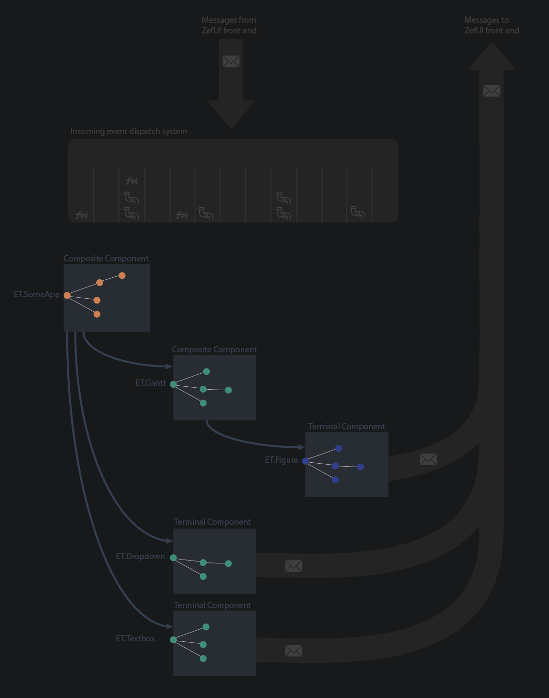
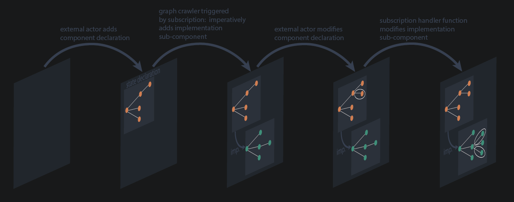

## Today's Problems

The trend of websites in recent years is increasingly towards reactive apps: web apps. Their core defining feature is that the presented content changes both as a reaction to user changes or any other external change to the content that they are displaying (think of a stock market indicators or scores during sports matches). Notice that the latter are observables / streams rather than values, although most of todays webapp code treats them as values.

One is more likely to find `int score_team_a = 0` instead of `observable<int> score_team_a ...` for most of today's web backend code bases (note: pure gut feel, unsubstantiated claim) - possibly even in many front end codebases. Often reactive behavior and subscriptions to update events are pushed in as an afterthought into a codebase that was never designed to be fully reactive. This situation is changing with languages like Clojure Script and Elm picking up and other languages adapting to these new requirements (e.g. JavaScript futures, Python & C++20 async).

The core challenge of modern reactive apps is to manage complex state that changes over time. Patterns like MVC have not lived up to the promise to manage the complexity of time-dependent state as apps and their requirements grow - a front where libraries like React and languages like Elm that are based on a functional reactive paradigm are getting more traction. However, traditional interfaces like REST (or more recently GraphQL) APIs operating in a (pull-based paradigm) remain the most common interfaces between browsers and backend services.

See

for an entertaining introduction to FRP in the context of today's systems.

Why is this a problem? Because the observer pattern (push based) is the superior paradigm for dealing with complex time-dependent state, especially asynchronously if potential delays are involved.

What is the observer pattern? It is the inversion of the iterator pattern that is particularly suited for dealing with real time information (i.e. the interface between real time and simulated time that we call 'now'). The core concept is often referred to as the Hollywood principle: "Don't Call Us, We'll Call You.". Instead of some pesty actor (client) constantly asking whether some new information on a role is available (polling an API), the server promises to give a call once anything comes up.

:::note
The browser refresh button is today's "reboot" button for (broken) reactive web apps.
:::

Pull-based and push-based architectures don't mingle well - one does not get the full benefits of a well engineered reactive system if the coupling layer is pull based: REST API were not designed to send out updates to the client if something changes on the backend. A consequence of this is that one sees a massive uptick of libraries/services like Firebase and recently Supabase. These are great for many of the typical webapp use cases, but come with some draw backs when dealing with more complex applications: They are JS libraries and built to directly connect the database with a front end application. When wanting to do more than typical CRUD, there is an option to slot in server side functions to some extent, but one would not offload more complex tasks like ML pipelines etc. into the database.

Now you may say: 'But GraphQL' supports subscriptions. Yes, but one still runs into several problems when building a complex reactive webapp. The default is still query (pull) based and this is how it is mostly used. Furthermore dealing with subscriptions is not simple for the server: since subscriptions are created for entire queries (in general computational bounds for answering the query are not easy to specify) and if one has a large number of subscriptions, each associated query needs to be performed upon each state change of the database!

Even the Facebook Relay team gave up on coming up with a systematic solution for this [todo: find blog post on this] and recommend subscribing only to 'flat' data, i.e. no complicated query. This does not solve the problem of inferring which data changes require which subscriptions to execute and fire.

# What is ZefUI?

An experiment answering the following question:

If A) one of the biggest problems of modern reactive web apps is managing complex, time dependent state B) B) ZefDB '
--If A) one of the biggest problems of modern reactive web apps is managing complex, time dependent state B) B) ZefDB '

---

## Sub-Component Causal State Transitioning Dynamics (Cascading)

1. The user / some outer component adds the component declaration to the graph.
1. This is attached via some relation
1. This is attached via some relation
