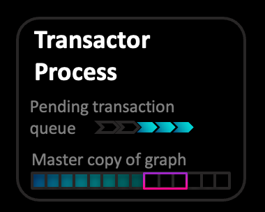

  
  
  
  
### A Single Thread to Rule them All  
on a per graph basis: all writes / transaction are performed by one thread. Requested changes (writes) to a graph are expressed as plain data and are part of [[ZefDoc - Introduction to Zef-FX| Zef's managed effect system]]: the wishes are automatically and safely forwarded as messages to the transactor thread.  
  
  
### Pending Transaction Queue  
Any requested write comes into a queue. This guarantees unique and safe ordering, also when dealing with varying numbers of requests from other threads or computational nodes running Zef.  
  
  
### Transaction Requests from Same Process  
The user does not  
  
  
  
### Transaction Request from Other Nodes  
Each OS process running Zef has a network coordination service running on one thread. All communication with ZefHub goes through this service, which is responsible for Egress and Ingress messaging. Transaction requests from other nodes come in via ZefHub and are forwarded from the local networking service to the graph's transactor thread.  
  
  
  
### Configuration Options  
(Upcoming feature)  
- declare conditions (independent of graph) which kinds of transactions to accept / consider  
- dealing with disconnection from ZefHub  
- options to deal with back pressure and prioritization of transaction requests  
  
