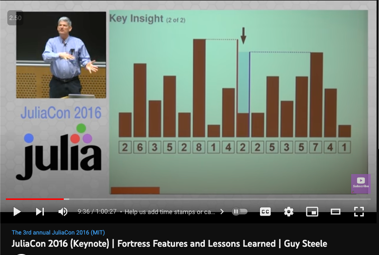

  
This tutorial is a collection of small sample problems and coding challenges. The goal of this tutorial is to demonstrate the usage of ZefOps on a variety of self-contained problems. Hopefully it gives you an idea of  
- some of the commonly ZefOps  
- demonstrate the conciseness and composability of code written in the data pipelining approach using chaining of ZefOps  
  
Notice that most of the code is expression based and therefore more composable than imperative code using statements (which mutate state).  
  
  
  
  
## Destutter  
taken from [OCaml for the Masses](https://dl.acm.org/doi/pdf/10.1145/2018396.2018413) by Yaron Minsky  
#### Goal  
```python  
# Removes sequential duplicates, e.g.,  
destutter([1,1,4,3,3,2]) = [1,4,3,2]  
```  
  
#### Zef Solution  
```python  
destutter = group | map[first]  
```  
  
  
  
  
---  
  
## Double Cola  
[Description of the Double Cola Challenge](https://codeforces.com/problemset/problem/82/A)  
  
#### Zef Solution  
```python  
from zef.ops import *  
  
people = [  
    'Sheldon',  
    'Leonard',  
    'Penny',   
    'Rajesh',   
    'Howard'  
]  
  
# express the solution as an inifinite lazy list  
solution = (people   
	| iterate[map[repeat[2]] | concat] # each person is added twice  
	| concat                           # concat all the lists  
	)  
  
# show out first elements only  
solution | take[30] | collect      
```  
  
  
  
### Water Levels  
  
Goal: find the total amount of water trapped between the bars. Water can flow out to both sides.  
For any given position m, the water level is equal or lower than  
1. the highest bar appearing to the left  
2. the highest bar appearing to the right  
  
Guy Steele made a nice figure:  
  
source: https://youtu.be/EZD3Scuv02g?t=576  
  
```python  
# v is the height of water column in each slot  
def run(v):  
	max_left = v | scan[max][0] | skip[1]  
	max_right = v | reverse | scan[max][0] | skip[1] | reverse  
	  
	return (zip(max_left, max_right)   
	  | map[unpack[min]]        # the water can flow out on either side  
	  | zip[v]                    
	  | map[unpack[subtract]]   # local water amount: we need the diff from the ground level  
    | sum  
	  | collect  
	)  
  
run([4,2,1,3,0,1,6,1,4,8,2,1])  
```  
