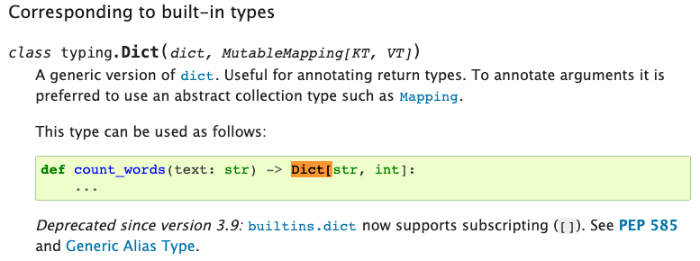

  
Not all type systems are equal. One perspective on types is to distinguish between representation types and logic types.  
  
  
### Representation Types  
In languages like C, one important part of a variable's type is to tell the compiler how to represent the data and how to read it. Given the address of a variable, the representation type and its declaration contains the context how to make sense out of the bit sequence starting at that location.  
  
  
### Logic Type  
How to concretely interpret a sequence of bits is not the only role of a type and this aspect moves to the background in languages with more advanced type systems. Examples are Idris, Haskell, OCaml and Typescript.  
  
Here Types can be seen much more as sets: specifically sets of things that fulfill certain constraints. Using types allows for a concise syntax that is  
1. easy and powerful to combine (unions, intersections, negations, differences)  
2. humanly readable - especially in composite form  
  
  
### Structural Typing  
The **Zef Type System**  itself is structural: the types themselves obey value semantics are not considered to have an identity.  
  
Let's look at an example of defining a composite type on the fly:  
```python  
PositiveInt = Int & Is[lambda x: x>0]    # & denotes intersection  
```  
`Is` is a wrapper function that takes an arbitrary predicate function (of one argument) and returns a ValueType. This type declaratively denotes the set of all things for which the predicate function returns `True`.  
  
  
### Overview of Zef Types  
!ZefDoc - Zef Value Types 2022-10-16 08.28.16.excalidraw  
related: [ZefDoc - Ref Types vs UIDs](ref-types-vs-uids)  
  
  
### Typing in Native Python  
  
Zef's type system is semantically similar the path that Python started going down recently. This also applies to the semantics of subtyping.  
  
  
source: https://docs.python.org/3/library/typing.html  
  
In normal Python `Dict` can be understood to represent the set of all instances of dictionaries.  
Using the square brackets `[...]` after a type specifies additional constraints, i.e. the resulting expression refers to a subset of elements as compared to the original expression without the `[...]`. Some examples:  
```python  
List            # the set of all lists in Python, e.g. [1. 'hello', True]  
List[int]       # lists that contain only ints  
  
Dict            # all dictionaries  
Dict[str, int]  # all dicts for which all keys are strings and all values are ints  
```  
  
  
  
### Constructing Types  
  
###### Combining Existing Types  
```python  
# suppose T1 and T2 are ValueTypes  
  
T3 = Union[T1][T2]     
T3 = T1 | T2                 # shorthand  
  
T4 = Intersection[T1][T2]     
T4 = T1 & T2                 # shorthand  
  
T5 = Complement[T1]          # logical complement: everything but this  
T5 = ~T1                     # shorthand  
```  
  
###### Wrapping a Predicate Function  
```python  
Evens = Is[lambda x: x%2==0]  
```  
  
###### Pattern Operator  
```python  
# T6 denotes the set of all dictionaries for which *all* of the following hold:  
# 1. `x` is a key and the associated val is an Int  
# 2. `y` is a key  
T6 = Pattern[{   
  'x': Int,  
  'y': Any  
}]  
  
{'x': 42, 'y': 'hello'} | is_a[T6]              # True  
{'x': 42} | is_a[T6]                            # False: no 'y' key  
{'x': hi, 'y': 'hello'} | is_a[T6]              # 'x' val wrong type  
  
# ok to have more  
{'x': 42, 'y': 'hello', 'z': True} | is_a[T6]   # True  
```  
  
We can also use the Pattern operator for Lists  
```python  
T7 = Pattern[(Int, Int, String)]  
(4, 5, 'hello') | is_a[T7]           # True  
(4, 5, 'hello', 'hi') | is_a[T7]     # True: can be longer  
  
...  
```  
  
  
### Graph Pattern Matching  
```python  
RP[Z, RT.ReleaseYear, {1996, 1997}]  
  
# Z indicates the position of the "subject": which thing are we talking about?  
  
  
```  
  
  
  
### UserValueTypes  
  
  
### Builtin Types  
  
  
  
### Events  
```python  
Instantiated[]  
Terminated[]  
Assigned[]  
```  
